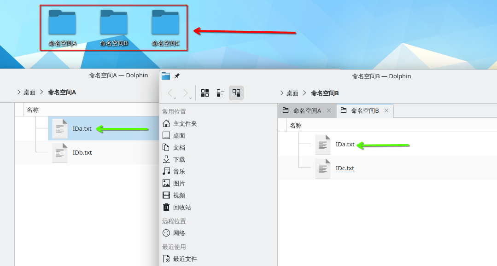
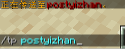
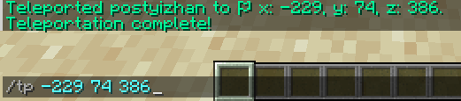
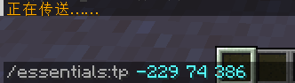
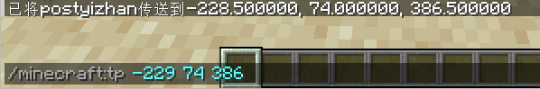

## 概念

> 命名空间ID（Namespaced identifier，或译为命名空间标识符）、资源路径（Resource location）、资源标识符（Resource identifier）或命名空间字符串（Namespaced string）是用来指明和识别游戏中特定对象而又能避免潜在的歧义和冲突的一种方式。

如果比喻一下的话，就像是

你的 "桌面" 上有几个命名空间（文件夹），这几个命名空间不能重名，命名空间里的东西可以重名

对于重名的 ID，可以用命名空间加以区分

格式通常是 `命名空间:ID` ，例如： `minecraft:tp`

例如，在上面的比喻中：

- 左侧的 IDa.txt 表示为 命名空间A:IDa.txt
- 右侧的 IDa.txt 表示为 命名空间B:IDa.txt

## 物品

原版物品的命名空间 `minecraft` 可不写，会自动补全，例如 `minecraft:stone` == `stone`

但是 mod 物品你不写也会补 `minecraft`，导致找不到物品

所以，如果你想在菜单等地方使用来自 mod 的物品，应该写 `mod命名空间:物品ID`

## 命令

命令存在 **优先级** 的概念

例如，当你安装 EssentialsX 之后，原版 tp 命令会被覆盖

而同时安装 EssentialsX 和 HuskHomes 之后，使用 tp 是 HuskHomes 提供的

如果此时你想使用 EssentialsX 的而不是 HuskHomes 的，可以使用命名空间

当然，你也可以使用原版命令，原版命名空间是 `minecraft`

通常，你作为用户不能调整优先级，这是插件开发者才能做的事

通常，插件作者会使用插件名字作为命名空间的名字

## 资源包

去学资源包基础而不是让我教你这个

## 参考

https://zh.minecraft.wiki/w/%E5%91%BD%E5%90%8D%E7%A9%BA%E9%97%B4ID
