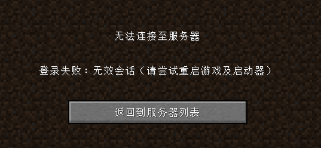

# 配置服务端

开启后，你需要进行一些简单配置，比如修改服务器端口，正版验证等

## 笨蛋脚本

[下载](https://github.com/lilingfengdev/NitWiki-Script/releases/download/windows-latest/config-eazy.exe)，我们会询问一些问题，帮你**自动配置**

目前可以配置的

- 服务器端口
- 正版验证
- 服务器种子
- 最大玩家数

## 正版验证

正版验证默认被开启，不关闭正版验证的话盗版玩家是不能加入游戏的。如果你没有用正版启动游戏，那么加入服务器会出现：



在 **server.properties** 中找到此项

```
online-mode=true
```

如果你想关闭正版验证，将 `true` 改为 `false` ，保存，重启服务端

:::danger

**不要开服开到一半去改正版验证!** 这会造成 UUID 混乱，玩家数据丢失，当然你可以转换 UUID 来解决这个问题 [查看解决方法](https://dodo939.love/2024/06/20/mc-online-conv-tool/)

如果需要更多的验证方式（如 **皮肤站**/**统一认证** 等），请在服务器 **公测前** 确定，具体请参考[更多验证方式](/docs-java/advance/loginchoices.md)

:::

注意,在离线模式下,玩家大概率没皮肤,你需要 [SkinsRestorer](/docs-java/process/plugin/other/SkinsRestorer.md)，根据需求选择 SkinsRestorer 的版本。

## 最大玩家数

在 **server.properties** 中找到此项

```
max-players=20
```

后面的数字就是你希望这个服务器最大能进入的玩家数。

## 服务器种子

在 **server.properties** 中找到此项

```
level-seed=
```

这里面就可以填上你想要的种子。

:::note

你可能会发现一些结构，比如村庄的生成，并不会遵循种子，是由于 `Spigot` 及其下游服务端加入了随机种子，地形的生成也会出现一些偏差

一些服务端也会添加一些地形生成优化补丁，通常会小范围改变地形生成

当然，你仍然可以利用种子定位群系，比如找史莱姆区块

:::

## 启用命令方块？

服务器中命令方块默认关闭，**并且不建议开启**。

**命令方块是性能低下的，并且所有功能都可以用插件替代。**

如何开启：

在 `server.properties` 中

```
enable-command-block=false
```

将此项设置为 `true`。

## 设置难度

```
difficulty=hard
```

支持以下值

* peaceful(0) - 和平
* easy(1) - 简单
* normal(2) - 普通
* hard(3) - 困难 

## 出生点保护

```
spawn-protection=16
```

出生点的保护范围,在保护范围中只有OP可以破坏或者放置

设置为0可以禁用

## 允许玩家前往地狱/生成地狱世界

```
allow-nether=true
```

设置为`false`可以禁用地狱

## 默认游戏模式

```
gamemode=survival
```

支持以下模式

* 生存 - survival 或 0
* 创造 - creative 或 1
* 冒险 - adventure 或 2
* 旁观 - spectator 或 3

## 强制游戏模式

```
force-gamemode=false
```

如果设置为`true`,玩家加入后将会被强制改为默认游戏模式

## 结构生成

```
generate-structures=true
```

结构（如村庄）是否会在新区块中生成

:::note

即使设置为false，地牢仍会生成

:::

## 允许玩家互相攻击

```
pvp=true
```

## 允许飞行

```
allow-flight=true
```

:::warning

最好将此值设为`true`,无论你是否需要飞行,如果你需要反飞行,请查看反作弊一章

:::

## 服务器端口

在下一章!
