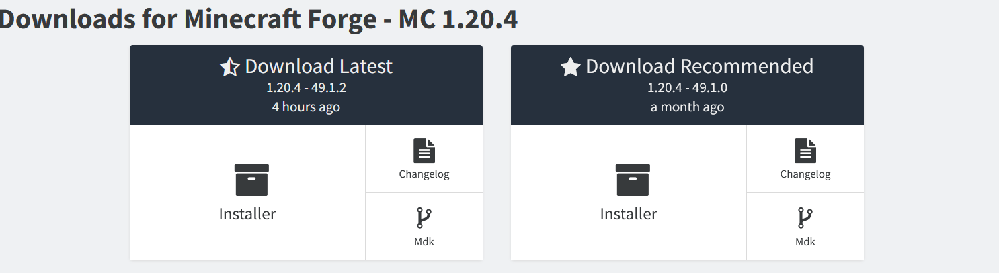
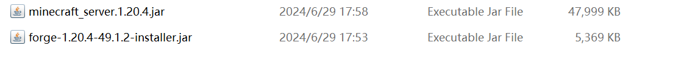

# 安装服务端

:::tip

该教程是为 Mod 服所编写的，插件和混合直接新建文件夹扔进去就完事

:::

全篇以 1.20.4 Mod 服务端安装为例子

如果你看不懂可以使用[笨蛋脚本](https://github.com/lilingfengdev/NitWiki-Script/releases/download/windows-latest/select-server.exe)，目前不支持 Fabric

## Forge

首先，来到 [Forge 官方网站](https://files.minecraftforge.net/net/minecraftforge/forge/)


在左边的 `Minecraft Version` 找到你需要的版本，然后下载下来



请选择 `Installer` ，左边右边都无所谓，打开后，你会来到一个广告窗口，点击最上面的 `SKIP`(没有出现就等一会)


然后你就成功下载了 Forge Installer，但还没有完!，继续

在浏览器中输入以下链接

```
https://bmclapi2.bangbang93.com/version/这里填你的MC版本/server
```

比如我 1.20.4 服务器应该是 `https://bmclapi2.bangbang93.com/version/1.20.4/server`

下载下来后，你需要将文件重命名为`minecraft_server.这里填你的MC版本.jar`，比如我1.20.4服务器应该是`minecraft_server.1.20.4.jar`，现在你的目录应该长这样



接着打开cmd，不会请查看[开启 cmd](launch-server.md#笨蛋脚本)，输入以下命令

````shell
java -jar forge-1.20.4-49.1.2-installer.jar(这里请改成你下载的文件名) --installServer
````

然后静待一会，直到控制台输出 `The server installed successfully` 就完成了!

## NeoForge

与Forge差不多，官网换[这个](https://neoforged.net/)

## Fabric

首先前往 Fabric 的[官网](https://fabricmc.net/)

然后点击中间那个蓝色的下载按钮

Fabric 有两种下载方案，这里我们两个都讲

进入新页面后点击中间的蓝色下载按钮，此时你会下载一个安装器

点击 服务端 然后依次根据提示进行安装，注意选择空文件夹

全部选择完毕后点击安装，等待安装结束

结束后一定一定要点击 下载服务端 以便下载香草服务端（模组服务端都需要这玩意），如果你懒得配置启动脚本也可以点击 生成 按钮让它给你整一个临时的

如果你觉得这种方案太麻烦，回到刚才的网页去点击下方的 Minecraft Server

依次根据提示进行安装，或者使用底下的安装命令进行快捷安装（限 Linux 用户）

下载完成后拖进空文件夹，随后新建脚本文件将启动命令复制到其中保存

启动服务器，等待后续安装，出现 Done 等语句后视为安装成功
