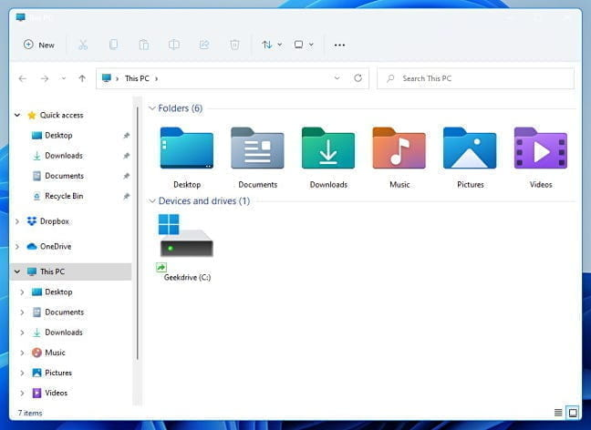
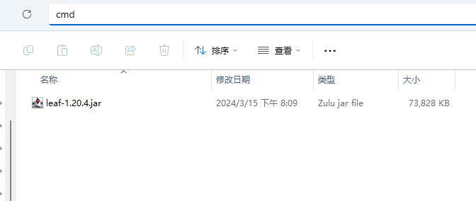
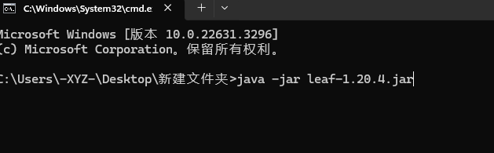
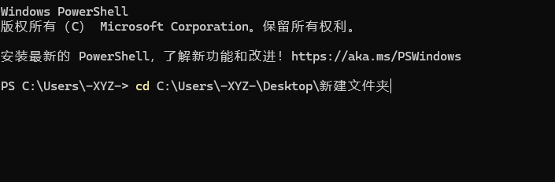

# 开启服务端

你已经做好了准备工作，开始启动你的服务器了

## 笨蛋脚本

下载此[脚本](https://github.com/lilingfengdev/NitWiki-Script/releases/download/windows-latest/generate-script.exe)，回答几个问题就可以为你自动生成启动脚本!!

<details>
<summary>直接在终端里敲命令来启动?</summary>

如果你第一次开服，或者你看不懂这个折叠里的内容，那就跳过，直接去看底下的编写启动脚本

## 终端路径

就像你的文件资源管理器



(估计有人不知道文件资源管理器是什么，所以放张图)

有路径一样，你的 cmd 也是有路径的(红框中为此 cmd 所在的路径)

[cmd 是什么](https://cn.bing.com/search?q=cmd%E6%98%AF%E4%BB%80%E4%B9%88)

[怎么打开 cmd](https://cn.bing.com/search?form=MOZLBR&pc=MOZI&q=%E6%80%8E%E4%B9%88%E6%89%93%E5%BC%80cmd)

## 启动命令

现在你把下载好的服务端核心放到一个空文件夹里



点击地址栏，输入 cmd 然后回车，就会在这个路径下打开 cmd



或者用别的办法打开 cmd，然后用 cd 命令切换路径

[怎么用 cd 命令切换到另一个目录](https://cn.bing.com/search?q=%E6%80%8E%E4%B9%88%E7%94%A8cd%E5%91%BD%E4%BB%A4%E5%88%87%E6%8D%A2%E5%88%B0%E5%8F%A6%E4%B8%80%E4%B8%AA%E7%9B%AE%E5%BD%95)



</details>

## 编写启动脚本

~~最简单的启动命令当然是 java -jar~~

现在你把下载好的服务端核心放到一个空文件夹里


在这个文件夹里创建一个 txt 文件，重命名为 bat 后缀的文件 如 `start.bat`

[文件看不到后缀怎么办](https://cn.bing.com/search?q=%E6%96%87%E4%BB%B6%E7%9C%8B%E4%B8%8D%E5%88%B0%E5%90%8E%E7%BC%80)

用你前面下的文本编辑器编辑这个文件，写入以下信息并保存，然后双击 `start.bat`

```
java -Xms2G -Xmx2G -jar 核心名.jar --nogui
```

## 最初的开启

双击启动脚本后，大概率会卡在你会看到 Downloading mojang_x.x.x.jar，请耐心等待

一旦下载完成，他会提示：

```
You need to agree to the EULA in order to run the server. Go to eula.txt for more info.
```

用文本编辑器打开此目录下生成的 `eula.txt` ，将里面的 `eula=false` 改为 `eula=true`

eula 就像是用户协议一样的东西，你想知道讲了啥，点 [这里](https://zhuanlan.zhihu.com/p/463084883)

改好之后重新开启服务器，当出现以下字样说明服务器已经成功开启。

```
Done (6.554s)! For help， type "help"
```

:::tip

你可以点击目录中的配置服务器进入下一节内容了!

:::

## 更复杂的 bat

请参考 [JVM 参数优化](/docs-java/process/maintenance/optimize/optimize.md#jvm-参数优化)

## 常见问题

### Downloading mojang_x.x.x.jar

如果您的服务器卡在：

```
Downloading mojang_x.x.x.jar
```

请尝试使用科学上网。

### 我不会在命令行界面 (CMD / 终端 / Powershell) 使用科学上网！

:::tip

其实你可以直接开启 TUN 模式

记得让小地球变绿


:::

请确定您的科学上网是可用的，不多赘述。

在命令行界面（一般情况下，一个黑 / 蓝框框）中执行这两条

```shell
set http_proxy=http://127.0.0.1:7890
set https_proxy=http://127.0.0.1:7890
```

其中 `7980` 是您的科学上网软件设置的端口，若有不同，请替换。

注：输入之后仅对这个命令行窗口有效，`开启新的 / 关闭它` 之后要重新输入。

> 大佬们，浏览器能用不是 cmd 能用，不然你猜我为什么写这个。