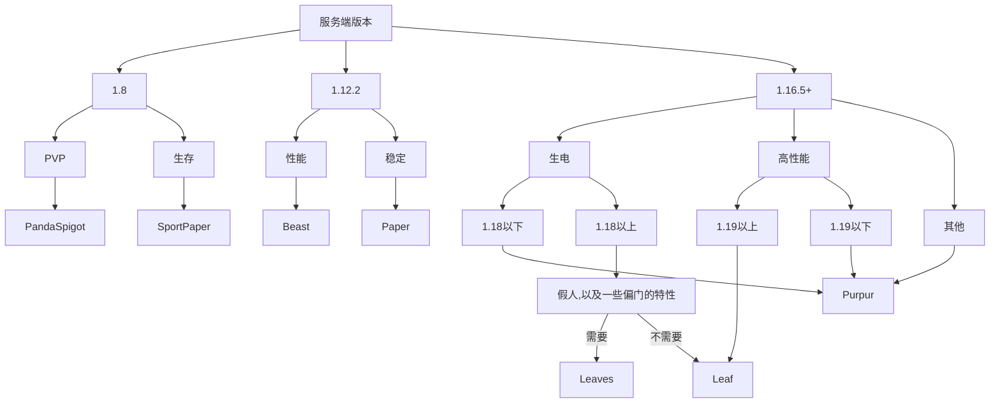

# 服务端核心选择

> 目前有三类主流的选择： Mod，插件，混合（可以装 插件+mod）

> 核心只要是同版本的分支基本可以考虑后期再替换（如使用 Purpur 替换 Paper 或 Spigot等）
> 对于插件服，这类操作几乎无感
> 对于混合服，这有待商榷，因为各个端兼容性差异较大
> 对于 Mod 服，这几乎不可能，你基本没有可选择的核心

Mod 服最开始就必须选好核心，也就是 Forge 还是 Fabric 的问题。

> 此处仅为部分开服核心

:::info

你可以点击名称栏中的字体跳转并找到下载

下载镜像只是备选选项

:::

## 笨蛋脚本

帮你选择服务端，并自动下载!

[下载](https://github.com/lilingfengdev/NitWiki-Script/releases/download/windows-latest/select-server.exe)

## Mod 服

性能较差，某些 Mod 就不是想给多人游戏设计的；拓展性强，内存需求较大，游戏性可以做的很丰富，但客户端需要安装相同的 Mod 。纯 Mod 服主流只有 Forge 和 Fabric 两种，

高版本一般推荐使用 Fabric ，因为 Fabric 优化 Mod 多效果比较好，但是最重要的还是：如果有什么 Mod 只有 Fabric / Forge 版本而你又非玩不可，只能选择相应的核心。

## 插件服

性能较好，是初学者最适合开的服务器，拓展性较强，配置性强，但坏处就是有的插件需自行配置后使用，客户端无需安装 Mod 。我个人推荐插件服使用 Purpur，

是截止到 2024 年的稳定性和优化最好的选择

:::info

此类核心的存档结构有些不同

如果您是从非 Bukkit 系核心或单人存档迁移，请查看[ Leaves 的迁移文档](https://docs.leavesmc.org/zh_Hans/leaves/guides/migration)(通用所有Bukkit插件端)

:::

如果你不知道怎么选,我们为你提供一个简单的方法(:

### 高版本核心推荐

import Tabs from '@theme/Tabs';
import TabItem from '@theme/TabItem';

<Tabs queryString="server-core-choose-1">
<TabItem value="paper" label="Paper">

**优势**：

- 性能 - 性能还可以
- 稳定 - 目前最稳定的核心
- 兼容 - 很多插件会以此核心为标准之一进行兼容

**劣势**：

- 性能 - 在高版本逐渐比不过他的分支
- 特性 - 丧失不少原版特性

总的来说，Paper 核心适合那些追究 *极端的* 稳定的人

**下载**：

- [官方](https://papermc.io/downloads/all)
- [FastMirror](https://www.fastmirror.net/#/download/Paper)
- [McRes](https://mcres.cn/downloads/paper.html)
- [原子云](https://res.nullatom.com/Minecraft/Server/Paper/)

</TabItem>
<TabItem value="purpur" label="Purpur">

**优势**：

- 性能 - Purpur 的性能相比于 Paper 提升大约20%，在高版本表现尤为明显
- 稳定 - Purpur 兼容 Paper 的全部插件，只要paper能跑，purpur就可以跑
- 特性 - Purpur 还原了 Minecraft 的部分特性，用来开生存服务器更加适合(当然生电还是得 Leaves)
- 兼容 - 很多插件会以此核心为标准之一进行兼容

**劣势**：

- 配置 - 配置文件比较脑瘫
- 支持 - 不给所有mc版本的构建

综上所述，目前 Purpur 是综合最优选择

**下载**：

- [官方](https://purpurmc.org/downloads)
- [McRes](https://mcres.cn/downloads/purpur.html)
- [FastMirror](https://www.fastmirror.net/#/download/Purpur)

</TabItem>
<TabItem value="leaves" label="Leaves">

**优势**：

- 特性 - 为生电而生，专门的生电向特性支持
- 兼容 - 支持paper能使用的几乎所有插件
- 支持 - 国人开发的核心

**劣势**：

- 优化 - 优化不如 Purpur 和 Leaf

专为生电而生的核心。

leaves基本完全支持客户端生电 Mod ，包括但不限于carpet，pca，投影，共享原理图，minihud，bbor，ommc，xaero小地图，jade，appleskin等

**下载**：

- [官方](https://leavesmc.org/downloads/leaves)
- [McRes](https://mcres.cn/downloads/leaves.html)

</TabItem>
<TabItem value="Leaf" label="Leaf">

**优势**：

- 性能 - 甚至比purpur还要好的优化
- 支持 - 国人开发的核心

**劣势**：

- 兼容 - 有极少插件不兼容（可向核心作者反馈）

总的来说，相比 purpur 会有更好的优化，极少不兼容的插件可以及时找作者反馈，所以非常推荐此核心

**下载**：

- [官方](https://github.com/Winds-Studio/Leaf/releases)
- [McRes](https://mcres.cn/downloads/leaf.html)

</TabItem>
</Tabs>

### 其他版本核心推荐

<Tabs queryString="server-core-choose-2">
<TabItem value="pandaspigot" label="1.8-PandaSpigot">

**优势**：

- 性能 - 拥有较好的性能
- 维护 - 可用于开PVP服务器，含大量konckback配置选项
- 维护 - 专为1.8提供维护

**劣势**：

- 还没想到

**下载**：

- [官方](https://nightly.link/hpfxd/PandaSpigot/workflows/build/master/Server%20JAR.zip)
- [McRes](https://vip.123pan.cn/1821558579/Lingyi/core/pandaspigot-116-mcres.cn.jar)

</TabItem>
<TabItem value="sportpaper" label="1.8-SportPaper">

**优势**：

- 性能 - 拥有较好的性能
- 维护 - 可用于开生存服务器，很多生存配置选项

**劣势**：

- 还没想到

**下载**：

- [官方](https://github.com/Electroid/SportPaper)
- [青草云MC](https://qcymc.cloud/f/ERGcp/sportpaper-1.8.8-R0.1-SNAPSHOT.jar)

</TabItem>
<TabItem value="beast" label="1.12-Beast">

**优势**：

- 性能 - 1.12相比高版本本身吃资源就少，此核心提供更多优化
- 维护 - 专为1.12提供维护，修复错误和改进

**劣势**：

- 还没想到

**下载**：

- [官方](https://github.com/HomoMC/Beast)
- [青草云MC](https://qcymc.cloud/f/G6ziA/beast-1.12.2.jar)

</TabItem>
</Tabs>

### 不推荐的核心

:::danger

以下核心真的不推荐，除非你真的疯了，否则不要用

:::

| 名称                                                      | 介绍                                    |
|-----------------------------------------------------------|-----------------------------------------|
| [CraftBukkit](https://getbukkit.org/download/craftbukkit) | 插件端鼻祖核心，无优化                  |
| [Spigot](https://getbukkit.org/download/spigot/)          | CraftBukkit的分支，有一点优化，仍不推荐 |

### 付费优化高性能核心

:::danger

大部分付费的所谓的高性能核心都是假的，如果你真的需要购买，你可以向大佬咨询

:::

## 混合端

:::danger

部分性能不如 Mod 端，游戏性丰富，稳定性和报错非常玄学，建议开服到大神级别再接触这个领域

:::

混合端常见的有Catserver；高版本推荐使用Mohist和Arclight，就目前来看，它们的本身稳定性良好，也比纯 Forge 有所优化（但 Mod /插件数量多了之后兼容性问题可能会莫名让人头疼）

支持的MC版本自行官网查看

### 混合端核心推荐

#### Forge 混合端

| 名称 | 介绍 | 推荐与否 | 下载镜像 | 支持版本 |
| ---- | ---- | -------- |--------- | -------- |
| [Crucible](https://github.com/CrucibleMC/Crucible)      | Thermos的分支，目前还在积极维护，完全兼容Thermos | 推荐 | [McRes](https://www.123pan.com/s/HRhfjv-3ey8v.html)，[青草云MC(推荐)](https://qcymc.cloud/f/gJRFG/Crucible-1.7.10-staging-0c25d250-server.jar)([library文件](https://github.moeyy.xyz/https://github.com/CrucibleMC/Crucible/releases/download/staging-0c25d25/libraries.zip)) | 1.7.10 |
| [CatServer](https://catmc.org/)                         | （推荐，但我真不喜欢核心内置广告）。既可以加入 Mod 又可以加入插件缺点：部分插件不支持，部分 Mod 不支持； Mod 和插件在一起运行难免出现一些七七八八的bug | 推荐1.12.2 | [McRes](https://mcres.cn/downloads/catserver.html) [FastMirror](https://www.fastmirror.net/#/download/CatServer) | 1.12.2/1.16.5/1.18.2 |
| [Mohist](https://mohistmc.com/software/mohist)          | 兼容paper的一些插件支持，兼容 Mod 和插件；缺点：比较多插件不支持，部分 Mod 不支持； Mod 和插件在一起运行难免出现一些七七八八的 bug。 | 推荐高版本 | [McRes](https://mcres.cn/downloads/mohist.html) [FastMirror](https://www.fastmirror.net/#/download/Mohist) [原子云](https://res.nullatom.com/Minecraft/Server/Mohist/) | 1.12.2/1.16.5/1.18+ |
| [Arclight-Forge](https://github.com/IzzelAliz/Arclight) | - | 推荐高版本 | [FastMirror](https://www.fastmirror.net/#/download/Arclight) [McRes](https://mcres.cn/downloads/arclight.html) | 1.16.5+ |
| [Magma](https://magmafoundation.org/)                   | - | - | [McRes](https://mcres.cn/downloads/magma.html) | 没用过，不知道 |
| [Sponge](https://spongepowered.org/]Sponge)             | 可加入sponge插件，支持 Mod，优化极强，而且服务器兼容性更高，对于线程优化能力更强，负载更好。缺点：即使你用了很多办法也很难让bukkit插件稳定运行；sponge插件特别少；启动速度特别慢。操作特别难，与前面的完全不相同。 | 不推荐新手使用  | [McRes](https://mcres.cn/downloads/spongeforge.html) [FastMirror](https://www.fastmirror.net/#/download/SpongeForge) | 没用过，不知道 |

#### Fabric 混合端

| 名称 | 介绍 | 推荐与否 | 下载镜像 |
| ---- | ---- | -------- |--------- |
| [Banner](https://new.mohistmc.com/software/banner)       | 并不是一款端，而是一个 Mod 需要安装在Fabric，安装后重启即可加载插件 | - | [McRes](https://mcres.cn/downloads/banner.html) |
| [Arclight-Fabric](https://github.com/IzzelAliz/Arclight) | 出现时间比banner晚，目前不太稳定  | - | [FastMirror](https://www.fastmirror.net/#/download/Arclight) [McRes](https://mcres.cn/downloads/arclight.html) |
| [Cardboard](https://cardboardpowered.org/)               | 支持的版本较多，支持1.16.5-1.20.4 | - | [McRes](https://mcres.cn/downloads/carboard.html) |

