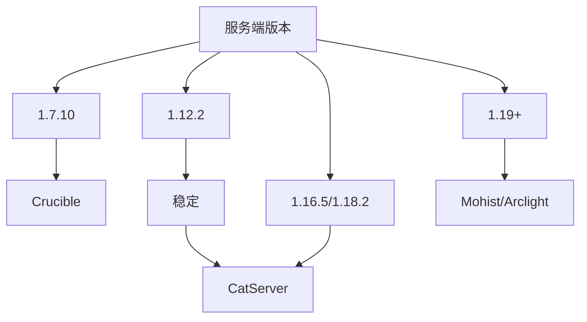
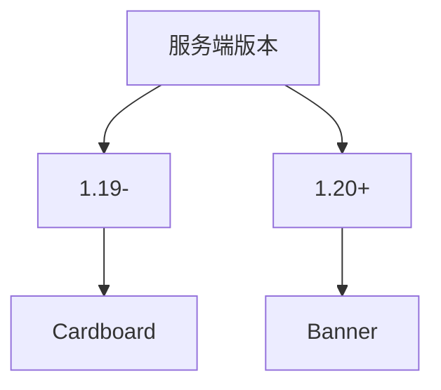

# 混合端

:::info

你可以点击名称栏中的字体跳转并找到下载

下载镜像只是备选选项

非必要不混合，先找平替再混合。

:::

:::danger 混合端注意事项

Mod 作者们绝大多数都不会受理与混合端相关的问题，风险自行承担。

:::

## Forge

<!--markdownlint-disable line-length-->

| 名称                                                      | 介绍                                                                                                                        | 推荐与否     | 下载镜像                                                                                                                                                                                                             | 支持版本                  |
|---------------------------------------------------------|---------------------------------------------------------------------------------------------------------------------------|----------|------------------------------------------------------------------------------------------------------------------------------------------------------------------------------------------------------------------|-----------------------|
| [Crucible](https://github.com/CrucibleMC/Crucible)      | Thermos 的分支，目前还在积极维护，完全兼容 Thermos                                                                                         | 推荐       | [McRes](https://www.123pan.com/s/HRhfjv-3ey8v.html)                                                                                                                                                              | 1.7.10                |
| [CatServer](https://catmc.org/)                         | (推荐，但我真不喜欢核心内置广告)。既可以加入 Mod 又可以加入插件缺点：部分插件不支持，部分 Mod 不支持； Mod 和插件在一起运行难免出现一些七七八八的 bug。                                    | 推荐1.12.2 | [McRes](https://mcres.cn/downloads/catserver.html) [FastMirror](https://www.fastmirror.net/#/download/CatServer) [MCSL](https://sync.mcsl.com.cn/core/CatServer)                                                 | 1.12.2/1.16.5/1.18.2/ |
| [Mohist](https://mohistmc.com/software/mohist)          | 兼容 Paper 的一些插件支持，兼容 Mod 和插件；缺点：比较多插件不支持，部分 Mod 不支持； Mod 和插件在一起运行难免出现一些七七八八的 bug。                                          | 推荐高版本    | [McRes](https://mcres.cn/downloads/mohist.html) [FastMirror](https://www.fastmirror.net/#/download/Mohist) [原子云](https://res.nullatom.com/Minecraft/Server/Mohist/) [MCSL](https://sync.mcsl.com.cn/core/Mohist) | 1.12.2/1.16.5/1.18+   |
| [Arclight-Forge](https://github.com/IzzelAliz/Arclight) | -                                                                                                                         | 推荐高版本    | [FastMirror](https://www.fastmirror.net/#/download/Arclight) [McRes](https://mcres.cn/downloads/arclight.html) [MCSL](https://sync.mcsl.com.cn/core/Arclight)                                                    | 1.16.5+               |
| [Magma](https://magmafoundation.org/)                   | -                                                                                                                         | -        | [McRes](https://mcres.cn/downloads/magma.html)                                                                                                                                                                   | 没用过，不知道               |
| [Sponge](https://spongepowered.org/]Sponge)             | 可加入 Sponge 插件，支持 Mod，优化极强，而且服务器兼容性更高，对于线程优化能力更强，负载更好。缺点：即使你用了很多办法也很难让 Bukkit 插件稳定运行；Sponge 插件特别少；启动速度特别慢。操作特别难，与前面的完全不相同。 | 不推荐新手使用  | [McRes](https://mcres.cn/downloads/spongeforge.html) [FastMirror](https://www.fastmirror.net/#/download/SpongeForge)  [MCSL](https://sync.mcsl.com.cn/core/SpongeForge)                                          | 1.7.10 - 最新           |

:::tip Mo与Arc

Mohist 与 Arclight 并没有谁好谁坏,通常来说,两个服务端最好都试一试,留下表现最好的就行

:::

## Fabric

:::tip 使用 Fabric 混合端前的提示

目前部分常用的 Bukkit 插件已有 Fabric 平替模组。

CoreProtect -> Ledger

EssentialsX/CMI/HuskHomes -> HuskHomes(Fabric 版)

:::

| 名称                                                       | 介绍                                       | 推荐与否 | 下载镜像                                                                                                           |
|----------------------------------------------------------|------------------------------------------|------|----------------------------------------------------------------------------------------------------------------|
| [Banner](https://new.mohistmc.com/software/banner)       | 并不是一款端，而是一个 Mod 需要安装在 Fabric，安装后重启即可加载插件 | -    | [McRes](https://mcres.cn/downloads/banner.html) [MCSL](https://sync.mcsl.com.cn/core/Banner)                   |
| [Arclight-Fabric](https://github.com/IzzelAliz/Arclight) | 出现时间比 Banner 晚，目前不太稳定                    | -    | [FastMirror](https://www.fastmirror.net/#/download/Arclight) [McRes](https://mcres.cn/downloads/arclight.html) |
| [Cardboard](https://cardboardpowered.org/)               | 支持的版本较多，支持 1.16.5-1.20.4                 | -    | [McRes](https://mcres.cn/downloads/carboard.html)                                                              |

<!--markdownlint-enable line-length-->

## NeoForge

目前仅有 [Arclight-NeoForge](https://github.com/IzzelAliz/Arclight) 支持,Youer 还正在开发
