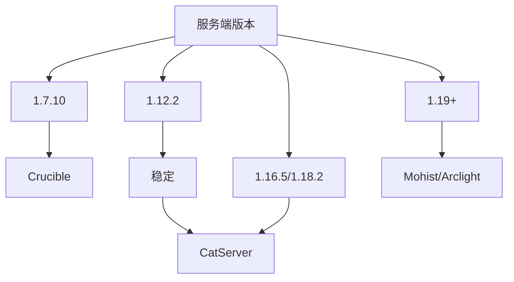
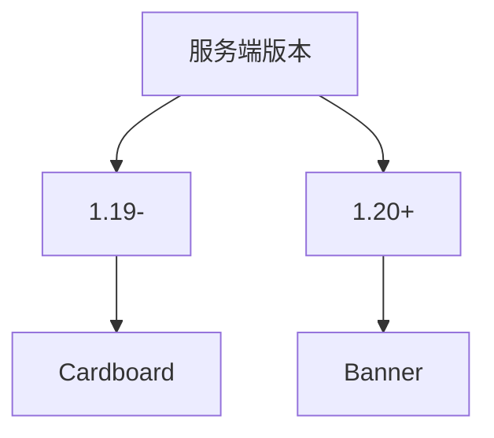

# 混合端

:::info

你可以点击名称栏中的字体跳转并找到下载

下载镜像只是备选选项

:::

## Forge

<!--markdownlint-disable line-length-->

| 名称                                                           | 介绍                                                                                                                                        | 推荐与否     | 下载镜像                                                                                                                                                                                                             | 支持版本                  |
|--------------------------------------------------------------|-------------------------------------------------------------------------------------------------------------------------------------------|----------|------------------------------------------------------------------------------------------------------------------------------------------------------------------------------------------------------------------|-----------------------|
| [Crucible](https://github.com/CrucibleMC/Crucible)           | Thermos的分支，目前还在积极维护，完全兼容Thermos                                                                                                           | 推荐       | [McRes](https://www.123pan.com/s/HRhfjv-3ey8v.html)                                                                                                                                                              | 1.7.10                |
| [CatServer](https://catmc.org/)                              | (推荐，但我真不喜欢核心内置广告)。既可以加入 Mod 又可以加入插件缺点：部分插件不支持，部分 Mod 不支持； Mod 和插件在一起运行难免出现一些七七八八的 bug。                                                    | 推荐1.12.2 | [McRes](https://mcres.cn/downloads/catserver.html) [FastMirror](https://www.fastmirror.net/#/download/CatServer) [MCSL](https://sync.mcsl.com.cn/core/CatServer)                                                 | 1.12.2/1.16.5/1.18.2/ |
| [CatRoom](https://github.com/NovaEngineering-Source/CatRoom) | CatServer + Cleanroom 的版本,拥有更新的 Mod 开发工具链,下载完后记得安装 [Fugue](https://www.mcmod.cn/class/13259.html)和[Scalar(如果你有用 Scala 编写的 Mod)](https://www.mcmod.cn/class/14677.html) | 推荐1.12.2 | [NitWikit](https://dl.yizhan.wiki/plugins/cleanroom-0.2.3-alpha-universal.jar)                                                                                                                                   | 1.12.2                |
| [Mohist](https://mohistmc.com/software/mohist)               | 兼容 Paper 的一些插件支持，兼容 Mod 和插件；缺点：比较多插件不支持，部分 Mod 不支持； Mod 和插件在一起运行难免出现一些七七八八的 bug。                                                            | 推荐高版本    | [McRes](https://mcres.cn/downloads/mohist.html) [FastMirror](https://www.fastmirror.net/#/download/Mohist) [原子云](https://res.nullatom.com/Minecraft/Server/Mohist/) [MCSL](https://sync.mcsl.com.cn/core/Mohist) | 1.12.2/1.16.5/1.18+   |
| [Arclight-Forge](https://github.com/IzzelAliz/Arclight)      | -                                                                                                                                         | 推荐高版本    | [FastMirror](https://www.fastmirror.net/#/download/Arclight) [McRes](https://mcres.cn/downloads/arclight.html) [MCSL](https://sync.mcsl.com.cn/core/Arclight)                                                    | 1.16.5+               |
| [Sponge](https://spongepowered.org/]Sponge)                  | 可加入sponge插件，支持 Mod，优化极强，而且服务器兼容性更高，对于线程优化能力更强，负载更好。缺点：即使你用了很多办法也很难让 Bukkit 插件稳定运行；Sponge插件特别少；启动速度特别慢。操作特别难，与前面的完全不相同。                      | 不推荐新手使用  | [McRes](https://mcres.cn/downloads/spongeforge.html) [FastMirror](https://www.fastmirror.net/#/download/SpongeForge)  [MCSL](https://sync.mcsl.com.cn/core/SpongeForge)                                          | 没用过，不知道               |

:::tip Mo与Arc

Mohist 与 Arclight 并没有谁好谁坏,通常来说,两个服务端最好都试一试,留下表现最好的就行

:::

## Fabric

| 名称                                                       | 介绍                                      | 推荐与否 | 下载镜像                                                                                                           |
|----------------------------------------------------------|-----------------------------------------|------|----------------------------------------------------------------------------------------------------------------|
| [Banner](https://new.mohistmc.com/software/banner)       | 并不是一款端，而是一个 Mod 需要安装在Fabric，安装后重启即可加载插件 | -    | [McRes](https://mcres.cn/downloads/banner.html) [MCSL](https://sync.mcsl.com.cn/core/Banner)                   |
| [Arclight-Fabric](https://github.com/IzzelAliz/Arclight) | 出现时间比banner晚，目前不太稳定                     | -    | [FastMirror](https://www.fastmirror.net/#/download/Arclight) [McRes](https://mcres.cn/downloads/arclight.html) |
| [Cardboard](https://cardboardpowered.org/)               | 支持的版本较多，支持1.16.5-1.20.4                 | -    | [McRes](https://mcres.cn/downloads/carboard.html)                                                              |

<!--markdownlint-enable line-length-->

## NeoForge

目前仅有 [Arclight-NeoForge](https://github.com/IzzelAliz/Arclight) 支持,Youer 还正在开发
