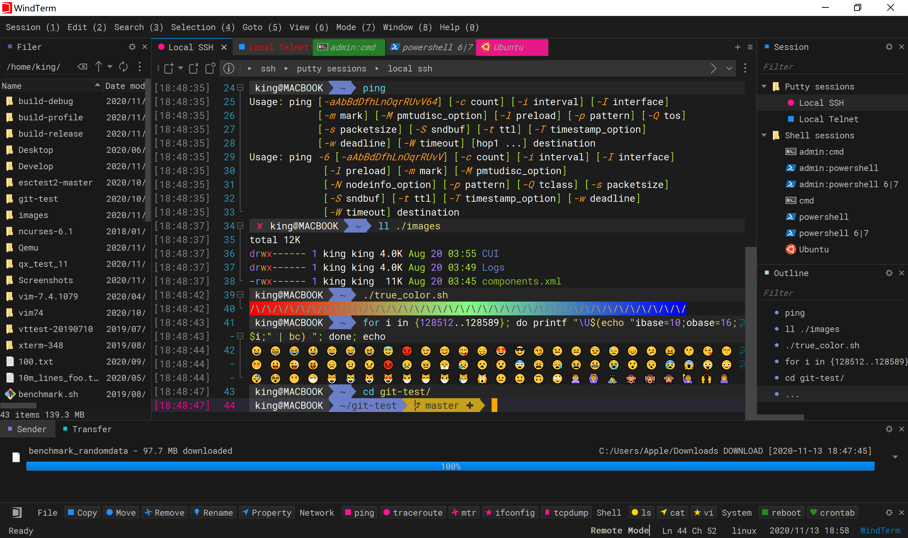
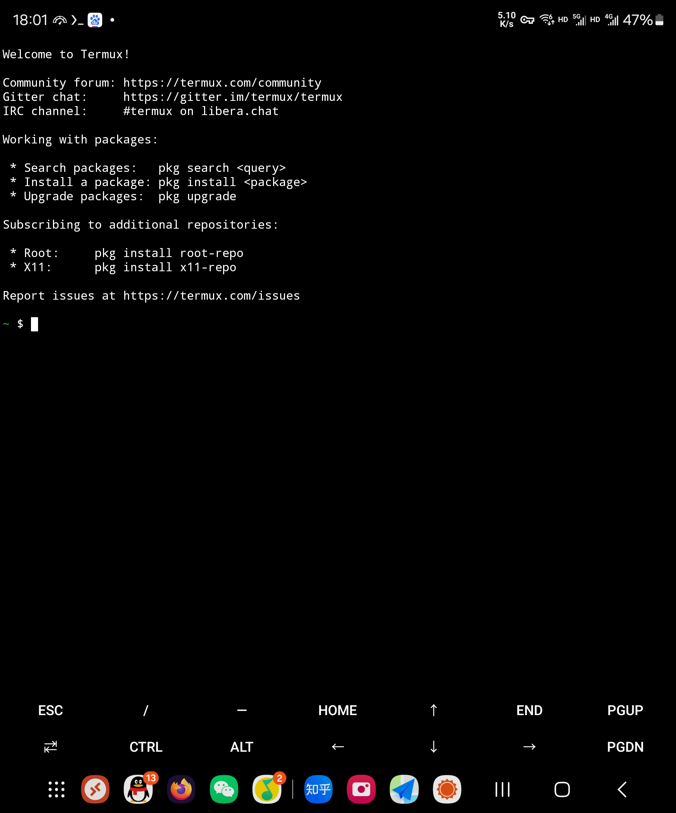
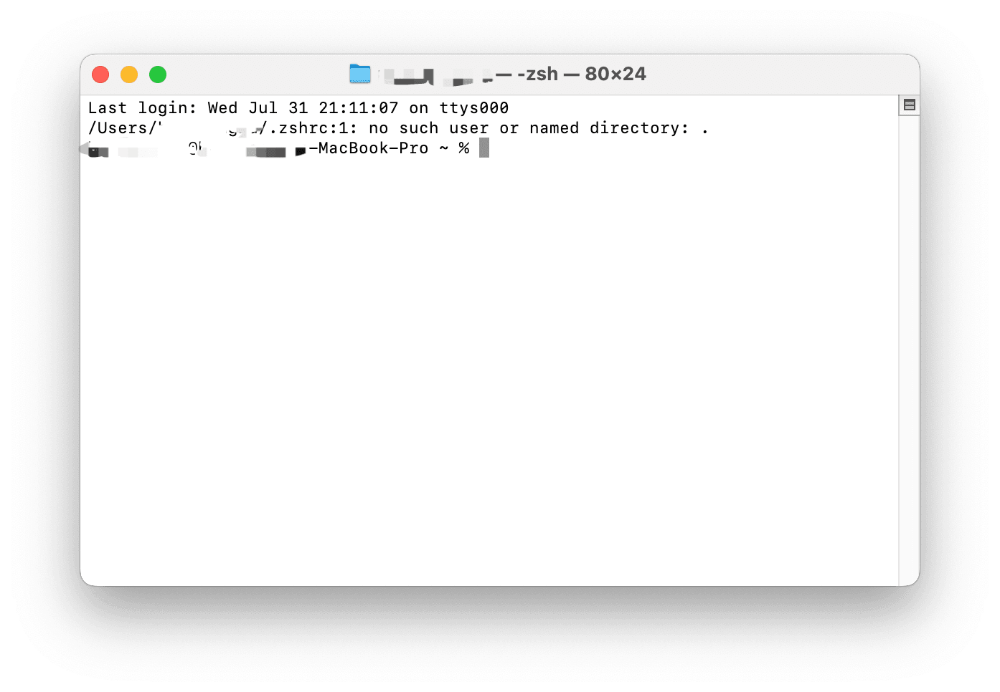

# 连接服务器

Linux有一个工具被业界广泛使用，它就是ssh。它虽然不能远程控制桌面，但是可以远程登录服务器的命令行，并让服务器执行一些命令。由于ssh非常常用，现在很多Linux系统都已经默认集成了这个软件。

## 开启ssh服务
为了让客户能顺利连接服务器，云服务器的ssh一般默认开启。如果你使用的是家里云，或者云服务器的ssh确实没有开启（比如你是只能通过服务商提供的VNC或者第三方远控软件连接的服务器，无法使用ssh），那么你可能需要先开启ssh才能进行连接。在主流的Linux系统中，执行`sudo systemctl start ssh`即可开启ssh，如果这些命令都报错，证明ssh服务存在问题，你可以把报错复制粘贴到搜索引擎上查询怎么修复这个问题。开启ssh后，你就可以连接到这台服务器了。

成功开启ssh服务后，如果要从公网连接，你还需要把ssh服务的端口`22`开放到公网。开放的方法与开放Windows的远程桌面端口的方式完全相同，但是协议只需要TCP即可。

:::danger

配置直接在公网使用22端口连接服务器ssh**会导致严重的安全性问题**，详见[如何抵御网络攻击](../../process/maintenance/how-to-defend-against-cyber-attacks.md)。  
另外除非有明确需求，不要随意配置UDP协议端口映射，包括上文中提到的**不需要UDP协议**的ssh，否则可能导致你的服务器被DDoS！详见[如何抵御网络攻击](../../process/maintenance/how-to-defend-against-cyber-attacks.md)。

:::

## 连接ssh服务

### Linux的ssh命令

就像 Windows 不用安装任何软件就能连接 Windows 的远程桌面一样， Linux 也内置了连接 ssh 的方式，直接执行 ssh 命令即可连接。它的语法如下：
```
ssh 用户名@连接地址
```
如何要指定端口，你需要指定端口参数。在一些操作系统上这个参数是`-p`，例如`ssh root@yizhan.wiki -p 48291`，有一些工具上则是直接在后面输入端口，例如Xshell是`ssh root@yizhan.wiki 48291`。你需要根据不同的工具的使用方式来确定ssh的命令格式。比如，你可以仅执行`ssh`，然后让 ssh 工具提示你如何使用当前工具的这个命令。

### 使用工具连接
其他操作系统也可以使用工具连接至服务器，在这里举出几个工具

import Tabs from '@theme/Tabs';
import TabItem from '@theme/TabItem';

<Tabs>
  <TabItem value="powershell" label="powershell" default>


windows 系统自带的 powershell

按下 Win + R 输入 powershell 即可

随后在 cmd 或 powershell 中输入 ssh -p (port) (username)@(hostname) 即可连接 Linux 服务器。

此时会弹出是否保存服务器密钥，选择接受并保存，之后就不会再弹出。

:::tip

port 输入服务器的 ssh 端口
username 为登录服务器的用户名
hostname 为服务器的域名或者 IP

:::

  </TabItem>
  <TabItem value="windterm" label="WindTerm">



一个开源的 SSH/Telnet/Serial/Shell/Sftp 客户端工具

https://github.com/kingToolbox/WindTerm

  </TabItem>
  <TabItem value="finelshell" label="FinelShell">


FinalShell是一体化的的服务器,网络管理软件,不仅是ssh客户端,还是功能强大的开发,运维工具,充分满足开发,运维需求.

  </TabItem>
  <TabItem value="xshell" label="Xshell">


他称自己是 业界最强大的SSH客户机

  </TabItem>
  <TabItem value="termux" lable="安卓手机（termux）">
    
你需要安装 termux 这个软件。你可以去 Google Play 下载，也可以去[它的开源地址](https://github.com/termux/termux-app)下载。  
安装好之后，打开软件就是命令行，随后直接使用 ssh 命令即可连接。  
  
  </TabItem>
  <TabItem value="zsh" lable="macOS（zsh）">
macOS 内置的终端app 中的命令行工具就是 zsh，它可以用来连接 ssh 。要打开这个工具，可以使用以下方式：
- （如果终端app没有被移动过）打开启动台，打开第一页的其他文件夹，点击终端。或者你也可以在应用文件夹（入口默认固定在访达侧边栏上）里找到它。
- 按下command+空格或键盘上的搜索键唤起 spotlight ，输入“终端”，然后它就会显示在下面。

  
打开终端后，使用上文中提到的ssh命令即可连接到服务器。
  </TabItem>
</Tabs>

<!--除了ssh之外，还有一种远程桌面叫VNC。VNC是一种远程桌面协议，在Linux上的使用尤其广泛，也可以用作包括Windows在内的其他系统。由于VNC没有业界采用极其广泛的具体软件，这里不介绍广泛使用的软件，具体要使用可以上网搜索相关的软件和教程。 -->
