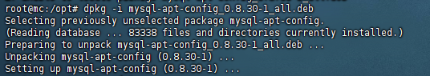
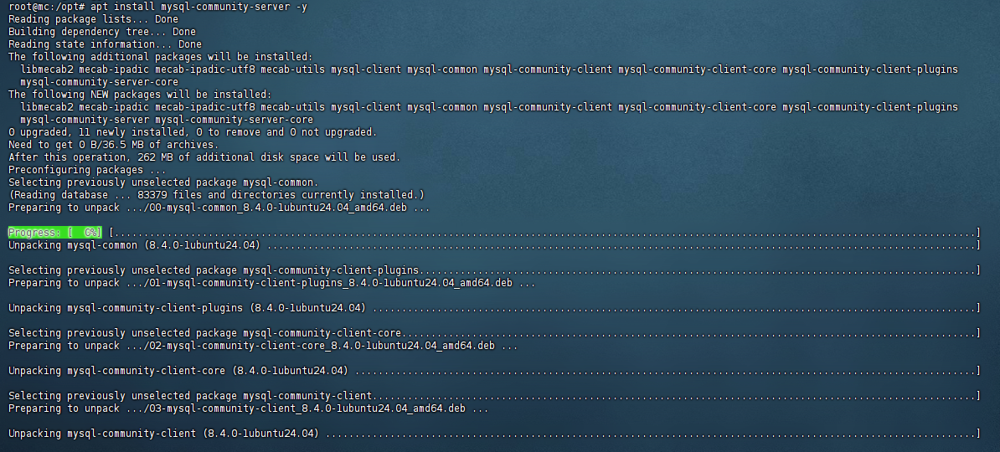
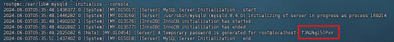
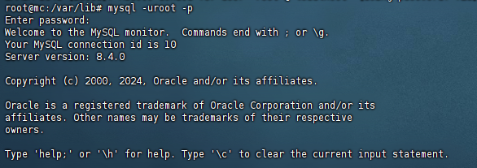
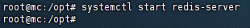
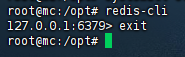
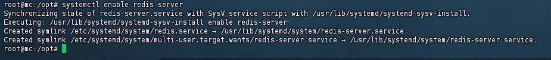

# 数据库安装

本部分讲解在命令行中安装常见数据库的方式。本教程以 Ubuntu 24.04 系统为例

## MySQL

### 安装

在[官方网站](https://dev.mysql.com/downloads/repo/apt/)页面下载 `mysql-apt-config_0.8.301_all.deb`

这个包是一个配置APT 的 MySQL 仓库。安装 mysql-apt-config 后，用户可以选择想要安装的 MySQL 版本。

将文件传入服务器 `/opt` 目录下，输入以下指令安装：

```
dpkg -i mysql-apt-config_0.8.30-1_all.deb
```



安装完成后使用以下指令更新软件包列表：

```
sudo apt update
```

随后进行 MySQL server （即 MySQL 服务）的安装，输入以下指令安装 MySQL：

```
apt install mysql-community-server -y
```



MySQL 默认会自带随机密码，所以等待安装完成后需输入以下指令查看初始密码：

```
mysqld --initialize –console
```



红框部分就是初始密码，安装已经完毕，接下来启动并 将 MySQL设为开机自启动，分别输入

```
systemctl start mysql
systemctl enable mysql
```

启动 MySQL 服务后，输入以下指令进入 MySQL 指令行：

```
mysql -uroot -p
```

按提示输入密码登录到 MySQL



输入修改密码指令：

```
ALTER user 'root'@'localhost' IDENTIFIED BY 'NewPassword';
```

将 NewPassword 修改为你自己设置的密码

**至此，MySQL 安装已经完成**

### 创建表

:::warning

以下的操作为 SQL 语句，在结尾处的 `;` 不能省略否则会报错。

:::

```
CREATE DATABASE IF NOT EXISTS XXX DEFAULT CHARACTER SET utf8mb4;
```

这里的 XXX 可以选择是你要使用数据库的插件名称也可以是自定义字符

### 创建用户

```
CREATE USER 'UserName'@'%' IDENTIFIED BY 'Password';
```

### 用户授权

```
GRANT ALL PRIVILEGES ON 数据库名称.* TO 'UserName'@'%';
```

:::tip

UserName 填写用户名，

`%` 代表所有 IP 地址，如果 Minecraft 服务端和数据库处于同一个服务器，建议改成 localhost 以增加安全性，

Password 填写用户的密码（由于安全性设置，密码必须有大小写长度8位以上，并且默认关闭远程访问）

如果需要设置密码强度为低，开启远程访问等不安全的操作请自行百度，对于修改安全设置之后的数据库安全问题，本站概不负责

:::

## Redis

依次在终端输入以下指令，分别操作为安装依赖、下载 Redis、将安装包放在安装路径。更新软件包，安装下载好的 Redis

```
apt install lsb-release curl gpg
curl -fsSL https://packages.redis.io/gpg | sudo gpg --dearmor -o /usr/share/keyrings/redis-archive-keyring.gpg
echo "deb [signed-by=/usr/share/keyrings/redis-archive-keyring.gpg] https://packages.redis.io/deb $(lsb_release -cs) main" | sudo tee /etc/apt/sources.list.d/redis.list
apt update
apt install redis -y
```

安装完成后输入 `systemctl start redis-server`



至此安装完成，输入 `redis-cli` 即可进入命令行管理



:::tip

使用 systemctl enable redis-server 使 Redis 开机自启



:::
