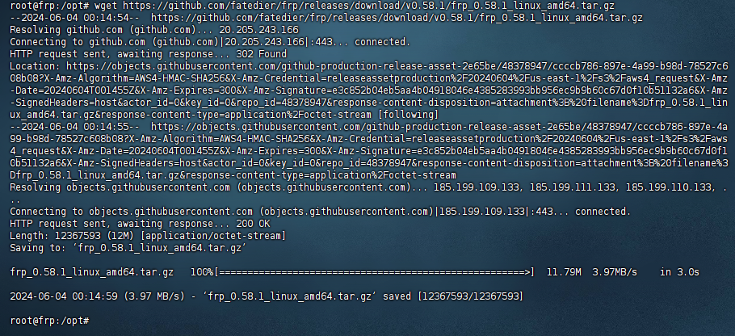
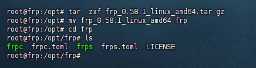
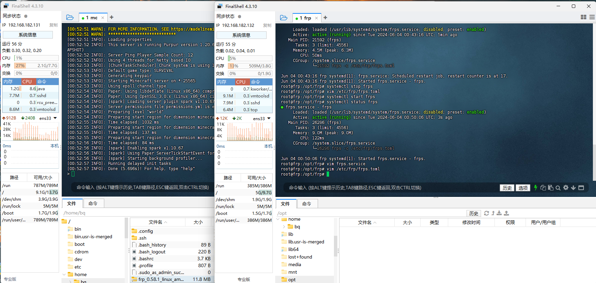
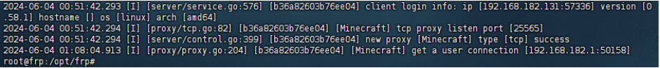

# 搭建内网穿透（Frp）

## 使用现成的内网穿透提供商

[Sakura Frp](https://www.natfrp.com/?page=panel&module=download) - 注册登录后前往 [下载页面](https://www.natfrp.com/tunnel/download) 下载 Frp 启动器。安装过程参考官方 [安装教程](https://doc.natfrp.com/launcher/usage.html) 即可。

## 搭建 Frp

获取 Frp [下载链接](https://github.com/fatedier/frp)



解压缩重命名



### 服务端配置 frps.toml

```
bindAddr = "0.0.0.0"
bindPort = 7000
kcpBindPort = 7000
log.to = "/var/log/frps.log"
log.level = "info"
log.maxDays = 3
auth.method = "token"
auth.token = "12345678" #这里改成你自己的token
```

### 客户端配置 frpc.toml

```
serverAddr = "192.168.182.132" #这里服务器ip填你自己的ip
serverPort = 7000
log.to = "/var/log/frpc.log"
log.level = "info"
log.maxDays = 3
auth.method = "token"
auth.token = "12345678" #这里的token要和上面服务端的一致
[[proxies]]
name = "Minecraft"
type = "tcp"
localIP = "127.0.0.1"
localPort = 25565
remotePort = 25565
```

### 将 Frp 添加到系统指令

服务端：

```
cp frps /usr/bin
```

客户端：

```
cp frpc /usr/bin
```

### 将配置添加到系统配置目录里

服务端：

```
mkdir -p /etc/frp
cp frps.toml /etc/frp
```

客户端：

```
mkdir -p /etc/frp
cp frpc.toml /etc/frp
```


### 配置服务自启动进程

#### 客户端 frpc.service

```
[Unit]
Description=frpc
After=syslog.target  network.target
Wants=network.target

[Service]
Type=simple
ExecStart=frpc -c /etc/frp/frpc.toml
Restart= always
RestartSec=1min
ExecStop=/usr/bin/killall frpc


[Install]
WantedBy=multi-user.target
```

#### 服务端 frps.service

```
[Unit]
Description=frps
After=syslog.target  network.target
Wants=network.target

[Service]
Type=simple
ExecStart=frps -c /etc/frp/frps.toml
Restart= always
RestartSec=1min
ExecStop=/usr/bin/killall frps

[Install]
WantedBy=multi-user.target
```

### 启动服务

服务端：

```
cp frps.service /usr/lib/systemd/system/
systemctl start frps.service
```

客户端：

```
cp frpc.service /usr/lib/systemd/system/
systemctl start frpc.service
```

效果展示：



在我们这个演示例子中：

Minecraft 服务器启动于 192.168.182.131 上

Frp 服务器启动于 192.168.182.132 上

Frp 日志中可以输入以下指令查看 Frp 日志

```
cat /var/log/frps.log
```


