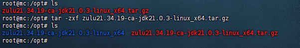
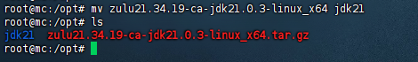
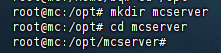
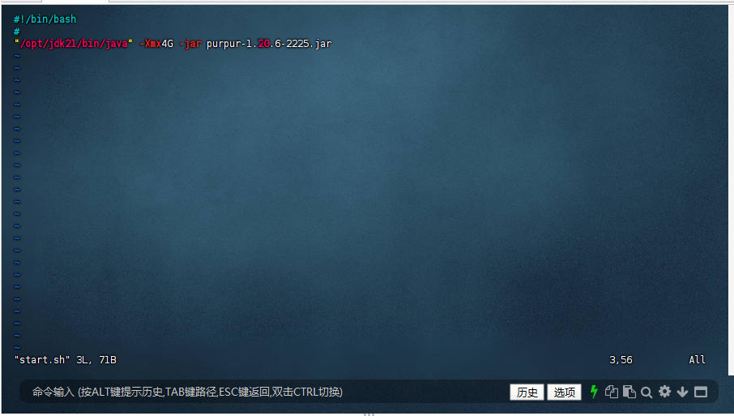
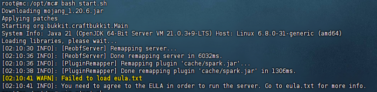
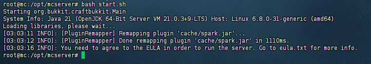

# 开服

开服之前，请检查服务器是否安装了 Java，在终端输入

`java -ver`

如果你看到类似以下的输出，那么服务器中已经安装了 Java

```
openjdk version "21.0.2" 2024-01-16 LTS
OpenJDK Runtime Environment Zulu21.32+17-CA (build 21.0.2+13-LTS)
OpenJDK 64-Bit Server VM Zulu21.32+17-CA (build 21.0.2+13-LTS, mixed mode, sharing)
```

## Java 安装

如果已经安装了 Java，可以忽略掉这一部分。如果环境未安装 Java 可以参考：

<details>
    <summary>Java 安装</summary>

一般来说，在 Linux 中进行软件安装部署会放在 `/opt` 目录下，我们也遵循这个规则，当然你也可以不遵循

使用cd切换到/opt目录

`cd /opt`

### 下载

#### SFTP 文件传输

不熟悉 wget 时，先使用 Windows 前往[zulu下载](https://www.azul.com/downloads/?package=jdk#zulu)，下载再使用 SFTP 软件上传到服务器 `/opt` 目录下。


#### wegt 下载

使用 wget 指令下载

`wget https://cdn.azul.com/zulu/bin/zulu21.34.19-ca-jdk21.0.3-linux_x64.tar.gz`


### 压缩包解压

解压压缩包：



将目录重命名为 jdk21 ：



这样就算是安装好了（PS：这里的操作仅适用于开服使用，若需要其他需要jdk的操作请使用包管理器安装openjdk）

</details>

## 开服

:::warning

TODO - 完善和排版

:::

在/opt目录中使用mkdir创建一个目录用于开服



将核心放入服务器内，并编写简单的开服脚本，使用 chmod 命令给脚本增加运行权限



输入./start.sh或者输入bash start.sh即可启动



使用vim修改eula为true就可以开服了

