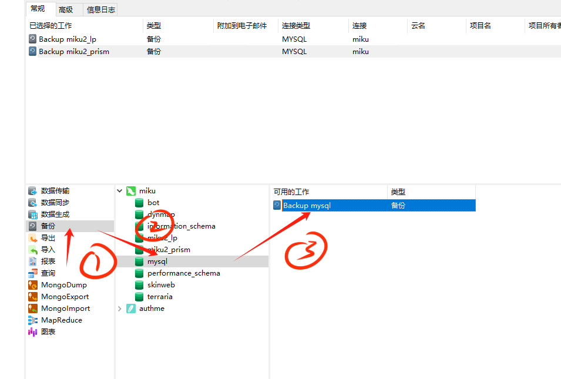
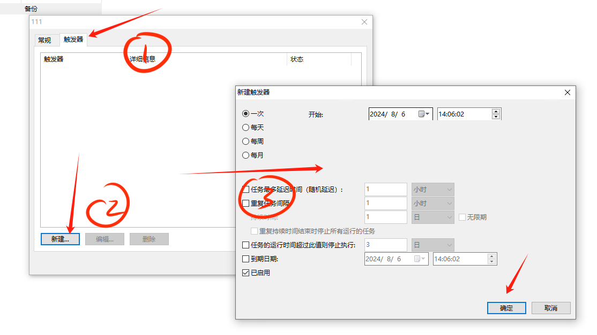

## 数据库备份

### 手动备份

TODO

### 自动备份

#### 使用 Navicat 自动备份

点击自动运行，然后点击新建批处理作业

之后分别点击: 备份 - 需要备份的数据库名字 - backup 数据库名

即可添加备份任务

完成这些步骤后点击保存，设置完任务名称后点击设置计划任务

点击触发器，新建触发器，然后自行设置备份任务时间

最后保存计划任务就大功告成啦