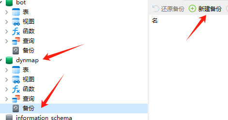
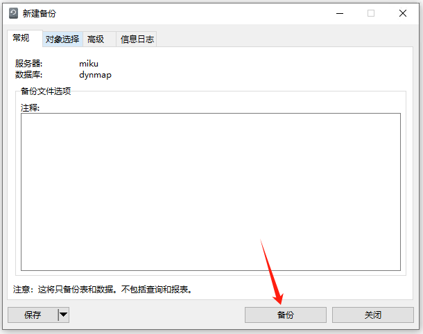
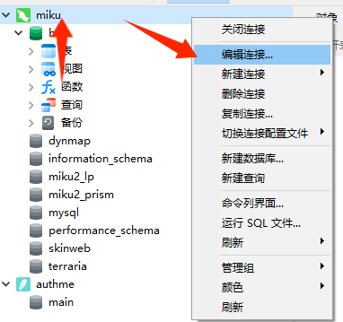
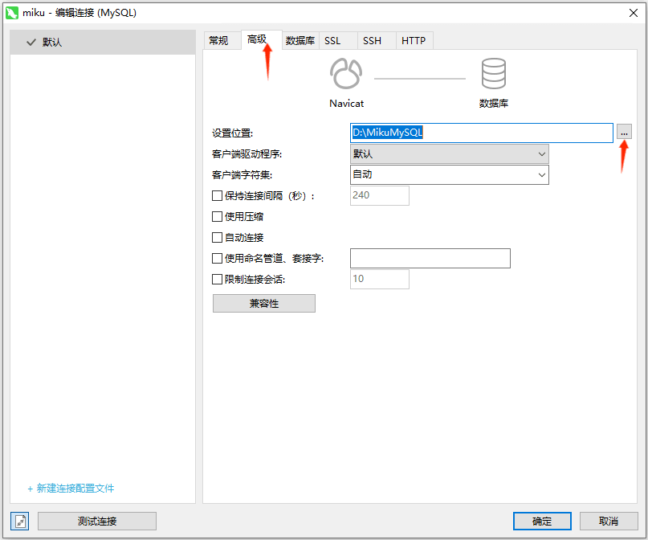
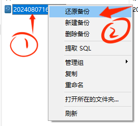
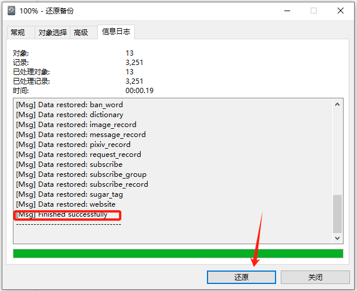
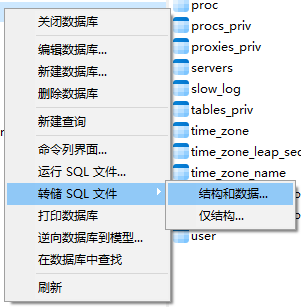
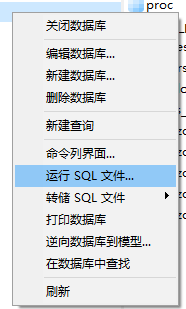
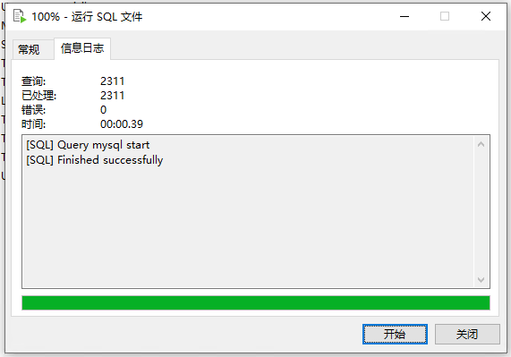

## 手动备份

### 使用命令行备份

TODO

### 使用 Navicat 备份

展开你想要备份的数据库，点击备份，再点击新建备份

然后点击备份即可开始备份

中间的命令行提示这一条的时候备份即已完成

**那我可以指定把数据库备份放在那里吗？**

当然可以!

右键你的连接，点击编辑连接

点击数据库，修改这里的设置位置即可让 Navicat 将你的数据库备份到你想要到的地方了

**如何使用备份？**

右键你想要使用的备份，然后点击还原备份

然后在弹出的界面中点击还原，当命令行出现这句话的时候，数据库就还原成功了

**对于数据量非常大的数据库，备份起来很慢，还容易出错，怎么办？**

遇到这种情况，不用慌张，我们这个时候转储 SQL 文件即可

转储 SQL 文件，能够极大降低还原备份时出错、数据缺失的问题

我们右键想要转储为 SQL 文件的数据库，点击转储 SQL 文件，点击结构和数据

之后我们选择一下 SQL 文件的转出位置

当命令行出现这句话的时候，即已完成转储

之后当我们需要使用备份的时候，我们再次右键那个数据库，点击运行 SQL 文件

然后找到你之前转储的后缀为 `.sql` 的文件，选中并确定后点击开始。当命令行出现这句话的时候，数据库就还原成功了

### 使用 HeidiSQL 备份

TODO

### 使用小皮工具箱备份

TODO

### 使用宝塔面板备份

TODO

## 自动备份

### 使用 Navicat 自动备份

点击自动运行，然后点击新建批处理作业

之后分别点击: 备份 - 需要备份的数据库名字 - backup 数据库名

即可添加备份任务

完成这些步骤后点击保存，设置完任务名称后点击设置计划任务

点击触发器，新建触发器，然后自行设置备份任务时间

最后保存计划任务就大功告成啦