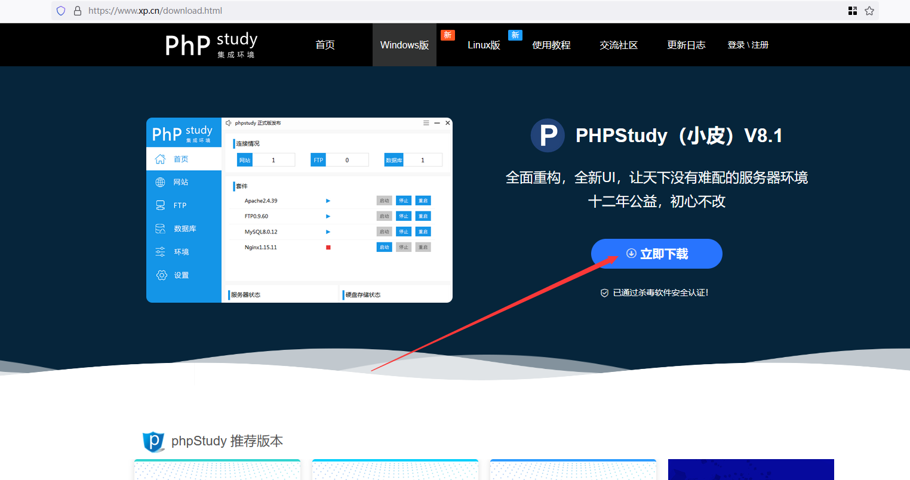
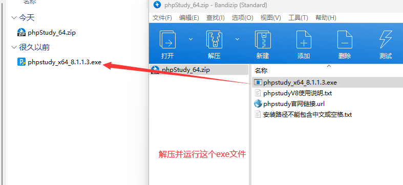
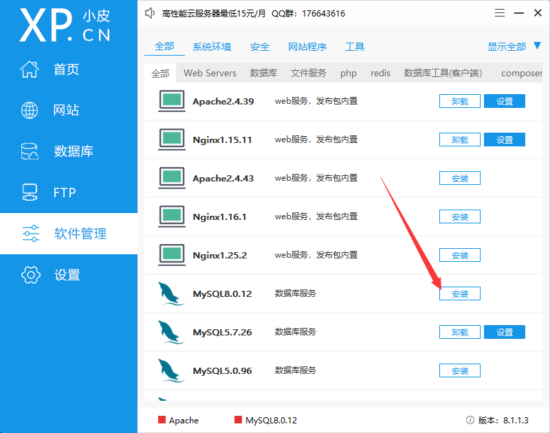
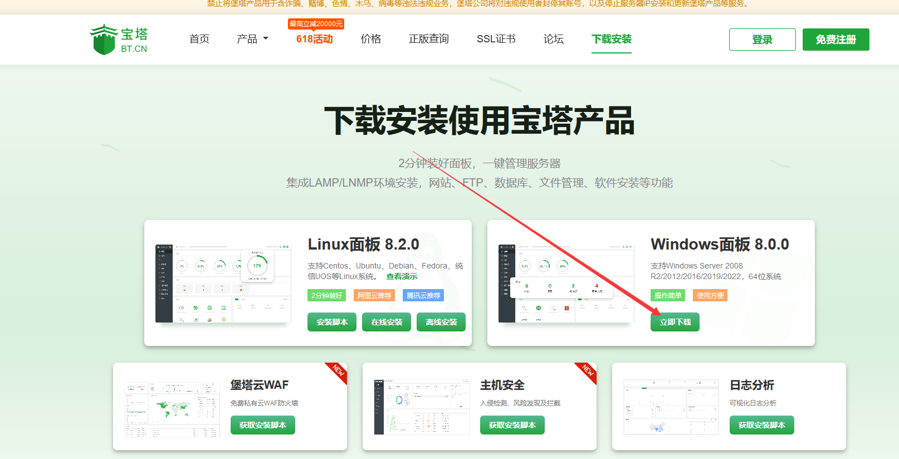
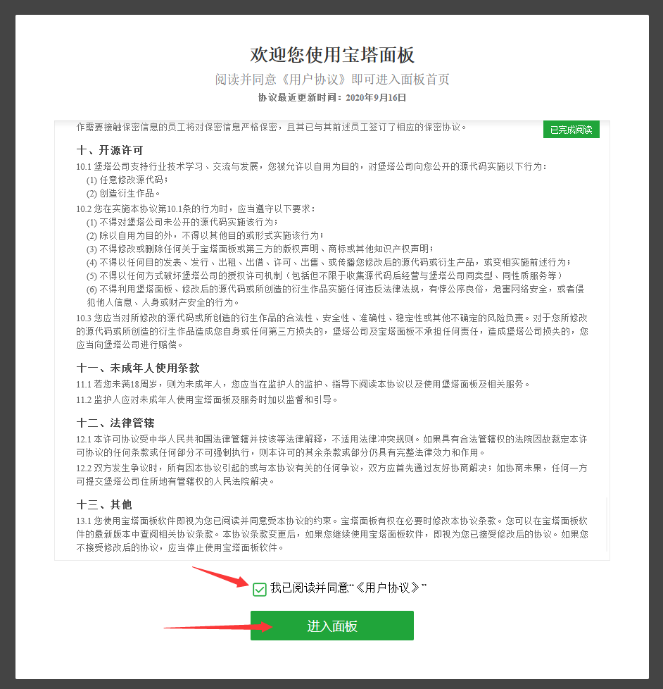
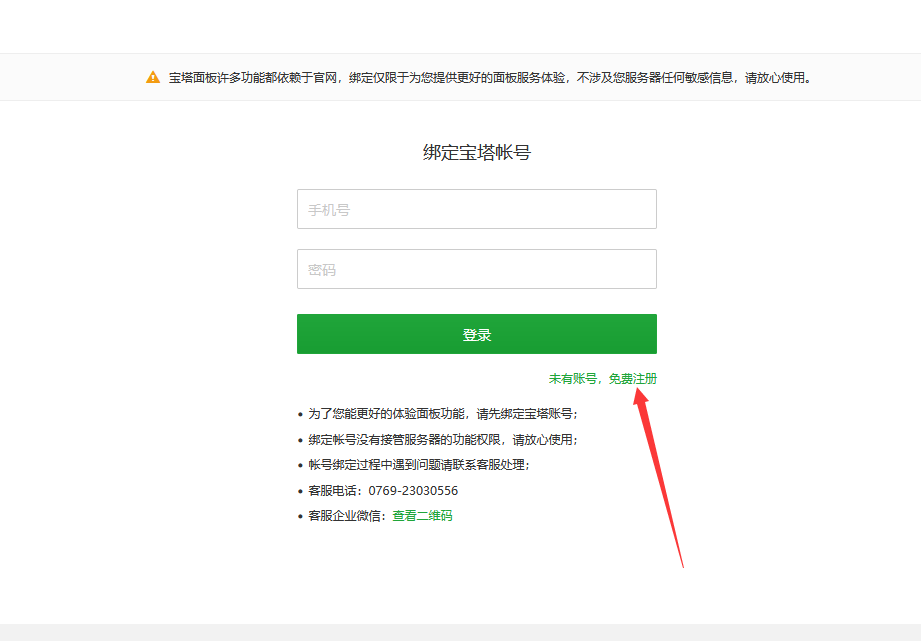
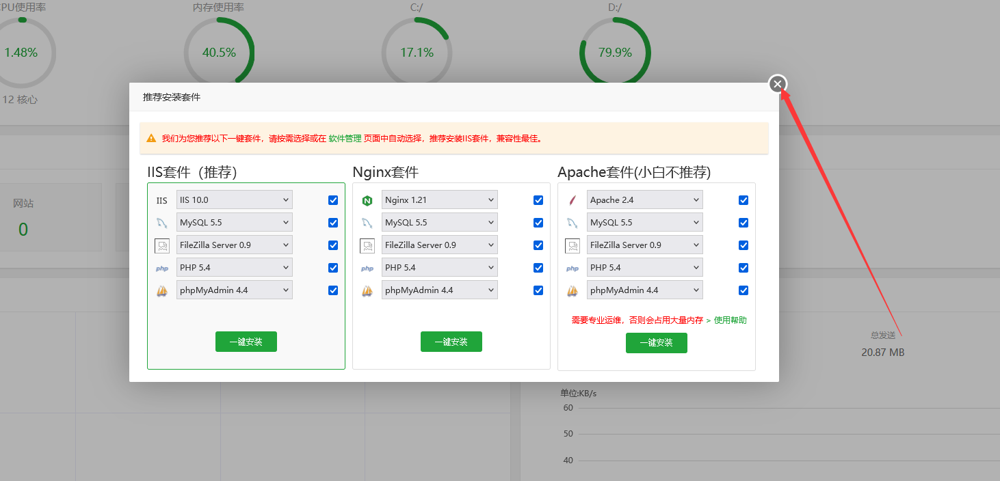
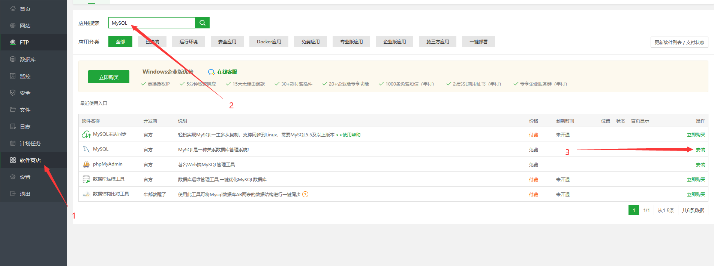
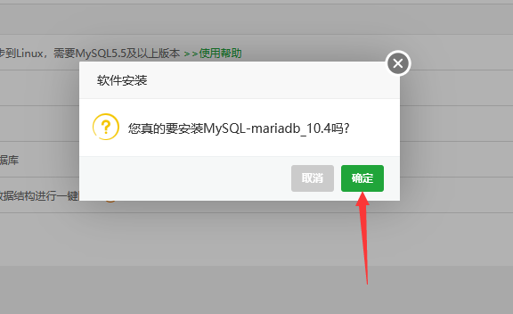

# 安装

我会告诉你 **我认为** 最简单的几种安装数据库的方法

## 小皮数据库

  
从官网下载和安装

  
卸载MySQL5和安装MySQL8

MySQL5 版本太低了，很多插件需要更高版本的，装 MySQL8 就够用了

## 宝塔面板

  
从官网下载和安装

宝塔面板是必须要绑定账号的

按照提示去做

全 x 掉，一个都不需要装

  
安装MySQL

