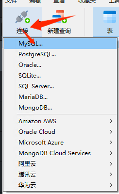
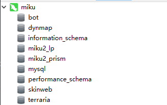
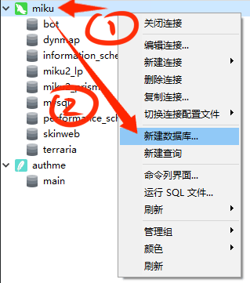
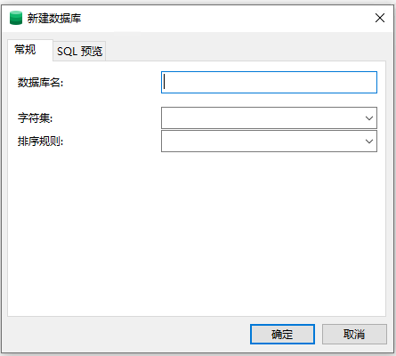
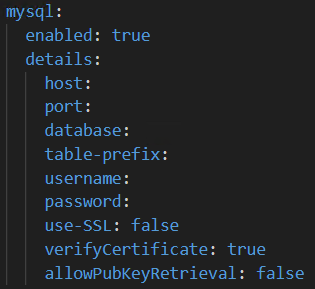

## 数据库管理

:::warning

1. 请一定记得关闭远程数据库访问，如果一定要开启远程数据库请设置复杂密码

2. 务必要调整数据库的配置文件，否则容易炸

3. 一般连接数据库使用的用户最好别用 root ，root 紧急情况下才会用，建议重新创一个账户

4. 数据库能跑就别乱动他，很容易炸

:::

## 使用数据库管理软件管理

### Navicat

:::info

官网 https://navicat.com.cn/products

 :::

**Navicat** 是一款企业级的简单易用的数据库管理软件

**优势**

- 简单易用，并且功能齐全

- 界面美观

- premium 版本支持多种数据库的管理，如 MySQL 、 MangoDB 等

**劣势**

- 收费，而且不便宜

#### 教程

<details>
  <summary>连接数据库</summary>

点击连接，并选择你想要连接的数据库的类型



然后分别填写:

- 连接名: 你想让他在 Navicat 中显示的名字，方便你辨认

- 主机: 填写主机 ip 地址,如果数据库就在本地，那就填写 localhost

- 端口: 数据库使用的远程端口，默认是 3306

- 用户名: 使用某个用户登录数据库，默认是 root

- 密码: 即登录数据库的密码，你在安装数据库的时候就已经设置过了，自己要记好！


填写完毕后点击确定即可

顺利的话，点开数据库后会显示一个绿色图标的海豚，并列出内部的数据库



否则他会报错

一般有这几种情况导致连接不上:

- 数据库主机、端口填写错误

- 用户名、密码不正确

- 数据库未开启远程连接，而且数据库不在本地

- 数据库没开或者炸了

请根据具体报错具体分析

</details>

<details>
  <summary>创建数据库</summary>

右键数据库图标，点击新建数据库



然后分别填写:

- 数据库名: 你自己想一个，之后要给插件认的，同时也方便你辨别

- 字符集: 请选择 `UTF8mb4`

- 排列规则: 可以选择 `utf8mb4_general_ci` 或者 `utf8mb4_bin`



然后点击确定即可创建数据库

</details>

### HeidiSQL

:::info

官网 https://www.heidisql.com/

GitHub https://github.com/HeidiSQL/HeidiSQL

:::

**HeidiSQL** 是一款开源的简易数据库管理软件

**优势**

- 简单好用，基本功能齐全

- 界面简洁

- 支持多种数据库的管理，如 MySQL 、 MangoDB 等

**劣势**

- 没有?

#### 教程

TODO

### 小皮数据库

#### 教程

<details>
  <summary>配置数据库</summary>

安装好后在首页启动 MySQL


更改 root 账户的密码

:::danger

不要设置过于简单的密码！

尤其是你打算把数据库开到公网，**绝对不要**设置过于简单的密码！

**这真的很严重**

:::


然后你就可以建数据库了，建好之后把你填这里的信息填到插件的配置文件里

</details>

### 宝塔面板

#### 教程

<details>
  <summary>配置数据库</summary>

TODO

</details>

## 手动管理

PS: 这年头谁还用指令管理数据库啊

:::info

语句示例:

```sql
CREATE DATABASE <数据库名称> CHARACTER SET utf8mb4 COLLATE utf8mb4_general_ci;
```

解释: `CHARACTER SET utf8mb4` 将数据库字符集设置为 utf8mb4， 能够存储包括表情符号在内的所有 Unicode 字符。 `utf8mb4_general_ci` 是一种不区分大小写（case-insensitive）的排序规则，如果你想区分大小写，可以改为 `utf8mb4_bin`，`_bin` 意为以二进制方式比较字符。

:::

TODO

## 插件连接数据库

下面，我们来演示一下怎么让插件连接上数据库

我们以 MySQL 为例:

这是一般插件的数据库配置项



我们来一一介绍他们的用途

- enabled: 是否启用 MySQL 存储数据？如果是请填 true ，否则填 false ，默认是 false ，而且有些插件是直接让你填写数据库类型的，默认是 SQLite ，对于这种配置文件，请把 SQLite 改成 MySQL 或者其他你使用的数据库名

- host: 也就是主机地址，如果数据库在本地，请填 localhost

- port: 数据库端口，默认是 3306

- database: 数据库名，也就是你在数据库下创建的数据库你为他设置的名字

- table-prefix: 数据库表的前缀，可以不管他

- username: 使用哪个用户来连接数据库？切记一般别用 root 否则连接数满的时候有你好受的

- password: 也就是上面那个 username 里面填的那个用户的登录密码

后面的就不做解释了，一般用不着

更改完后保存配置，然后重启服务器，如果连接成功，那么你在数据库管理软件上会看见那个插件的数据库下面已经自动生成表了

如果连接不上，插件在启动的时候就会报错，一般导致连接不上的原因有:

一般有这几种情况导致连接不上:

- 数据库主机、端口填写错误

- 用户名、密码不正确

- 数据库连接数满了

请结合报错分析原因