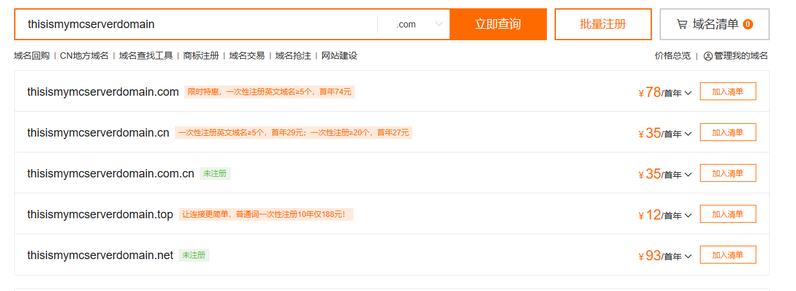

# 申请域名

域名不但是服务器的招牌，也是老玩家重新找回的一个重要渠道，一个好的域名应该够短（太长了没人记得住）、有记忆点（最好是和 Minecraft 或玩法相关），那么准备好一点小钱钱和待选的名字开始吧。

## 什么是域名

简单来说，域名就是将计算机之间识别网络地址的 IP ，变成人类能够读懂、方便记忆的一串 **用点分隔的字符串**

例如:

* github.io
* 仿真教学.中国
* live.bilibili.com
* example.mc.12345.org

这些字符串和 IP 的对应关系被储存在 DNS 服务器上，当访问域名时候会查询 DNS 从而解析到 IP，

除此之外，DNS 服务器会记录不同域名所有者对于 IP 对应的修改情况，

以上的域名使用了数量不同的 `.` 将其分开，每段片段可以是中文、英语、或者数字等。

从右往左数第 n 个被 `.` 分开的片段就是 n 级域名，下表示意了例子中对应的域名级别：

:::tip

有些资料认为顶级域名后的域名为一级域名，此处以顶级、二级、三级为准。

:::

| 四级域名 | 三级域名 | 二级域名 | 顶级域名 |
| -------- | -------- | -------- | -------- |
|          |          | github   | io       |
|          |          | 仿真教学 | 中国     |
|          | live     | bilibili | com      |
| example  | mc       | 12345    | org      |

其中一级域名代表了国家（cn 代表中国）、用途（com 代表公司）。我们主要需要考虑的是 **二级域名**，

作为 Minecraft 服务器，域名不仅方便了玩家记忆和进入，也代表了服务器的玩法或名字。

因此，我们建议所有长期开放的 Minecraft 服务器都购买自己的域名。

## 寻找合适的域名提供商查询域名

以阿里云的[万网](https://domain.aliyun.com/)为例，打开网站，来到如下页面：

搜索你想要的域名

:::warning

此处域名价格为你输入域名的人气决定，名称越热门越贵，没有优惠最便宜首年也这个价。

有些域名首年很便宜，但第二年续费要成百上千，将鼠标悬停在价格旁边的倒三角处查看续费价格，

我们推荐.top，第二年价格最低，长期开服绝对推荐。

出于很多原因不推荐使用所谓的免费域名

:::

## 购买域名

登录后点击域名旁边的加入清单，然后点批量注册旁边的域名清单，更改域名购买时间后，最好底下什么套餐都不要选，直接点立即购买。

跳转后这个页面立即购买是点不动的，滑动到下方，点击创建信息模板来实名验证。

:::tip

此操作未成年也可以，但无论如何信息需要真实（通讯地址似乎不用太精确，填到市就能过了），请不要拿着他人的身份证假冒认证！

:::

点提交后等通过，然后回来勾选最底下的我已阅读、理解并接受《域名服务条款》。在下一个页面选择支付方式后点支付。

:::tip

购买的域名一般需要至多 24 小时才能正常解析，打开网址 `https://whois.aliyun.com/domain/ + 你的域名`，如果域名状态那里是正常状态 `（ok）` 就代表可以使用了。

:::

:::warning

**购买域名后，一定要记得续费！！！** 你可以定一个提醒，在域名**快过期**的时候续费，

如果你预算充足，那就直接把域名续费到比自己服务器能开的时间还要长。

如果域名过期，你的玩家将 **不再能通过他们之前输入的地址连接服务器**，

导致玩家连接服务器失败的情况。而且如果你注册了好域名但没及时续费，你的域名可能被 **抢注** ，

这会导致你必须通过各种手段从抢注域名的人手里高价赎回域名，或者被迫更换其他域名。

:::

# 域名解析

A 记录是 DNS 中用于将域名映射到 IPv4 地址的记录（也就是我们常用的 IP 记录）。

SRV 记录，使用二级域名记录了端口的信息，使用 SRV 可以隐藏域名端口。

:::warning

文档中，假设你购买了域名 `xxx.top`，服务器在外网的端口为 `22222` ，请勿直接照抄配置。

:::

## A 记录

将域名指向一个 IPV4 地址。

人话就是把数字 IP 地址解析成英文字符的域名。

打开网址 [阿里云域名控制台](https://dc.console.aliyun.com/#/domain-list/all)，找到你的域名点右边蓝色字的解析。

点击添加记录，记录类型选择 A 记录。

主机记录改为 `@` （这意味着直接使用二级域名），记录值改为服务器数字 IP 。

等待解析生效。此时，玩家可通过 `xxx.top:22222` 进入服务器了。

:::tip

1. 如果只知道域名不知道 IP 就 Win + R 输入 cmd，随后输入 ping + 域名。

2. 主机记录可以改成如 `play` 等，玩家就可以通过 `play.xxx.top:22222`（但这是不是有点太长了，除非你有明确的需求必须使用这种三级域名，否则不推荐）。

:::

## CNAME 记录

将域名指向另一个域名。

假如服务商给的是解析好的域名不是 IP，比如服务器的连接地址是play.simpfun.cn:xxxxx，那就需要用这个来指向你自己的域名。

记录类型选 CNAME。

然后主机记录填你需要的二级域名，填写 `@` 代表直接使用二级域名，玩家连接服务器时可以不用前缀。

记录值填服务商给的域名就行了。

## SRV 记录

点击添加记录，记录类型选择 SRV 。

然后主机记录填你需要的二级域名，如你需要使用 `mc.xxx.top` 代替 `xxx.top:22222` （端口），就将主机记录改为：

`_minecraft._tcp.mc`

此处的 mc 可以改为其他，如 `play` 、`*` 等，填写 `@` 可以不用前缀。

记录值填写为：

`5 0 22222 xxx.top`

> 5 0 是固定的，22222 是你的端口

点击确认，等一会，你就可以发现直接用域名可以连接上你的服务器了。

:::tip

此方法只能用于 Minecraft Java版服务器，不能用于其他服务，比如基岩版就不支持这种srv，

所以基岩版玩家进服时必须仍然要正常填写域名和端口，即使服务器为 Java 版的互通服。

:::

## AAAA 记录

将域名指向一个 IPV6 地址。和 A 记录的不同之处是，AAAA 记录专门用来指向 IPv6 地址，不能指向 IPv4 地址。同理，A 记录也只能指向 IPv4 地址，不能指向 IPv6 地址，这也意味着你如果要为服务器的IPv6地址也绑定一个域名，你就必须要再创建一条 AAAA 记录。

按照A记录中的方法找到你的域名点右边蓝色字的解析。点击添加记录，记录类型选择 AAAA 记录。

填写主机记录名，比如 playv6 。记录值改为服务器 IPv6 地址。

等待解析生效。如果记录名为 playv6 ，此时支持 IPv6 的玩家就可通过 `playv6.xxx.top:22222` 进入服务器了。

:::tip

因为大环境原因，很多玩家目前都无法通过 IPv6 连接到服务器，所以除非你有非常明确的目的，否则完全没有必要为服务器的IPv6地址配置AAAA记录。

:::

#### 为双栈网络的服务器配置同时支持 IPv4 和 IPv6 的域名

不仅可以有同时多个域名同时指向同一个 IP 地址的情况，也可以有同一个域名同时指向多个 IP 地址的情况。

你或许已经知道，很多已经支持 IPv6 的网站虽然在支持 IPv6 的情况下可以通过 IPv6 访问，

但是仅支持 IPv4 的网络也仍然可以访问。这是因为边些网站的域名**既指向了 IPv4 地址，也指向了 IPv6 地址**，

它的实现原理是为同一个域名同时添加 A 记录和 AAAA 记录。要实现这个目的，你只需要：

1. 在域名注册商的后台打开服务器 IPv6 地址正使用的 AAAA 记录的编辑页面。
2. 把主机记录名改为和 A 记录一样的，比如服务器的连接地址是xxx.top:22222，那么AAAA记录的记录名也写 @ ，和 A 记录保持一致，然后保存。
3. 你的玩家就可以在支持IPv6的网络环境下通过 IPv6 连接到服务器了。不支持 IPv6 的玩家不受影响，他们可以继续正常地通过 IPv4 连接到服务器。

:::warning

A 记录和 AAAA 记录都与 CNAME 记录冲突，如果你的服务器 IPv4 连接地址对应的域名是 CNAME 记录，你需要把那个记录改为A记录并指向服务器的 IPv4 地址，然后才能继续添加 AAAA 记录。

:::

## DDNS 服务

在一些网络中，即使不更换服务器，IP 地址也会发生变化。这就是动态 IP；而如果 IP 地址始终和同一台电脑绑定，也就是说这台电脑的 IP 地址永远不会变化，这就是静态 IP 。

如果服务器是静态 IP，那么你就不用担心域名和 IP 无法对应，因为只要你不去手动更换服务器（或者换 IP），服务器的 IP 就不会变化。但是动态 IP 就不一样了。在使用动态 IP 的情况下，即使你完全不对服务器进行任何操作，服务器的 IP 地址也会改变，这会导致域名和 IP 在维护者不知情的情况下无法对应。

所以为了能把电脑的 IP 地址的变化随时同步到 DNS 服务器上，需要这台电脑自己能够发现自身 IP 地址的变化，并且自行和 DNS 服务器同步。而用来实现电脑发现自己 IP 地址的变动并同步到 DNS 服务器的这种服务就叫 DDNS（动态域名解析服务）。有了这个服务，电脑就能随时更新自己对应的域名对应的 IP ，这样无论自己的 IP 地址怎样变化，那个域名都能一直指向自己。这样一来使用者也可以直接通过域名来访问那个IP地址不固定的服务器了。

我们的家用宽带几乎全都是动态 IP（点名批评杭州华数，在杭州能给一个阿拉斯加的 IP）。如果你申请到了公网 IPv4 ，或者你让玩家能够通过 IPv6 连接服务器，那么你就需要把你的公网 IPv4 和 IPv6 告诉玩家。然而作为家用宽带，这些地址都是动态的。所以你必须要给服务器配置 DDNS 服务，否则你就必须要频繁地重新公布连接地址或者手动更新域名解析。

DDNS 服务必须需要一个域名才能开始搭建。运行 DDNS 服务的软件，目前开服圈子最常用的是[ddns-go](https://github.com/jeessy2/ddns-go)，这个软件开箱即用，只需要简单的几步配置就可以让域名绑定在服务器上，非常方便。

由于读者可能使用各种各样的域名注册商，而且限于篇幅，本文仅提供 Windows 系统上的腾讯云服务器和 ddns 配合使用的教程，

其他注册商和操作系统的配置方法大同小异，读者们灵活变通即可，有不懂的地方善用搜索引擎搜索。

1. 前往 https://github.com/jeessy2/ddns-go/releases 下载最新版的 ddns-go 安装包。
2. 将安装包（就是下载的那个压缩包）解压到一个不会被自己误删除的位置（如果你不知道哪里自己不会误删除，就直接解压到文件管理器左侧的文档那个文件夹）。
3. 在 `ddns-go.exe` 所在的同级目录[打开 Powershell](https://cn.bing.com/search?q=%E6%80%8E%E4%B9%88%E6%89%93%E5%BC%80windows%E6%8E%A7%E5%88%B6%E5%8F%B0)。
4. 执行 `./ddns-go.exe`。
5. 打开浏览器，访问网站 localhost:9876 ，这是 ddns-go 的管理面板。
6. 提示输入帐号密码，由于这是你首次打开网站，直接点击登录。
7. DNS 服务商选择 DNSPod（腾讯云）。
8. 进入 DNSPod 官网 dnspod.cn 。登录自己的帐号，点击帐号头像，点击 API 密钥，点击 DNSPod Token，点击创建密钥，先将 ID 和 Token 分别复制到 ddns-go 管理面板的DNS 服务商项中的 ID 和 Token 中，再关闭 DNSPod 控制台中弹出的窗口。
9. 往下翻，根据自己的实际情况启用 IPv4 或 IPv6 。获取方式都建议选择通过接口获取。在 `Domains` 中填写要跟踪的解析记录，例如你想让 `mc.arsky.club` 指向这台电脑，那就在里面填写 `mc.arsky.club` 。不要只填写 `mc`，要把整个域名都写上。
10. 在`其他配置`中，勾选`禁止公网访问`，然后设置 `ddns-go` 的登录用户名和密码。下载登录后台的时候，你就必须要输入自己设置的用户名和密码来登录了。如果实在记不住用户密码就在服务器桌面上创建一个文本文档写里面，当然不推荐这么做，因为这很不安全，除非你认为自己真的记不住用户名和密码。
11. 点击最下面的 `Save`。
到这里域名解析就配置成功了。此时控制台翻到顶，右边应该会出现日志，如果有修改域名解析 xxx 成功！或者 IP 未改变，将等待 n 次后与 DNS 服务商进行比对，就是配置成功了。如果失败了，日志会提示错误原因。
