---
title: 搭建官网
sidebar_position: 8
---

# 搭建官网

## 使用 Github + Cloudflare saas 回源

如果无法正常访问 Github 或 Cloudflare，请使用 [Watt Toolkit](https://steampp.net)

### 0\. 要准备的

主域名，回源域名

### 1\. 注册一个github账号

进入github.com，点击sign up

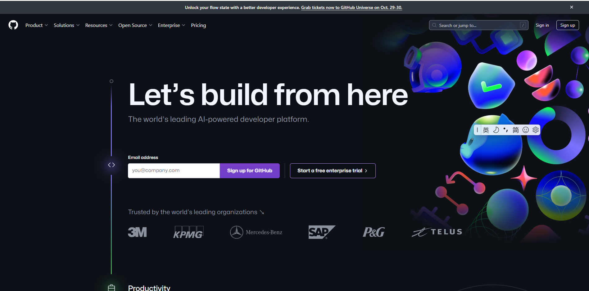

进入后按照提示完成注册(看不懂自己用翻译)

进入主页后点击左上的new(绿色的)

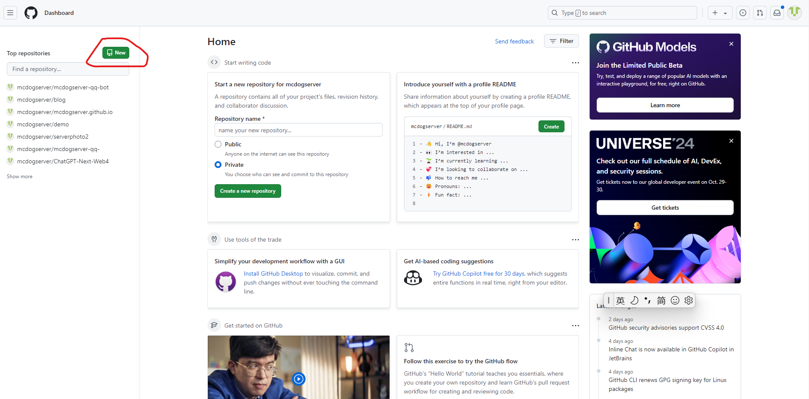

会跳转到一个界面

Repository name填 你的用户名.github.io

如果不会git的话就勾选Add a README

然后点Create repository
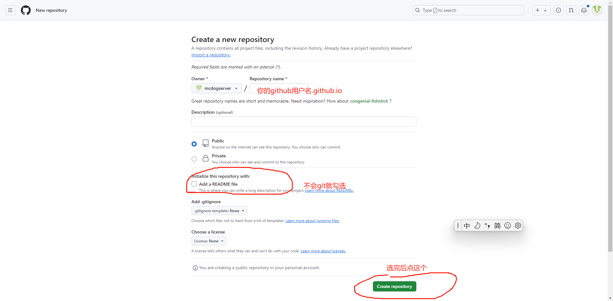

会直接到创建的项目主页

点Add file 会出来两个选项点Upload files

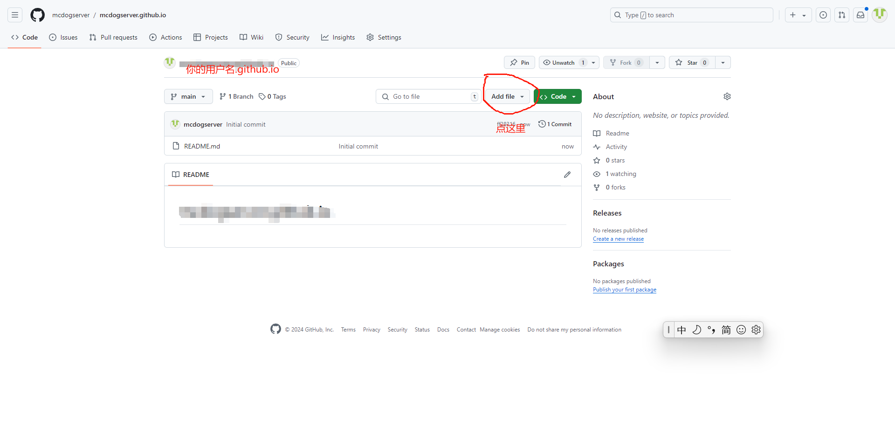

会来到上传界面，上传你的网站源码(首页的名字要改成index)

上传完后点Commit changes

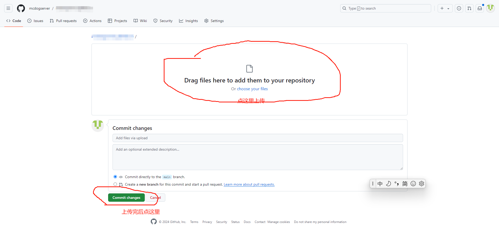

然后你访问 你的用户名.github.io就可以访问了

如果你做到这一步至此你的网站已经是搭建完成了。但是由于某些特别的原因，大陆访问 Github Pages 服务比较困难。为了保证不懂技术的普通玩家们顺利访你的服务器官网，可以选择以下方式

### 2\.cloudflare saas回源

:::warning

注意!如果想要域名访问要先在github项目的settings-pages-Custom domain 添加域名

:::
先将你的回源域名绑定到cloudflare

然后创建一个DNS记录

类型填CNAME 名称填origin 内容填你刚刚搭建完的网站

你的用户名.github.io 选择开启小黄云 点保存

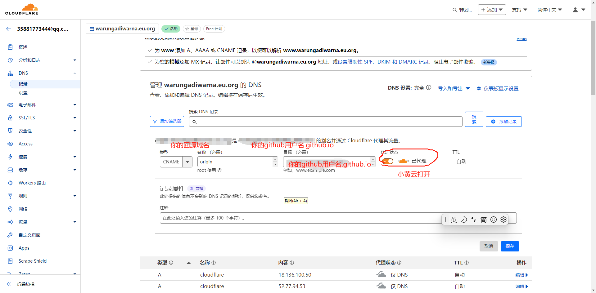

然后来到ssl/tls-自定义主机名

然后选择开通，如果它提示你要绑卡的话，如果你没有卡，你可以上闲鱼买一个15块的代绑

开通完成后，先在回退源那输入你刚刚创建的DNS记录origin.你的回源域名
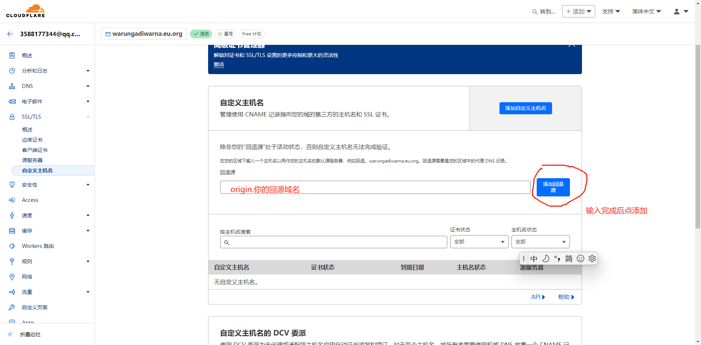

等待到那里显示生效后 点击添加自定义主机名
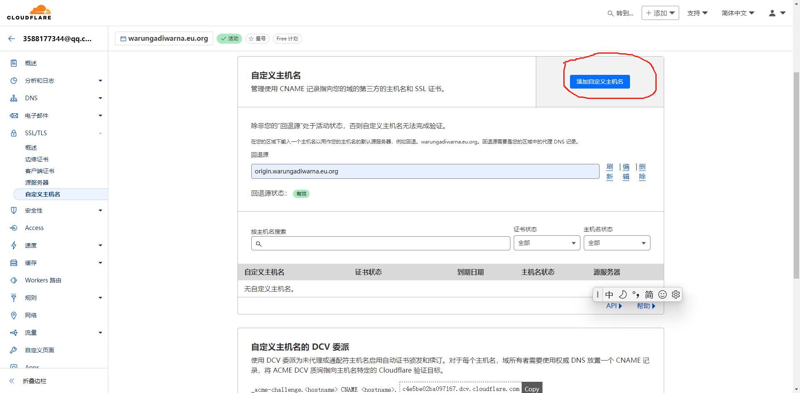

自定义主机名填你的用来开网站的域名

填完后点击添加
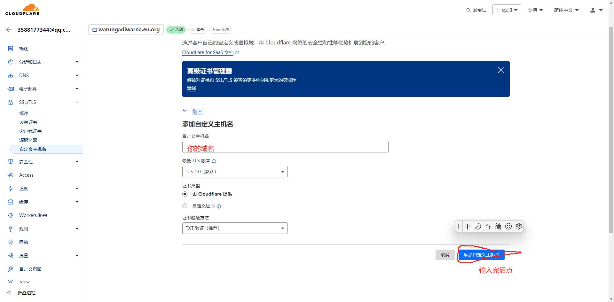

然后按照提示完成txt授权

然后回到DNS记录

添加一个类型为CNAME 名称为cdn 内容为
cf-cname.xingpingcn.top 不需要开启小黄云
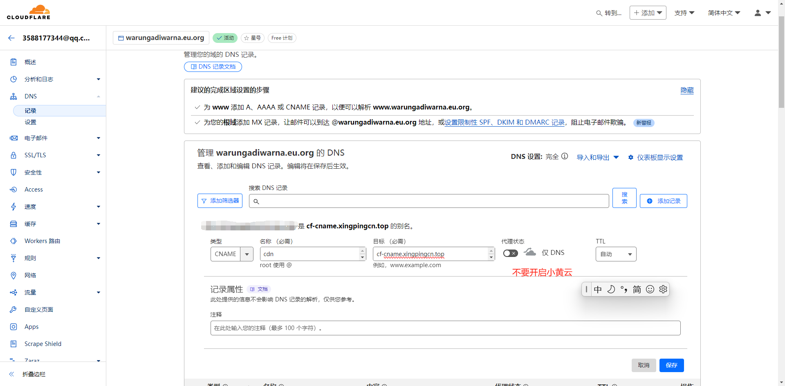

然后来到你的主域名 添加DNS记录

添加一个类型为CNAME 名称为输入你刚刚在自定义主机名时输入的前缀 内容为cdn.你的回源域名

并等待DNS记录生效，生效后就可以正常使用你的域名访问了

## 使用服务器搭建

### 备案

:::warning

不要使用自己家里的宽带搭建服务器官网！由于家宽无固定 IP，无法进行备案。目前已有因使用家宽建站而受到运营商警告的案例，详见 https://www.zhihu.com/question/440645939/answer/3228728304

:::

信息产业部在第十二次部务会议审议通过《非经营性互联网信息服务备案管理办法》条例，要求在国内提供非经营性互联网信息服务，应当办理备案。

根据《非经营性互联网信息服务备案管理办法》，在中华人民共和国境内提供非经营性互联网信息服务，应当办理备案。未经备案，不得在中华人民共和国境内从事非经营性互联网信息服务。而对于没有备案的网站将予以罚款和关闭。

也就是说，使用位于大陆的服务器建站必须进行备案（ICP）。如果你拥有海外地区的服务器，你可以直接使用这类服务器建站或使用它们为你的服务器搭建反向代理如内网穿透，不再需要备案了。

#### 准备工作

要为网站备案，需要进行以下准备：

1. 一台拥有固定 IP 的云服务器，或一条拥有固定 IP 的商用宽带
2. 已经实名认证、用于网站访问的域名
3. 服务器的经营许可证等相关证件或自己的身份证等证件。

#### 备案类型

备案类型分为企业备案和个人备案。其中个人备案限制较多，如果你的服务器规模较大、网站功能较多，你需要尽可能进行企业备案。

但是企业备案较为繁琐，需要较长时间，并提供包括企业的法人身份证明、营业执照、组织机构代码证等基础资料，还需要提供负责人信息、经营许可证等其他材料。

如果服务器网站规模较小，例如仅作展示作用，或者服务器没有条件办理经营许可证等，你需要进行个人备案。个人备案只需个人有效证件（如身份证）、联系方式和通信地址等相关信息即可。

#### 备案流程

如果是大厂服务器，如腾讯阿里华为云，可以直接在服务商网站上自助进行备案。前往相关页面，根据指引填写相关信息并提交即可。

提交后，需要经过一段时间的审核，全程在 1 到 22 天。部分服务器运营商会自行先对你的信息进行审核，确保其能够顺利通过管局审核后再提交到管局。审核通过后，你将会获得 **ICP 备案号**作为服务器官网的备案证明。

备案通过后网站上线时，你需要根据相关规定在网站上标注备案信息。并链接至工信部备案网址 http://www.beian.miit.gov.cn 供用户查询。技术上可通过以下方法实现：

在网站首页的 html 文件中，在`<body>`标签内最底部添加以下代码：

```html
<a href="http://www.beian.miit.gov.cn/">备案号</a>
```

你可以参考其他各大网站的格式来设计展示备案号的方案。

你可以通过 CSS、`<div>`标签来对备案信息进行美化。通常在 CSS 中将此 a 标签的`text-decoration`属性设置为`none`来防止其显示为蓝色带下划线的格式即可。

### 在 Linux 系统上搭建网站服务

以ubuntu为例

在控制台输入apt install nginx

然后找到var-www-html将网站源码上传上去

随后在 nginx 安装目录中执行 `./nginx` 即可运行服务。

为了保证网站时刻开启，建议为 nginx 设置开机自启。

### 在 Windows 系统上搭建网站服务

在浏览器中输入 https://nginx.org/en/

然后点击右边的download

进入后点击你电脑适合的版本

选择下载要下载带有windows这个词的

下载完之后解压文件

解压后进入文件夹，找到名字为html的文件夹

将你的源码上传上去。记住先把原来里面的文件给删掉再放

然后双击启动nginx.exe

为了保证网站时刻开启，建议为 nginx 设置开机自启。

<!--
然后如果你的服务器有公网IP的话，现在的浏览器输入你的公网IP就可以看到你的网站了

如果你按照前面的教程申请了公网IP，并且关闭了防火墙，但是还是访问不了的话，那就是运营商封了80和443

如果可以正常访问，那就可以来到你的域名添加一个a类型的记录，把服务器的公网IP填进去然后就可以使用域名访问了-->

### 使用虚拟主机搭建网站服务

如果你没有用来建站的服务器，或者前面的不用服务器的方法对你来说实在是太难，可以尝试一下

接触过租服务器的一般都会知道有一些idc的网站里面有一些叫做虚拟主机的东西
那么那是什么？那是用来开网站的，在我看来，如果你是一个新手服主的话，我的建议就是使用虚拟主机搭建网站

:::warning

如果你的域名没有备案的话，请不要购买国内的虚拟主机(因为工信部为了打击不良网站,所以只要在国内的虚拟主机或服务器要进行建站的话，域名需要备案)

:::

以[星辰云](https://starxn.com/)的虚拟主机为例

购买后点击一键登录进入面板
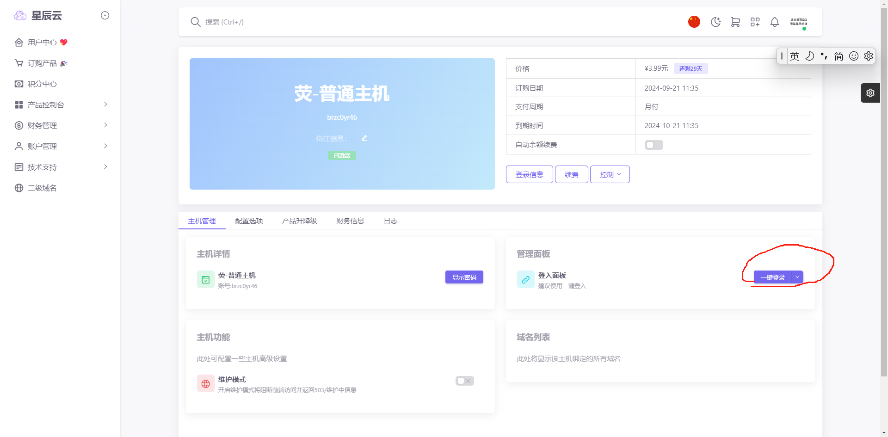

进入后点击文件管理

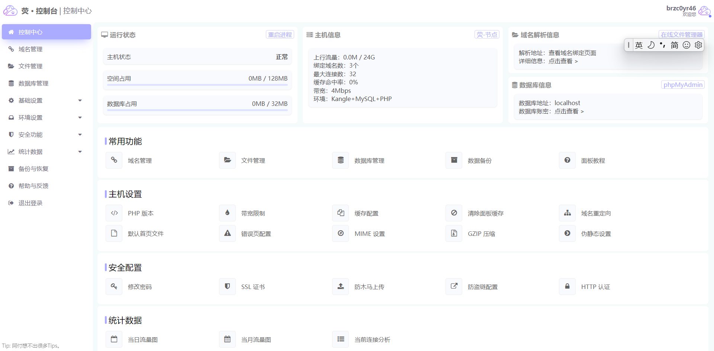

点击上传上传源码


然后点击解压
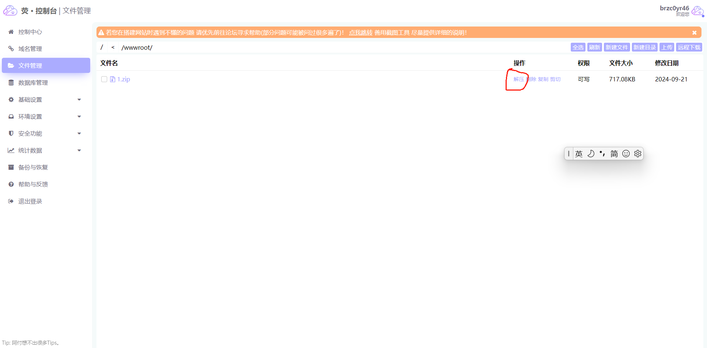

然后将解压出来的文件夹里面的源码全部复制出来

然后来到域名管理
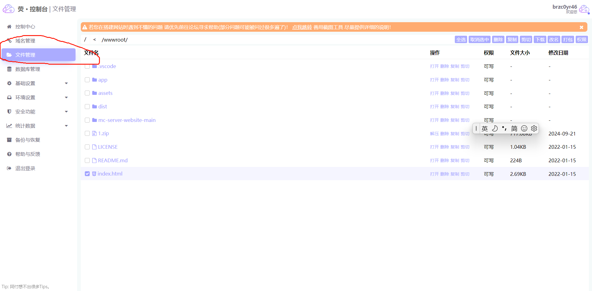

在添加域名那里输入你自己的域名
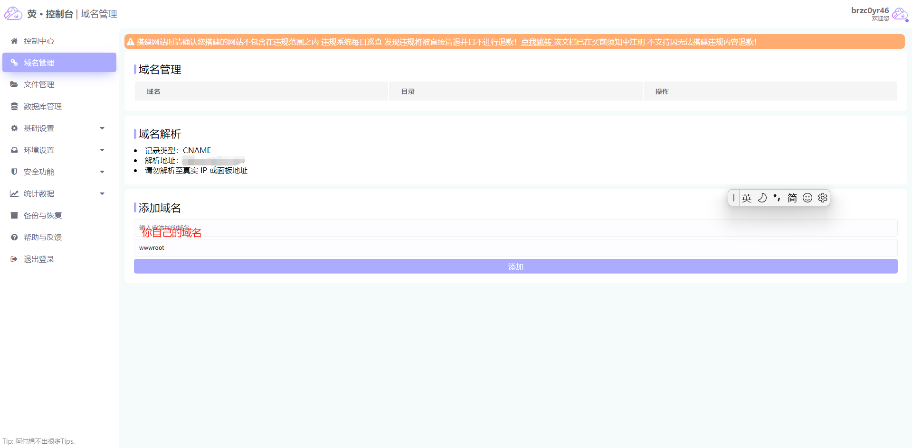

然后按照上面的域名解析解析好之后你就可以访问你的域名，看到你的网站了

在这里附上源码下载[点击下载](https://b2.mcdogserver.top/1.zip)

如果你觉得这个源码不适合你，或者是你不想用别人的源码，你可以尝试去自学。这里就不附上自学的教程了

## 使用NamelessMC搭建网站服务

### 使用宝塔面板搭建

:::warning

如果你的域名没有备案的话，请不要购买国内的服务器(因为工信部为了打击不良网站,所以只要在国内的虚拟主机或服务器要进行建站的话，域名需要备案)

:::

#### 要准备的

namelessmc的配置要求原文要求的是

PHP 7.4、8.0或8.1（推荐），具有以下扩展：

  php curl

  php-exif

  php-gd支持png和jpeg

  php mbstring

  php-mysql或php-mysqlnd

  php pdo

  php xml
还有MySQL 5.7.22或更高 或 MariaDB 10.2或更高

还有一台安装了Apache或NGINX或Caddy的服务器

这些宝塔面板都有(除php插件外)

#### 正式开始

:::warning

接下来的教程都默认你安装了所有依赖和有公网ip

:::
先在网站-php项目点添加站点
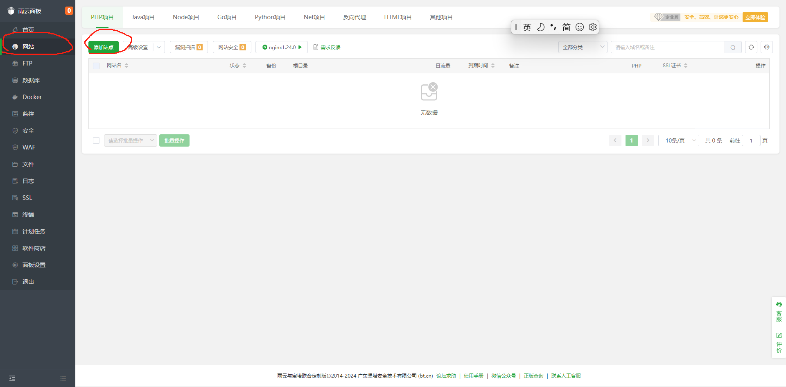
然后按以下选择


创建完成后点图片圈的地方
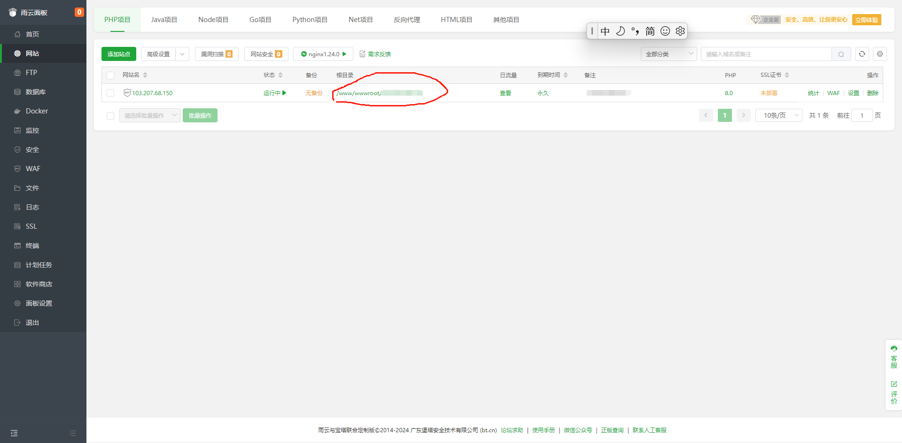

然后删除默认文件
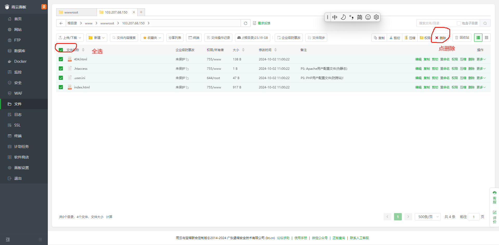
然
后上传源文件[点击下载](https://b2.mcdogserver.top/nameless-deps-dist.zip)
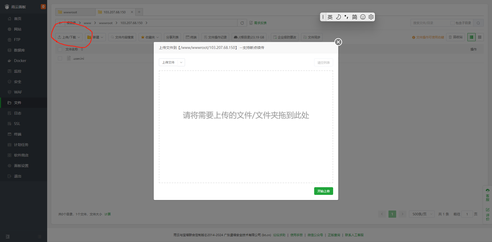

然后解压
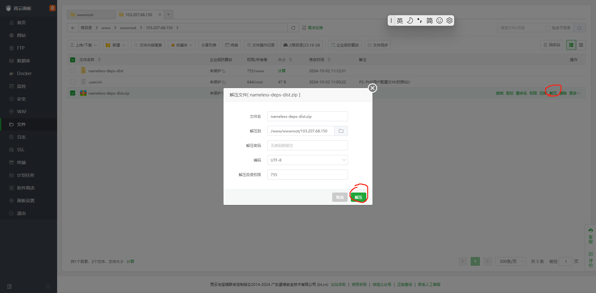

然后将文件夹的东西复制到根目录

然后访问你的公网ip来到安装界面
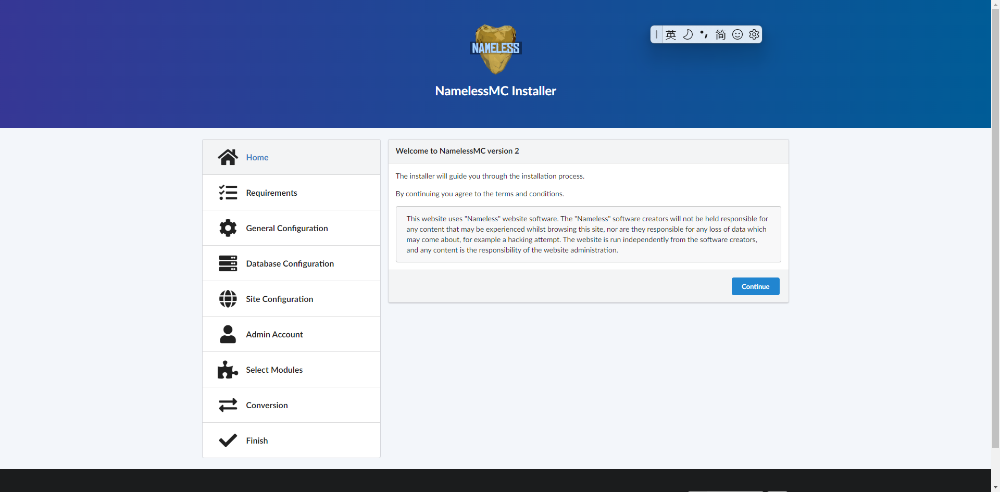

然后点击Continue 下一步

然后按照提示完成安装
:::warning

有时候安装完之后可能会识别不出来重启一下php就可以解决了

:::
完成后会跳转到仪表盘,然后记得去把API开一下，到时候可以直接和你的MC服务器连接


然后它会出现连接地址和API密钥,到时候输入你插件的配置文件里面就可以实现联通了,这里就不做演示了

然后主页面就长这样子
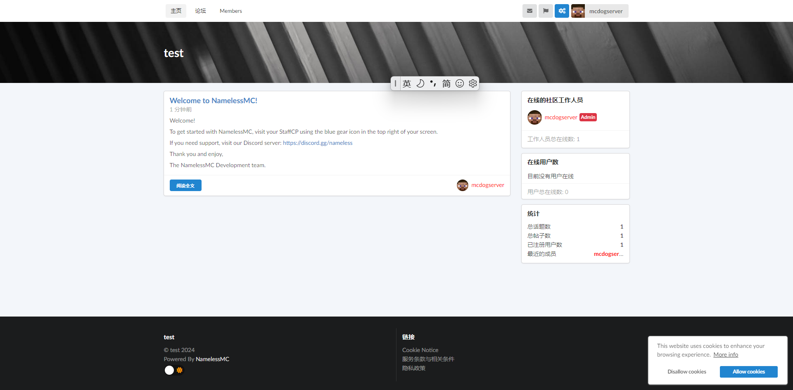

如果你看到这个界面那么如果你是第1次使用宝塔面板搭建网站，那么恭喜你，你成功了
