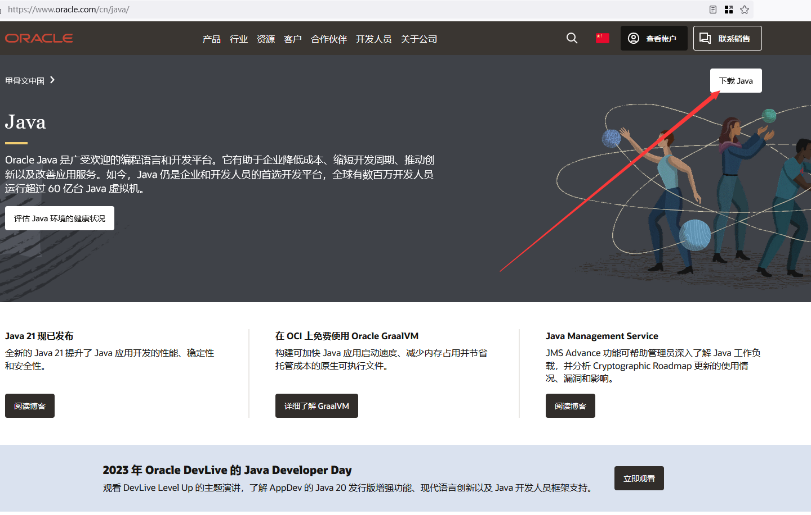
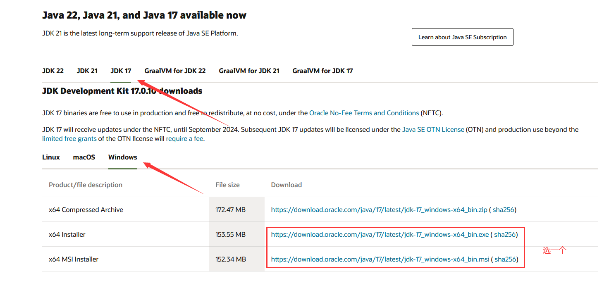
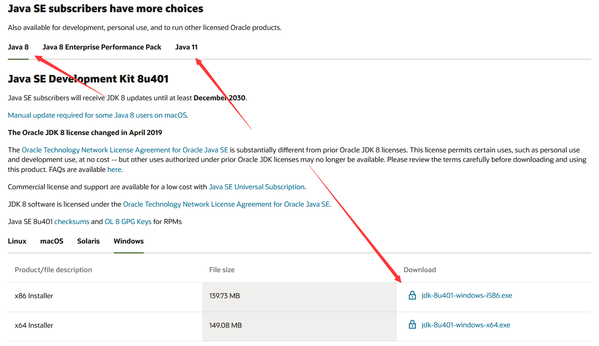
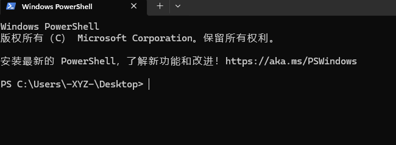
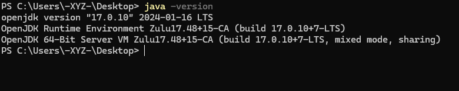

# 选择、下载和安装 Java

您的服务端和客户端都需要安装 Java 才能运行。各个游戏版本需要安装的 Java 版本不同。

原则上选择最新的兼容的 Java 版本，可以体验到最新的优化，并且大部分现代插件对最新版的特性有优化（比如 AuthMeReReload）。

<details>
  <summary>JRE 和 JDK 是什么? 我该怎么选择?</summary>

JRE (Java Runtime Enviroment) 是 Java 的运行环境。面向 Java 程序的使用者，而不是开发者。如果你仅下载并安装了 JRE，那么你的系统只能运行 Java 程序。JRE 是运行 Java 程序所必须环境的集合，包含 JVM 标准实现及 Java 核心类库。它包括 Java 虚拟机、Java 平台核心类和支持文件。它不包含开发工具(编译器、调试器等)

JDK (Java Development Kit) 又称 J2SDK (Java2 Software Development Kit)，是 Java 开发工具包，它提供了 Java 的开发环境 (提供了编译器 javac 等工具，用于将 java 文件编译为 class 文件) 和运行环境 (提供了 JVM 和 Runtime 辅助包，用于解析 class 文件使其得到运行)。如果你下载并安装了 JDK，那么你不仅可以开发 Java 程序，也同时拥有了运行 Java 程序的平台。JDK 是整个 Java 的核心，包括了 Java 运行环境 (JRE)，一堆 Java 工具 tools.jar 和 Java 标准类库 (rt.jar)

**总结: 只开服务端下载 JRE 即可，JDK 也没问题**
</details>

## 选择版本

:::warning
部分服务端有在项目的 README 中标注最低版本和推荐版本，例如 [Beast](https://github.com/HomoMC/Beast)，最低版本为 Java 8，推荐版本为 Java 21
MOD 服务端
:::

### 常见插件端(Paper 等)

| Minecraft 版本   | 最低版本 | 推荐版本 |
|-----------------|---------|---------|
| 1.0 - 1.11.2    | Java 6  | Java 8  |
| 1.12 - 1.16.4   | Java 8  | Java 11 |
| 1.16.5          | Java 8  | Java 16 |
| 1.17 - 1.17.1   | Java 16 | Java 17 |
| 1.18 - 1.20.4   | Java 17 | Java 21 |
| 1.20.5 - 1.21   | Java 21 | Java 21 |

### 混合服务端(CatServer 等)

#### CatServer
| Minecraft 版本   | 最低版本 | 推荐版本 |
|-----------------|---------|---------|
| 1.12.2          | Java 8  | Java 8  |
| 1.16.5          | Java 8  | Java 11 |
| 1.18.2          | Java 17 | Java 17 |

#### MohistMC
| Minecraft 版本   | 最低版本 | 推荐版本 |
|-----------------|---------|---------|
| 1.7.10          | Java 8  | Java 8  |
| 1.16.5          | Java 11 | Java 11 |
| 1.18.2 - 1.20.2 | Java 17 | Java 17 |

## 直接下载

:::warning
此处下载链接可能不是最新版，如需下载最新版请跳转至 [手动下载](#%E6%89%8B%E5%8A%A8%E4%B8%8B%E8%BD%BD)
:::

| Java 版本 | 下载链接                                                                                                                                   |
|---------|----------------------------------------------------------------------------------------------------------------------------------------|
| Java 8  | [Dragonwell 8](https://dragonwell.oss-cn-shanghai.aliyuncs.com/8.19.20/Alibaba_Dragonwell_Extended_8.19.20_x64_windows.zip)            |
| Java 11 | [Dragonwell 11](https://dragonwell.oss-cn-shanghai.aliyuncs.com/11.0.23.20.9/Alibaba_Dragonwell_Extended_11.0.23.20.9_x64_windows.zip) |
| Java 17 | [Azul Zulu](https://cdn.azul.com/zulu/bin/zulu22.32.15-ca-jdk22.0.2-win_x64.zip)                                                       |
| Java 21 | [GraalVM EE](https://download.oracle.com/graalvm/21/latest/graalvm-jdk-21_windows-x64_bin.zip)                                         |

:::danger

32 位操作系统开个鬼服...

[32 位和 64 位有什么区别](https://cn.bing.com/search?q=32%E4%BD%8D%2064%E4%BD%8D%E6%98%AF%E4%BB%80%E4%B9%88%E6%84%8F%E6%80%9D)

[如何确定自己电脑是 32 位还是 64 位](https://cn.bing.com/search?q=%E5%A6%82%E4%BD%95%E7%A1%AE%E5%AE%9A%E8%87%AA%E5%B7%B1%E7%94%B5%E8%84%91%E6%98%AF32%E4%BD%8D%E8%BF%98%E6%98%AF64%E4%BD%8D)

:::

## 手动下载

### Oracle 版

官方版本

<details>
  <summary>怎么找到官网并从官网下载</summary>





如果再往下翻的话可以看到 Java 8 / 11。



但是在这里 Java 8 需要登录才能下载。

你可以在下方链接直接下载 Java 8：

https://www.java.com/zh-CN/download/
</details>

如果你想进行 JVM 优化,请看 [JVM 优化](https://yizhan.wiki/NitWikit/Java/optimize/jvm)

## 验证 Java 安装

打开 Windows 终端 / PowerShell / CMD 。

[怎么打开 Windows 终端](https://cn.bing.com/search?q=%E6%80%8E%E4%B9%88%E6%89%93%E5%BC%80windows%E6%8E%A7%E5%88%B6%E5%8F%B0)



输入：

```
java -version
```

并回车：



> 返回类似的消息即为 Java 已安装

## 使用 AJI 静默安装 Java

群友氿月写的一个小脚本，可以在 Windows 平台后台静默安装 JDK。

<details>
<summary>食用方式：</summary>

1. 打开此链接下载 AJI: https://github.com/Lafcadia/AJI/releases/download/v0.0.2/main.exe
2. 下好了，右键选择以管理员权限打开（如果不以管理员权限打开就无法绑定 Java 环境变量，虽然不给管理员权限程序也能正常运行，并安装 Java，但可能会在后续阶段出现问题）
3. 
4. 选择合适的版本的 Java，点击 `Install Java`，下载。
5. 不要关闭窗口，直到下方的提示栏从 `Installing...` 变为 `Complete.`
</details>

## FAQ

### 为什么 .jar 文件的图标是个白纸

1. 服务器根本没有安装 JRE 或者 JDK。
2. 服务器上的 Java 未设置环境变量 (其实这个影响不大)。
3. 没有绑定文件打开方式 (不过其实也没啥必要绑)。

### 怎么制作绿色版 Java & 绿色版怎么使用

下载 Java 时下载 `.zip` 或 `.tar.gz` 结尾的压缩包，将压缩包解压到任意位置。

随后可以修改环境变量 `JAVA_HOME` 即可，如果不懂看[这篇文章](https://blog.csdn.net/MrsHorse/article/details/82695353)

# 本节视频教程

[**点此前往B站**: 笨蛋级MC开服教程-第三集P1:实机演示安装JAVA](https://www.bilibili.com/video/BV1eT42167iZ/)
