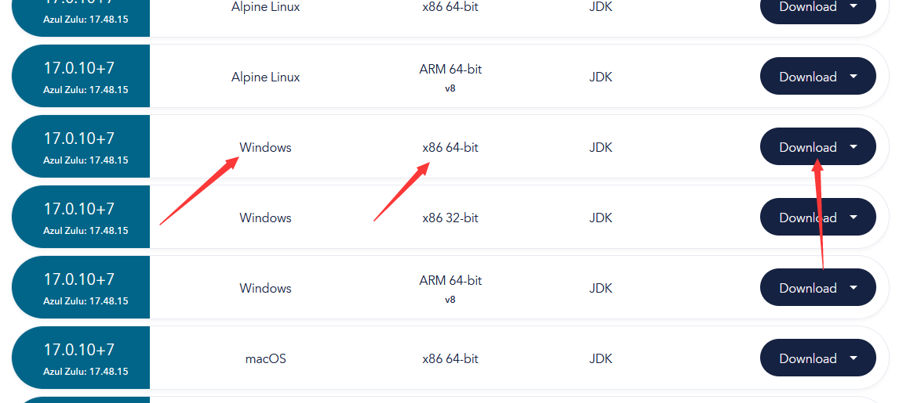

# 下载和安装 Java

您的服务端和客户端都需要安装 Java 才能运行。各个游戏版本需要安装的 Java 版本不同。

原则上选择最新的兼容的 Java 版本，可以体验到最新的优化，并且大部分现代插件对最新版的特性有优化（比如AuthMeReReload）。

## 选择合适的版本

| Minecraft 版本    | 介绍                                           | 下载地址（直链，Zulu）                                                                            |
|-----------------|----------------------------------------------|------------------------------------------------------------------------------------------|
| Classic - 1.6.4 | JDK 6(真的有人会开这种服务器)                           | [JDK 6 64位](https://vip.123pan.cn/1821558579/Lingyi/java/6/jdk6-windowsx64-mcres.cn.exe) |
| 1.7 - 1.12.2    | JDK 8 （如果使用的是SportPaper或者Beast，最好用JDK 21）    | [JDK 8 64位](https://cdn.yghpy.com/DL.Javas/zulu8.74.0.17-ca-jdk8.0.392-win_x64.msi)      |
| 1.13 - 1.16.5   | JDK 11（推荐） 或者 JDK 8 部分整合包仅能使用 JDK 8 或 JDK 16 | [JDK 11 64位](https://cdn.azul.com/zulu/bin/zulu11.72.19-ca-jdk11.0.23-win_x64.msi)       |
| 1.17 - 1.19.4   | JDK17，模组服推荐17,插件服推荐 JDK 21（特别是Leaf，Beast核心）  | [JDK 17 64位](https://cdn.yghpy.com/DL.Javas/zulu17.50.19-ca-fx-jdk17.0.11-win_x64.msi)   |
| 1.20 - 1.20.4   | JDK 21（推荐）或者 JDK 17                         |                                                                                          |
| 1.20.5 +        | JDK 21                                       | [JDK 21 64位](https://cdn.yghpy.com/DL.Javas/zulu21.34.19-ca-fx-jdk21.0.3-win_x64.msi)    |

:::danger

32位操作系统开服开个鬼服...

[32 位和 64 位有什么区别](https://cn.bing.com/search?q=32%E4%BD%8D%2064%E4%BD%8D%E6%98%AF%E4%BB%80%E4%B9%88%E6%84%8F%E6%80%9D)


:::

## 手动下载

### Oracle 版

官方版本

<details>
  <summary>怎么找到官网并从官网下载</summary>


如果再往下翻的话可以看到 Java 8 / 11。


但是在这里 Java 8 需要登录才能下载。

你可以在下方链接直接下载 Java 8：

https://www.java.com/zh-CN/download/
</details>

### Zulu 版

根据各路大佬的测试 Zulu 相较 Oracle (你可以看做"公版") 更适合开 MC 服务器。

<details>
  <summary>怎么找到官网并从官网下载</summary>


往下翻，找到这个，选择你想要的版本：


找到 64-bit (64位) （如果你的电脑是32位的，建议不开服）：



如果您不能安装此软件（如不兼容），请关闭此文档，且**不要向**文档编写者们提问，感谢。
</details>


## 验证 Java 安装

打开 Windows 终端 / PowerShell / CMD 。

[怎么打开 Windows 终端](https://cn.bing.com/search?q=%E6%80%8E%E4%B9%88%E6%89%93%E5%BC%80windows%E6%8E%A7%E5%88%B6%E5%8F%B0)


输入：

```
java -version
```

并回车：


> 返回类似的消息即为 Java 已安装

## FAQ

### Java 为什么 jar 包是个白纸

服务器根本没有安装 Java 程序或者服务器上 Java 未设置环境变量 (其实这个不影响任何东西，忽略即可)。

### 怎么制作绿色版 Java & 绿色版怎么使用

下载 Java 时下载 `.zip` 或 `.tar.gz` 结尾的压缩包，将压缩包解压到任意位置。

随后可以修改环境变量 `JAVA_HOME` 即可，如果不懂看[这篇文章](https://blog.csdn.net/MrsHorse/article/details/82695353)