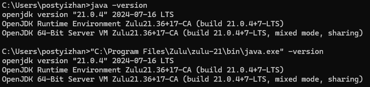
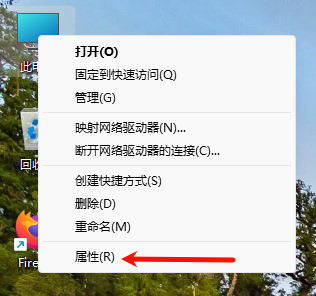
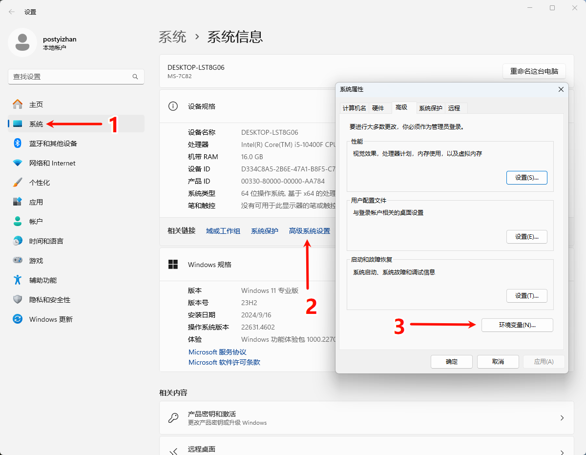
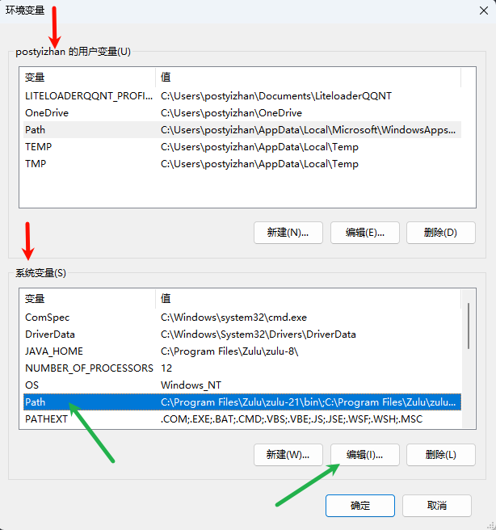
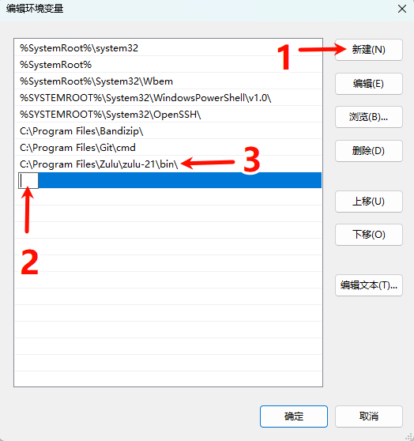
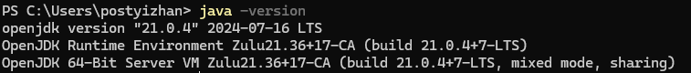
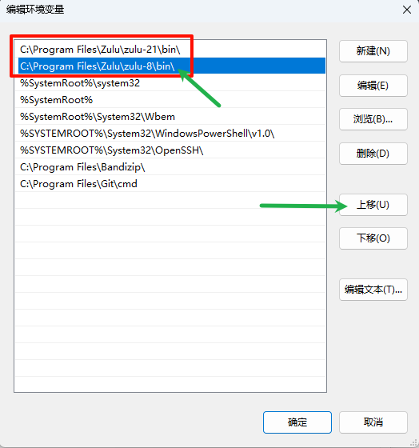
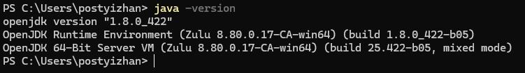

# 环境变量

环境变量用于记住程序路径，方便在命令行界面的任意目录启动程序。

例如：

在此处，`java` 等同于 `"C:\Program Files\Zulu\zulu-21\bin\java.exe"`

当你使用安装包安装 Java 时，通常会自动配置环境变量

如果不是使用安装包安装，即没有配置环境变量，你应该会遇到这个情况：

## 编辑环境变量

打开环境变量面板：

import Tabs from '@theme/Tabs';
import TabItem from '@theme/TabItem';

<Tabs queryString="environment">
<TabItem value="11" label="Windows 11">

右键点击 “**此电脑**”，点击 “**设置**”。

在 “**系统**” 点击 “**高级系统设置**”，在弹出的窗口中点击 “**环境变量**”。

</TabItem>
<TabItem value="10" label="Windows 10">

TODO

</TabItem>
<TabItem value="server" label="Windows Server">

TODO

</TabItem>
</Tabs>

在这个名为 “**环境变量**” 的界面中，我们可以看到，环境变量有 “**用户变量**” 和 “**系统变量**” 之分（红色箭头）。

- 用户变量：仅对此用户有效。
- 系统变量：此电脑的所有用户均可使用。

我们现在编辑系统变量（绿色箭头）。

先鼠标左键选中 “**Path**”，接着点击 “**编辑**”，会弹出一个名为 “**编辑环境变量**” 的界面。

## 新增环境变量

首先，找到你的 Java 路径，我的是 `C:\Program Files\Zulu\zulu-21\bin`。

:::tip

你的路径应是包含 “**java.exe**” 文件的文件夹，此处为 “**bin**” 文件夹。

:::

点击 “**新建**”，在 2 处输入你的 Java 路径，接着回车，可以看到像 3 一样写入了。

接着 **重新打开** 一个终端。

:::warning

注意，这里一定要重新打开一个终端来刷新环境变量。

:::

重新打印 Java 版本。

## 优先级

可以看到，在名为 “**编辑环境变量**” 的界面中，我安装包安装的两个 Java（zulu 8 和 zulu 21）都有环境变量（红框部分）。

选中 zulu 8 并 点击 “**上移**”。（绿色箭头）

接着点击下方 “**确定**” 关闭 “**编辑环境变量**” 界面，接着点击 “**环境变量**” 面板的 “**确定**”。

是的，你要关闭这两个界面才行。

接着 **重新打开** 一个终端。

:::warning

注意，这里一定要重新打开一个终端来刷新环境变量。

:::

重新打印 Java 版本。

于是我们可以得到结论：

对于同样配置环境变量的两个目录，会优先使用最顶部的一个。
