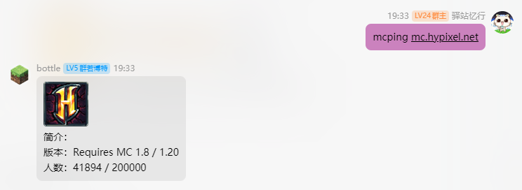

# 笨蛋服务!

这些服务由赛博菩萨 cloudflare 和 lilingfeng 搭建，完全免费提供!

目前包括

- [笨蛋 AI](https://ai.yizhan.wiki) - AI 聊天，文字生成图片
- [笨蛋镜像](https://mirror.yizhan.wiki) - 加速网站的访问(为没有 VPN 的人准备)
- [笨蛋图床](https://image.yizhan.wiki) - 简洁，免费的图床
- [笨蛋粘贴板](https://paste.yizhan.wiki) - 上传文件/创建 Paste!(不要当网盘)
- [笨蛋笔记本](https://notepad.yizhan.wiki) - 免费笔记本，支持密码，Markdown 和分享
- [笨蛋短链](https://imc.rip) - 缩短链接

## 规则

**不要滥用，不要上传违法文件!!!!!**

## 限制

由于服务提供商 CloudFlare Free Plan 的限制，超过一定额度后部分服务会停机(虽然目前没碰到过)

### AI

一天 1w 次对话，超过后笨蛋 AI 服务停机。

### Worker

一天 10w 次请求，超过后笨蛋镜像，笨蛋图床，笨蛋粘贴板，笨蛋笔记本，笨蛋短链服务停机

### KV

单次文件最大 25 MB，一天 1000 次上传，1000 次删除，超过后笨蛋镜像，笨蛋图床，笨蛋粘贴板，笨蛋笔记本，笨蛋短链**上传，删除**(读取不影响)服务停机

所以赞助我吧...(Workers Pro 一个月 5 美元，Cloudflare Pro 一个月 25 美元)

# 机器人命令

在群内发送消息即可使用！



## `mcping`

打印 mc 服务器信息。

用法：

```
mcping <服务器地址>
```

## 消息回复

消息回复关键词要加前缀 `#`


下方是可用的关键词。

### `乐子文档`

返回乐子文档的地址和仓库。

### `开服教程`

返回本文档的地址和仓库。

### `帮助`

返回 https://nitwikit.yizhan.wiki/%E6%89%A9%E5%B1%95%E9%98%85%E8%AF%BB/%E6%9C%BA%E5%99%A8%E4%BA%BA%E5%91%BD%E4%BB%A4

### `正确提问`

返回消息 https://nitwikit.yizhan.wiki/start/%E5%90%91%E5%A4%A7%E4%BD%AC%E6%B1%82%E5%8A%A9

### `搜索`

返回消息 https://nitwikit.yizhan.wiki/search?q=

### `核心`

返回消息

📦 单端 https://nitwikit.yizhan.wiki/start/%E6%9C%8D%E5%8A%A1%E7%AB%AF%E6%A0%B8%E5%BF%83%E9%80%89%E6%8B%A9

📦 跨服端 https://nitwikit.yizhan.wiki/%E8%B7%A8%E6%9C%8D%E7%AB%AF/%E6%A0%B8%E5%BF%83%E9%80%89%E6%8B%A9
