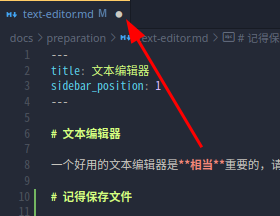
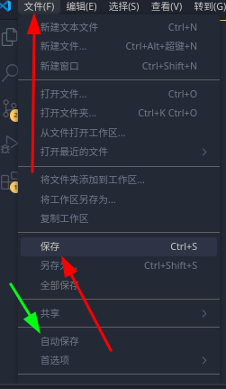
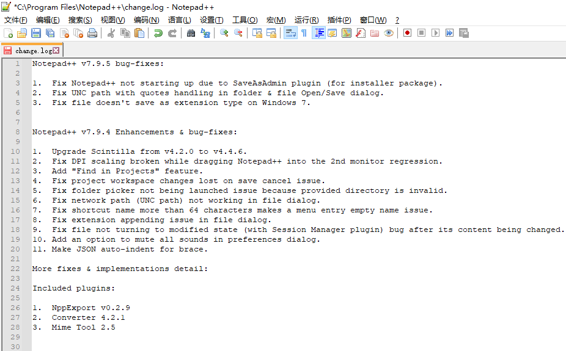
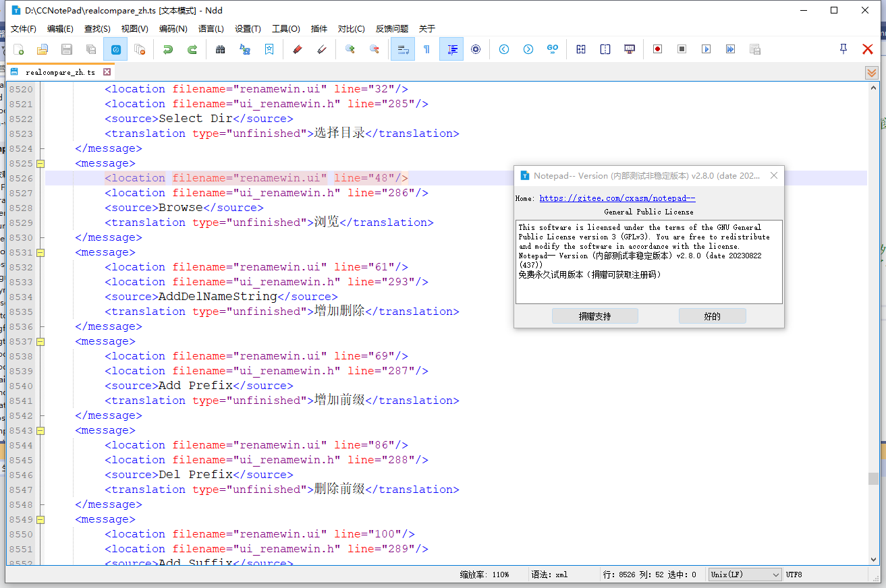
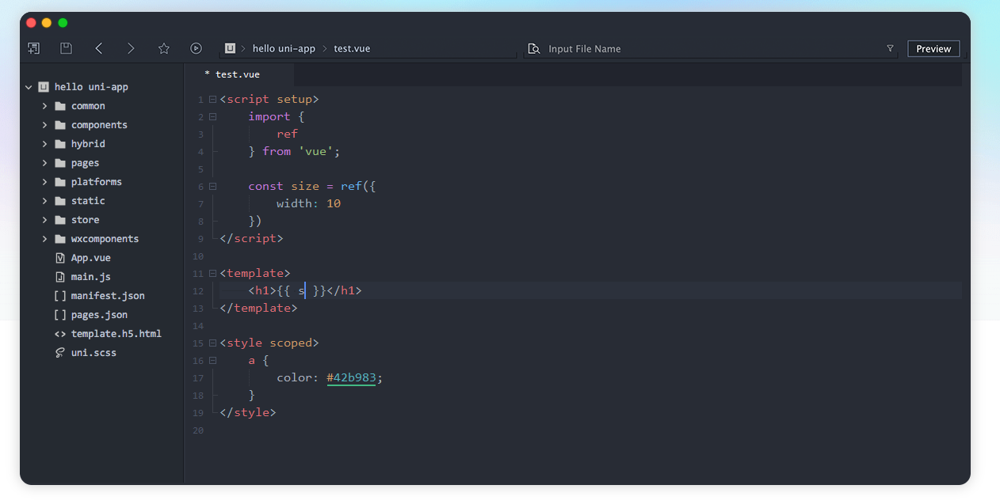

# 文本编辑器

一个好用的文本编辑器是**相当**重要的，请不要再使用 Windows 自带的记事本和写字板了。~~(如果你想用也不是不行)~~

# 记得保存文件

发现有人第一次用文本编辑器不知道编辑完后保存。

VSCode 会在未保存的文件后标记一个白点，提示你这个文件编辑了但是没有保存（其他文本编辑器类似）。

保存按钮（红色箭头），也可以用快捷键来保存 Ctrl + S 。

开启自动保存（绿色箭头）。

~~当年 TrMenu 的自动重载治好了我的 autosave ~~

## Visual Studio Code

  
点击展开

全能型文本编辑器，**非常非常推荐**，支持简体中文 / 繁体中文 / 英文，仅支持 `Windows 10 +`。

缺点是启动速度可能不是很快，不过非常适合新手使用。(已经算是比较快的了。)

官网链接：https://code.visualstudio.com/

[下载龟速怎么办](https://cn.bing.com/search?q=vscode%E4%B8%8B%E8%BD%BD%E9%BE%9F%E9%80%9F%E6%80%8E%E4%B9%88%E5%8A%9E)

[VSCode 视频安装教程](https://www.bilibili.com/video/BV1nM4m117Fv/?share_source=copy_web)

## Sublime Text

  
点击展开

我不太喜欢的一点是保存文件时，对非激活的用户有一定概率弹出个窗口，提示你去付费支持（可以选择不支持）。但这依旧是一个非常优秀的文本编辑器。

官网链接：https://www.sublimetext.com/

[如何汉化](https://cn.bing.com/search?q=sublime+text%e6%b1%89%e5%8c%96&qs=SC&pq=sublimetext&sk=HS1SC5&sc=10-11&cvid=19623440FA3646E0BEBECEED995CFCAF&FORM=QBRE&sp=7&lq=0)

## Kate

  
点击展开

官网链接：https://kate-editor.org/zh-cn/

开源，跨平台，也可以秒开文件。

## Notepad3

  
点击展开

也是一个比较不错的文本编辑器。要求：**Windows 8 +**。

官网链接: https://rizonesoft.com/downloads/notepad3/

GitHub: https://github.com/rizonesoft/Notepad3

## Notepad++

  
点击展开

可用, 相关功能也较为完善。

:::warning

作者政治立场可能引起众怒, 但请理性看待：

[notepad++](http://www.notepadplus.com.cn/)台独 + 多次辱H [这里](https://cn.bing.com/search?q=notepad%252B%252B%E8%BE%B1%E5%8D%8E)。

dizhi 08年奥运会 声称（仅声明，但还是挺过分的）不同意它的政治观点就在你的源码中添加随机字符 [这里](https://zhuanlan.zhihu.com/p/609192758)。

可替代为 **Notepad--** 等。

:::

## Notepad--

  
点击展开

国内作者维护的 Notepad++ 的替代品。

[`Gitee`](https://gitee.com/cxasm/notepad--)
[`GitHub`](https://github.com/cxasm/notepad--)

## HbuilderX

  
点击展开

官网链接：https://dcloud.io/hbuilderx.html

一个国产的文本编辑器。

#### 关联右键菜单?

可以在工具→设置(Ctrl+Alt+，)打开设置，找到“常用配置”手动选中【关联右键菜单】。

## Geany

  
点击展开

官网链接：https://www.geany.org/

另外出于多方面原因，不推荐使用 GitHub 官方出品的 Atom，它已在 2022 年 12 月由于安全原因宣布停止维护。
