# 创作美术资源

> 大多数市面上的美术风格层次不齐，如果你想让自己服务器元素与原版更贴合，请耐心的看完本页

:::info

翻译自 Blockbench Wiki 上的 Minecraft 风格指南

:::

## 建模

### 元素数量

MC 美术风格的基础是简约，一个物体的整体形状应该由模型定义、主要的细节则由纹理定义。一方面，你应该在精确描绘一个物体的同时，尽可能减少元素的数量。另一方面，简化也要有限度，你也要避免过度简化导致物体失去识别度。

### 形状描绘

基于上面的原因，你最好避免用阶梯表现斜面和曲线，我们更建议你通过旋转元素来创建一个斜面。很多 MC 模型中都能找到旋转的元素，但这样的用法必须有理有据。举例来说，为了创造曲线而将相邻的元素旋转并不符合 MC 的美学

旋转元素 vs 用阶梯状表现

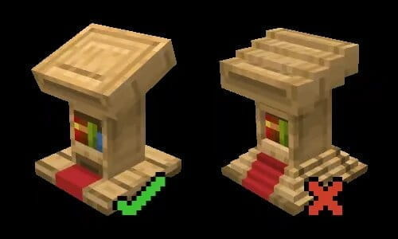

球形或圆柱形的物体通常以单个元素示人，你可以在游戏里找到很多这样的例子：桶、蛋糕、原木、磨石、南瓜、西瓜、可可豆……

单个方块元素 vs 多元素组合

MC 模型会用到平面（只有 2 个面的元素）和透明度，大部分时候会两者兼用。一个物体中较小的部分可以用单个大元素来描绘、有意的使其中的某些像素完全透明。在 MC 的美术风格中，这种解决方案比用多个小元素（比如体素）要更为可取。

以薄面表现 vs 以体素表现

### UV 贴图

UV 贴图定义了纹理要如何应用到模型，在 MC 中，纹理的一个像素对应着模型上的一个像素（Blockbench 软件中的一个比例单位）。在模型上保持同样的像素比例也非常重要，这样一来，纹理才不会被压扁或拉伸变形。

保持一致的比例 vs 拉伸变形的比例

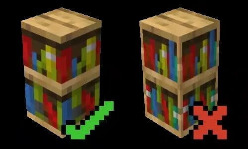

在单个面的 UV 贴图中，你都可以使用 Blockbench 提供的 自动 UV 的功能，正确缩放对应面的 UV 贴图。

Blockbench 中提供了自动 UV 功能

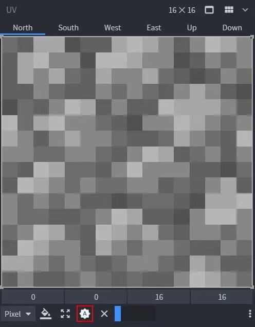

在箱形 UV 贴图中，元素的贴图会自动展开、默认适用于所有的面。在下图中，你可以看到一个展开的 UV 贴图示例（蓝色 = 北、黄色 = 南、粉色 = 西、绿色 = 东、白色 = 顶、灰色 = 底）。北方通常代表“前面”，像是角色的脸、柜子的门所在的位置。

箱形 UV 贴图会自动展开一个 box 的 UV 贴图

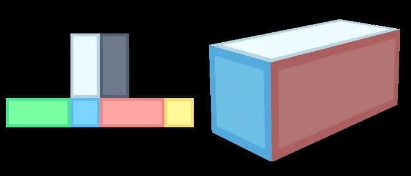

### 混素（Mixels）

如果说“像素”（pixel）是图片元素（pix + el），混素（mixel）就是混合了多种分辨率的元素，无论 2D 还是 3D 都混在了一起。大多数低规格的艺术完全避免混素，一般来说，MC 艺术不允许混素（某些模型上略微膨胀的元素除外），模型上的混素表现为两种：小于 1px 的元素（或 Blockbench 中的 1 个比例单位）、过度膨胀的元素。

均衡的细节分布 vs 失衡的细节分布

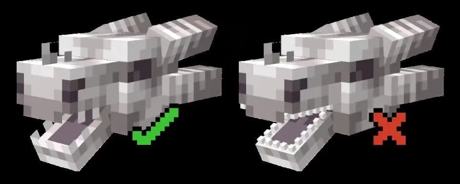

### 尺寸与比例

MC 中方块的尺寸是 16x16x16 像素，对应 1 立方米，单个像素长 6.25cm。尽管这个比例应该考虑到设计中，但它不总是适用。小物体的识别度优先于比例（常见的例子比如 MC 里的蜜蜂，完全成比例的话，蜜蜂必须要小于 1px）

此外，在游戏这套特殊比例之下的功能，可能无法直接参考现实。最直接的例子就是玩家的模型，Steve 看上去比现实里的普通人还笨重，如果要创建需要玩家互动的对象，这类的比例的也要考虑在内。

真人 vs Steve

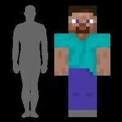

也类似其他的艺术形式，改变模型中特定部位的比例，也会影响用户解读其所描绘的对象及功能。举例来说，大头配上小身体能让角色看起来更加可爱，夸张的躯干和手臂则能表现出力量感。

教育版的 Agent vs 原版的铁傀儡

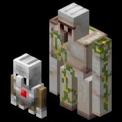

## 纹理

### HSV（色相、饱和度、明度）

色相（Hue）是由波长决定的色系（例：棕色变成红色或橙色，海蓝宝石色变成蓝色），它可以视作是色环中的一个点，范围是 0-360 度（环状）。

饱和度（Saturation）是指颜色的强度，对于指定的色相，饱和度越高、色相越强，它的范围是 0-100（水平轴）。

明度（Value）是颜色的亮度，值越高颜色越亮，范围是 0-100（垂直轴）。

常见的 HSV 调节面板

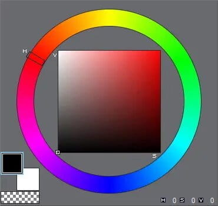

颜色渐变与调色板

渐变色是单一颜色衍生而来的一系列不同亮度的集合，调色板是纹理文件中所用的所有颜色渐变的集合。你最好从中间的颜色开始创建渐变，建议先分别创建一个阴影和一个高光、加上基础的阴影，随后再添加更多颜色。

改变阴影颜色 HSV 的行为称作偏移（色相偏移、饱和度偏移、明度偏移），保持多个颜色间的跨度平衡很重要。

当我们说“线性渐变”（Straight Ramp）时，指的是一系列渐变色只做了明度的差异化。线性渐变做起来容易，但外观上过于沉闷、用到的地方不多，它们可以适用于某些材料和颜色。在下图中，左侧是线性渐变，右侧是色相偏移渐变。

沉闷的蜜脾 vs 鲜艳诱人的蜜脾

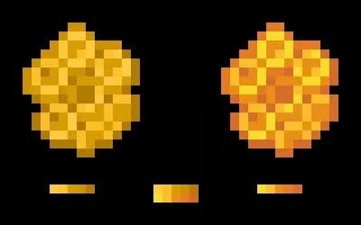

## 阴影

在像素艺术尤其是 MC 的美术中，放置像素需要慎重。你有必要使用有意限制的调色板、一套没有平滑度的工具（铅笔、图形工具、填充桶以及橡皮擦），你需要明确定义材料的属性。

抗锯齿（Anti-aliasing）或 AA 是一种平滑形状之间过渡的方法，你可以手动在边缘放置不同颜色的像素，下图中左侧的鸡蛋有 AA，右侧的则没有。

有抗锯齿处理 vs 无抗锯齿的鸡蛋

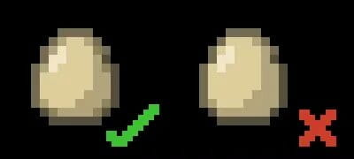

抖动（Dithering）是一种在两个像素堆之间以特定形式交叉像素、从而实现过渡的方法，交错抖动（Checkered dithering）是最常见的一种抖动类型。

在堆状物品的纹理中，用抖动交叉混合像素点

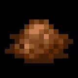

用笔刷可以产生带噪点的纹理，但噪点不会为纹理添加任何信息，在最坏的情况下，没有上下文的噪点会让纹理变得难以识别。

有上下文、可识别的纹理 vs 难以识别的纹理

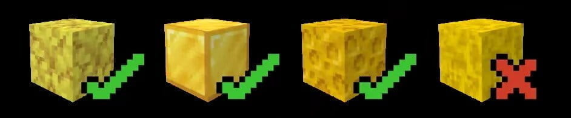

阴影有很多可能会出现的错误示范，通常是偶然的。最常见的便是条带（Banding），一系列由亮到暗排列的像素产物，无论是以直线、斜线还是边角的形式出现。之所以要避免这种情况，是因为它会暴露像素网格、分散观看者的注意力，并且会扭曲物体的形状。

当美术试图绘制抗锯齿或难以在表面绘制阴影时，通常就会催生出条带。

原版钻石剑 vs 出现条带的钻石剑

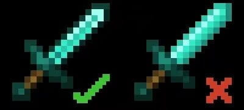

枕状阴影（Pillow shading）是一种类似条带的情况，通常出现于围绕中心绘制阴影、试图覆盖表面的情况。

原版桶 vs 出现枕状阴影的桶

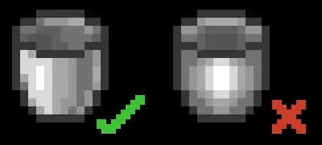

煎饼式阴影（Pancake shading）是将高光、阴影放在两个对立位置的产物，它会使物体失去表面的形状。

原版苹果 vs 出现煎饼式阴影的苹果

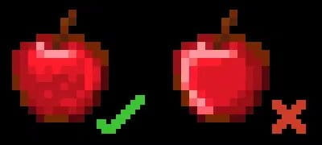

不必要的抖动有很多种情况，最基础的是在过渡开始的地方过度使用抖动，以至于覆盖了太多的表面积。其他情况则包括：在不需要抖动的使用抖动、抖动在纹理中的使用不一致（随机、或只在某些地方）。

原版海带 vs 错用抖动的海带

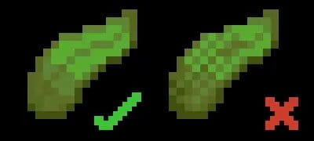

纹理中也会出现混素，这只会在美术有意的放大纹理、继续绘制的时候发生。这么做通常是为了添加更多细节，如果 16x16 的分辨率中难以容纳更多细节，就需要重新评估整个纹理、或者看是否不没必要再添加细节。当元素的分辨率冲突时，纹理会变得不那么吸引人，看起来像是被错误的放大或缩小了。

原版海洋之心 vs 出现混素的海洋之心

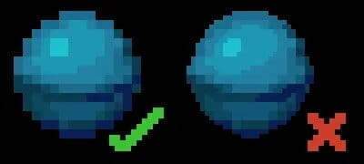

### 线条 & 形状
「锯齿」是像素画中由于线条/边缘未经润色、或缺少抗锯齿而出现的形状（无意中产生的边角），直线的步长需要保持一致，这样看起来就不会过于粗糙。

除了直线，曲线中也会出现锯齿，通常表现为棱角或对角线的形式（用于表现圆形）。

直线与曲线中的锯齿表现

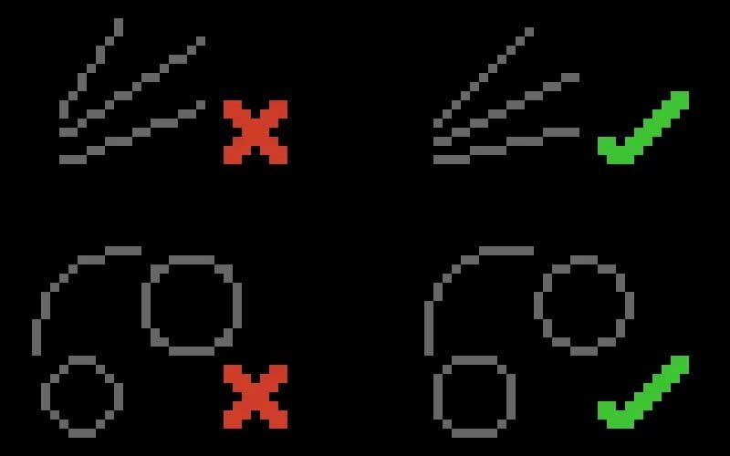

### 物品纹理
所有绘制的物品都应该适配 16x16 网格。

首先用中间色调画出物品的基础形状，并给它加上一个深色的轮廓

添加高光和阴影，想象左上角有个光源照射物体，相应的也要为轮廓着色

添加调色板剩下的部分，补充更多高光和阴影的细节

添加一些表面的属性，比如下面的例子中，物品是半透明、光滑的绿宝石。其他情况下，属性可能是粗糙、裂纹、褶皱、脏污的……

画出基础形状 > 添加高光阴影 > 补充更多细节 > 凸显表面属性

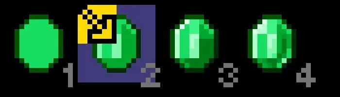

### 方块纹理
对方块纹理的要求不同于物品，方块纹理既需要考虑其单独出现，也需要考虑相邻放置的情况。将多个同类方块紧贴放置的行为称作「平铺」，如果在视觉上能感到纹理中有部分显著重复、凸显出平铺的图案，这种情况就需要加以纠正了。

你可以直接用 Blockbench 制作方块纹理（使用 Paint 模式）、或只是用于实时 3D 预览你在外部图像编辑器创建的纹理。如果你想预览平铺的效果，最推荐的方法是创建一面 3x3 方块构成的墙。

在大量绘制阴影之前，你最好检查平铺的效果，有两三种色调的纹理的早期版本就够用了。检查完平铺之后，你可以继续着色，但别忘了这之后也要定期检查平铺。

你可以用 3x3 的墙体实时预览方块纹理的平铺效果

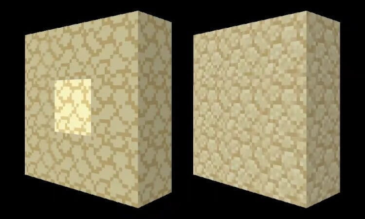

### 实体纹理

实体纹理会用到箱形 UV 贴图，遵循一套特殊的纹理准则。实体的顶部和正面要比底部和背面更亮，这适用于单独为面着色、以及相对于其他面的着色（例：顶面明显会比底面更亮）

为了让绘制纹理的过程更轻松，先生成纹理模版，Blockbench 也会自动映射好元素

画出不同颜色的分布，添加阴影和高光

在其中添加更多色调

通过编辑特定色调像素堆的相对位置来定义材质，消除前面步骤中的条带和其他的阴影产物

生成纹理模板 > 画出颜色与高光阴影 > 添加更多细节 > 表现出材质效果

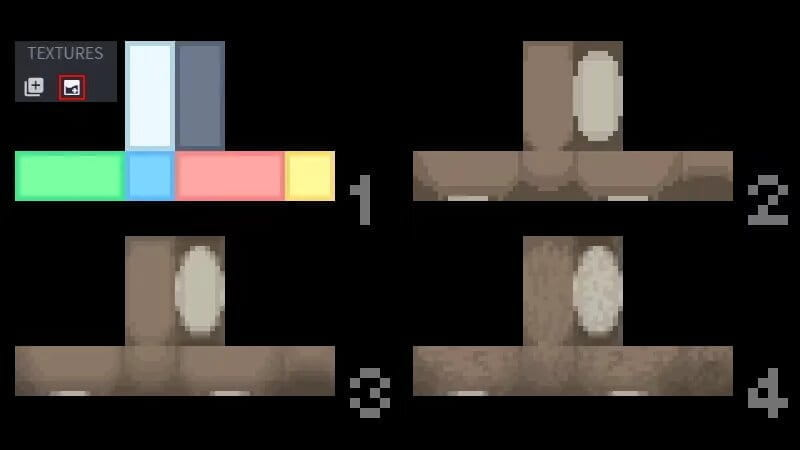

