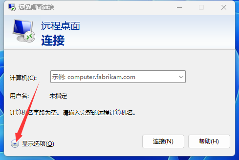

# 连接到云

当你买好服务器后，你应该如何连接到服务器并部署你的服务端

## 面板

去骚扰卖你面板的人

## vps

  
Windows远程桌面连接

### Windows
按下 `win键` + `R键`

在弹出的窗口中输入 `mstsc`

把卖你 vps 的人给你的信息照着填进去就可以连接到你的 vps 了。

你也可以在 vps 安装 [ToDesk](https://www.todesk.com/download.html) 或 [向日葵远程控制](https://sunlogin.oray.com/) 等软件

#### 映射驱动器

可以在 vps 中点击 `此电脑` 看到本地的 **驱动器**（c 盘 d 盘的，这下听懂了吧）

方便你传输文件

或者，你也可以 `Ctrl c` + `Ctrl v` 来传文件

### MacOS 和手机

在 iOS 和 macOS 上，需要在 App Store 登录海外的 Apple ID ，然后搜索 Microsoft Remote Desktop ，就可以找到这个应用。在安卓手机上需要在 Google play 上搜索 Microsoft Remote Desktop 就可以找到这个应用，如果手机无法使用 Google play ，也可以在网上搜索安装包下载。打开应用后，点击加号，点击 **Add PC** ，选择或输入那台电脑上的那串代码，然后点击添加或保存。随后点击或双击添加的那台电脑，然后输入帐号和密码，就可以连接到那台电脑。

[Linux ssh](../../advance/Linux/Connect-to-server.md)

#### 放行端口

然后你需要在防火墙放行你 mc 服务端使用的端口，可参考教程：https://blog.csdn.net/aa1213366512/article/details/119964839 。

如果你使用的是家宽公网，你需要在路由器里后台放行远程桌面使用的端口，协议同时选择 TCP 和 UDP 。远程桌面使用的端口为 3389 ，所以你需要把服务器的 **3389** 端口映射到外网。

:::danger

配置直接在公网使用3389端口连接服务器远程桌面**会导致严重的安全性问题**，详见 [如何抵御网络攻击](../maintenance/how-to-defend-against-cyber-attacks.md)。

:::

接着用外网地址连接你的服务器。注意，除非你直接在外网使用 3389 端口，否则连接服务器时需要使用外网端口连接，比如服务器 IP 是 yizhan.wiki，外网使用的是 41982 端口，你就需要连接 `yizhan.wiki:41982`，而不是`yizhan.wiki`。

**举例，不一定正确：**

你远程桌面连接用的是 `yizhan.wiki:12345`

你的服务商告诉你，除了`12345`，你可以使用 `12346` 端口

那你就把你服务端的 [端口](https://yizhan.wiki/NitWikit/Java/start/connect-to-server#%E7%AB%AF%E5%8F%A3) 设置为 `12346` ，记得 [放行端口](#放行端口)

然后在你的游戏客户端里添加服务器，填地址为 `yizhan.wiki:12346`

## 家里云

  
我有公网 IP

按照上文 VPS 的方式打开电脑的远程桌面或 SSH 服务即可。**如果要公网访问，记得在路由器里配置端口映射，把电脑的远程控制端口开放到公网**

  
我没有/不知道啥是公网 IP

[申请公网ip](apply-for-public-ip-address.md)

如果申请不到，那么为了在没有公网IP的情况下连接到你的内外机器，你需要 **内网穿透（Frp）**

[内网穿透](intranet-penetration.md)

[Linux | 搭建内网穿透（Frp）](../../advance/Linux/frp.md)

## 独立机

机房的运维一般会帮你设置。如果你用的是第三方远程桌面，但是服务器本身又有远程控制的条件，按照上文中 VPS 的方式操作即可。

## 开服器

不教，自己查开服器的食用方式。
