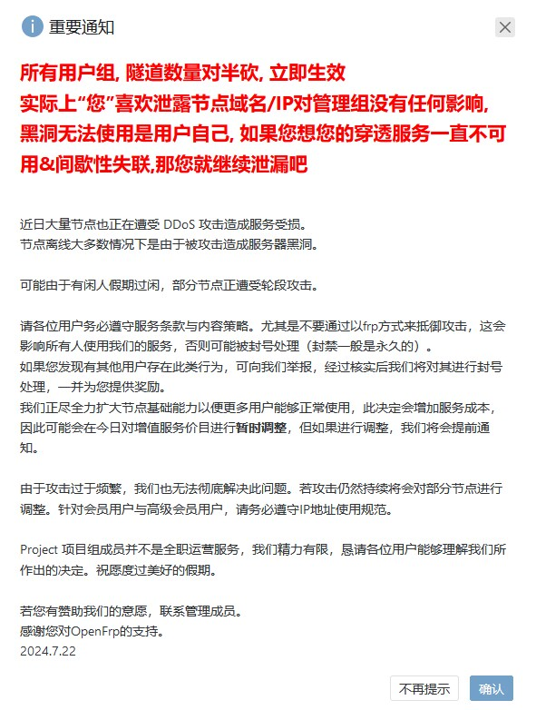

# 如何抵御网络攻击

随着你的 Minecraft 服务器人数和宣传越来越多，你的服务器越有可能收到其他“友商”或者某些不怀好意的玩家攻击。

别害怕，大多数网络攻击没有那么致命，可能只会引起玩家高 Ping 掉线、后台操作卡顿等。

## 分类

下面将列出几种常见的 Minecraft 服务器容易遭受的攻击类型。

### 应用层（也称为 L7 ）

在服务器上运行并绑定了指定地址和端口的应用程序，可以在这一层接受连接。

应用层的攻击往往意味着针对某个应用程序发起的攻击。

通常攻击者会利用应用中的漏洞，来让应用占用更多的计算机资源，或者通过大量请求使带宽不堪重负，使服务器难以处理新连接。

#### 假人攻击

简单来说，假人攻击一般是通过模拟客户端协议，伪造有玩家接入服务器，并发送进入服务器的数据包。

这些假人大多数是不动的、名字高度相似或者非常随机的。

随着假人的快速加入和退出游戏，导致服务器需要处理大量的数据包，会让服务器卡顿。

#### MOTD (状态请求) 攻击

简单来说，就是向服务器请求状态 (也就是 Ping)，玩家每次 Ping 服务器时，服务器将返回一个 MOTD 。

由于 MOTD 中包含图片和文字信息，大量的请求会占满服务器带宽，使服务器难以处理新的连接。

Minecraft 后端服务器一般是不会对 Ping 进行过滤和记录的，这会导致 MOTD 攻击难以察觉。

但是对于 Velocity / BungeeCord 等反向代理服务端，默认 Ping 服务器的行为是会被记录的，类似于：

```
[/127.0.0.1:61647] <-> InitialHandler has pinged
```

:::info

可以通过调整设置 `log_pings` (BungeeCord) 或 `show-ping-requests` (Velocity) 来启用或禁用反向代理在控制台输出 Ping 日志。

:::

#### 其他插件

如果你使用了 Plan, Dynmap 等插件，这些插件会在某个端口开启网站。

请注意这些端口如果被不怀好意的人知道，则可能会导致这些 HTTP 端口遭受攻击。

#### Minecraft 漏洞攻击

通过利用 Minecraft 游戏本身的漏洞，向服务器发送 (可能是大量的)不合法的数据包，造成服务器卡顿甚至**崩溃**，例如攻击者可以向 BDS 服务器发送大量空数据包使其不断打印日志而不再正常处理游戏内容。  

#### 远程桌面 / SSH爆破

众所周知，只要足够有耐心，就一定能赢得猜数游戏。远程桌面或 SSH 也是如此。由于其并没有针对用户的复杂的验证机制，这导致任何人都可以无限制地试错。所以攻击者可以通过编写脚本等方式制作软件，不断地假设密码登录服务器远控服务，这就是**爆破攻击**，或者叫暴力破解密码。最终当登录成功时，攻击即成功，攻击者将**获得你服务器完全的控制权**。

注意由于该服务在电脑上非常常见，所以世界各处经常有攻击者通过扫描 IPv4 地址（扫段攻击，通过对某个 IP 段的所有 IP 逐个检测来找出可以攻击的目标），并通过扫描端口（扫端口，通过对某个 IP 上的所有端口进行检测来找出可以攻击的目标），来找到你的服务器的远控地址，而不需要事先对你的服务器或你本人有任何了解。也就是说，如果你遭遇了这种攻击，不要一味地反思自己是否激怒过他人或和小人有了过节，而是要专注于防范你所遭受的攻击本身。

### 网络层

网络层攻击是 DDoS 攻击的一种形式，它针对于网络基础架构进行攻击。

最常见的网络层攻击是IP地址欺骗，攻击者可以伪造IP地址并向目标服务器发送大量数据包，以消耗目标服务器的网络带宽和系统资源。

Minecraft JAVA 服务端采用 TCP 作为通信协议，所以您可能会遭受到如 TCP Flood (TCP 洪水攻击) 等攻击方式。

防御这种类型的攻击唯一办法就是增大宽带，没有什么别的好办法。

## 解决方案

### 低调做人，不要惹是生非

在开服圈子里，有大量的攻击并非无故发起。多数时候是因为服主招惹了一些有攻击能力的人，才招致服务器受到攻击。你不是专业的企业家、生意人，你的服务器非常脆弱。我的世界作为世界上销量最高的游戏，其玩家社区非常复杂而混乱。如果你对其做不到非常了解，请务必谨慎对待。
1. 遇到对服务器中违规感到愤怒的玩家，不要一味地对他采取强硬态度。尽可能和他私下解决，保证他对处罚结果感到满意，如从轻处罚、删除处罚名单等。遇到不讲理的玩家，虽然其行为本身不合理，但顾客就是上帝，你仍然需要与其协商做出让步，在对方确实执意要破坏服务器时，再对其采取强硬态度来保证自身利益。注意协商成功后不要和其他任何玩家提及此事。
2. 对已付费、已赞助或活跃的玩家放宽违规行为的评判标准，并优先响应其反馈。愿意为服务器花费真金白银或大把时间的玩家通常更在意服务器，他们的体验往往更重要，不仅后期有潜力为服务器带来更多收入和更多玩家，还很有可能在服务器中遭遇负责情绪时采取更极端的行为。你可以在这类玩家违反规定后视其影响对其适当采取宽容态度（睁一只眼闭一只眼），并在他们和其他玩家起冲突时以协调为主，尽可能不对其进行处罚。
3. 千万不要在其他服务器玩家交流平台（比如服务器群）里宣传自己的服务器。如果你的服务器非常缺人，这时突然来人宣传把你的玩家全抢走了，你怎么想？在其他服务器交流平台上宣传自己的服务器往往会被对方的玩家或管理团队视为不正当竞争，这将激怒他们，并导致他们对你的服务器发起攻击。
4. 不要招惹任何人，包括任何从事或爱好计算机行业的人和所有mc玩家。请注意，很多人嘴上不说自己喜欢攻击他人，但是他们会在愤怒的情况下想尽一切方法搞砸你的服务器，就像他们和其他人闹矛盾时会起肢体冲突一样。

### 使用 Velocity / BungeeCord

不要试图单独使用任何后端服务器 (如 Spigot / Paper / Purpur 等) 抵御大规模应用层攻击。

后端服务器处理连接的速度较慢，这将会导致消耗比代理更多的计算机资源，一旦攻击规模过大，这会导致后端服务器卡顿甚至崩溃。

但对于 Velocity / BungeeCord 等代理服务器，它们被设计为允许接受大量连接，且反向代理自带单个 IP 多次重新连接的配置：

```
connection_throttle: 4000
connection_throttle_limit: 3
```

这意味着，在 4000ms 内最多能连接服务器 3 次，如果超过该值，服务器将拒绝其登入请求。

### 在代理端安装反假人插件

你可以在代理端安装假人过滤插件，同样的，由于代理端相较后端服务器在面对大量连接时更加高效，请务必在**代理端**安装插件。

以下是推荐的反机器人插件列表

| 名称                                                       | 介绍                             | 支持平台                              | 缺点                            |
|----------------------------------------------------------|--------------------------------|-----------------------------------|-------------------------------|
| [Sonar](https://github.com/jonesdevelopment/sonar)       | 轻量级反机器人，皆在检测和移除机器人，而不影响任何真正的玩家 | Velocity, BungeeCord              | 暂时没有？                         |
| [LimboFilter](https://github.com/jonesdevelopment/sonar) | 强大的过滤机器人方案                     | Velocity                          | 笨重且配置复杂，且仅在必要的时候提供更新。 (缺少维护)  |
| [nAntiBot](https://en.docs.nickuc.com/v/nantibot)        | 一个高效反机器人插件                     | Spigot, Velocity, BungeeCord      | 依赖云服务，无法在服务器网络不好的情况下使用该插件。    |
| [EpicGuard](https://github.com/4drian3d/EpicGuard)       | 基于事件的反机器人和反VPN插件               | Waterfall (停止维护), Paper, Velocity | 容易绕过(但没那么烦人)，且只支持特定的Paper服务端。 |

:::warning

该列表目前仅列出了免费的反假人插件，实际情况可能需要使用者自行决定。

使用插件直接对抗超大规模的网络攻击是不太现实的。

如果正在遭受这种攻击，最合理的办法是提升服务器带宽或使用专门针对于此类攻击的代理

:::

#### 付费防御核心

如果您非常有钱，您可以打开跨服端[核心选择](https://yizhan.wiki/NitWikit/Java/advance/cross-server/server-core-choose)，选择那些付费的跨服端核心，NullCordX 是一个较好的选择。

但在没有想好的情况下，**不建议为反假人付费**。

#### 改掉默认端口

修改默认端口为其他端口。尽可能使用**高位端口**，例如`5000`和`55555`端口尽可能不要使用，`8371`不推荐使用，`36752`推荐使用。
##### [修改Windows默认远程桌面端口](https://learn.microsoft.com/zh-cn/windows-server/remote/remote-desktop-services/clients/change-listening-port)

##### [修改Linux系统中默认ssh端口](https://cloud.tencent.com/developer/article/1635355)

#### 设置强密码

对于容易被爆破的服务，如 MCSM、机器人框架、背包同步软件服务端、远程控制等服务，设置强密码，最好 20 位以上，只要软件允许就要包含：
- 大小写英文
- 数字
- 特殊符号，如`!@#$*_.`


例如不要使用以下密码：
- `123456`（又短又简单，黑客的最爱）  
- `114514`（极常见词汇，114514 是互联网上常见的梗）  
- `#sI3wA@!`（虽然复杂但是由于较短仍然容易被暴力破解）
- `skyworkserver`（服务器名）  
- `yizhan`（人名、物品名、地名等）  
- `111111111111111111111111111`（虽然很长，但是不复杂，仍然容易被破解）
- `minimouse4820030611`（包含生日等个人信息）

并尽可能不使用以下密码：
- `yizhan114514`（由常见词汇组成）
- `shuodedaoli`（汉语拼音而且对应的汉语为常见词汇，本密码对应的汉语词汇为常见的梗“说的道理”）
- `#tianjifuwuqi`（除了寥寥几位强密码以外其他都是弱密码）

#### 在操作系统中安装防御软件
##### Windows
有火绒（家庭版即自带安全防护无需付费）等杀毒软件可供选择，宝塔面板也可以购买付费的防爆破功能  
##### Linux
有雷池waf、1P等面板可供选择

### 网络层攻击防御

#### 将服务器托管到高防机房/购买高防 VPS

对于大多数 MC 服务器，150G 的防御是足够的，性价比较高。

一般托管一个月大概 800 RMB，速率为 50 Mbps。

建议最多升级到 300G 防御 (再多就放弃吧这是想让你倒闭的)。

如果是 VPS，建议向 VPS 提供商咨询防御服务。

#### 套 CloudFlare

最稳定的办法还是白嫖 CloudFlare 的免费套餐，无限防御流量。

但不太好的地方就是免费用户是没有办法使用国内节点的，所以国内访问会较慢。

#### 使用第三方Minecraft代理

例如 TCPShield 和 Infinity-Filter。

包含专门针对于缓解 Minecraft 攻击的负载均衡代理，且能够有效隐藏服务器 IP 地址。

缺点是似乎还没有任何一家这样的代理拥有国内服务器(延迟高)，且需要花费一点时间设置。

这些代理的免费套餐都具有一定的限制(例如限制玩家数或流量)，除非您升级套餐。

使用前请三思。

#### 狂套 Frp

这个方法比较缺德，我们只需要疯狂 Frp ，一个 Frp 被打死了，我们就换另一个 Frp ，通知玩家重新连接就可以。

:::danger

除非迫不得已，不要使用这种方法防御攻击。就算被迫使用这种方法防御攻击，也千万不要告诉任何人，最好对于自己的服务器管理员也闭口不谈，只说“攻击的事我暂时解决了，让玩家进服吧”。因为在开服圈子的任何一处这种方法都是一种十分自私、对同行极不负责任的行为。你的行为可能会导致相应的内网穿透运营商突然出现大量额外支出，并影响大量使用同一节点的人正常使用服务（如果节点被打死了，那么攻击者就是在攻击你的过程中误伤了大量其他无辜用户）。不要因为你图省事的想法牵连无辜的陌生人。  
<!--  -->

:::

#### 更换 IP

攻击者需要服务器的 IP 地址才能攻击。

可以不断的更换 IP 地址，打死一个换一个。

还可以使用动态DNS (DDNS)，换 IP 还能顺便更新 DNS 记录。

:::danger

如果您使用的是腾讯云之类的大厂 VPS ，永远不要尝试硬扛 DDOS ，服务器受攻击流量超过其机房黑洞阈值时，VPS 会屏蔽服务器的外网访问，直接断网并且恢复时间未知。

:::
