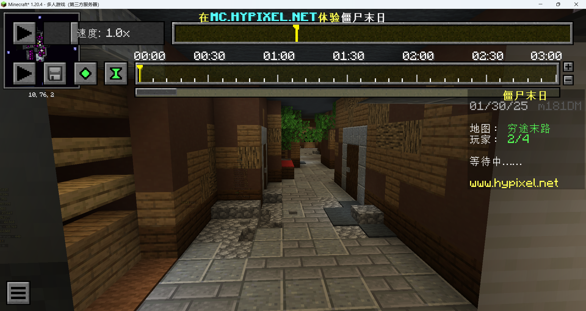
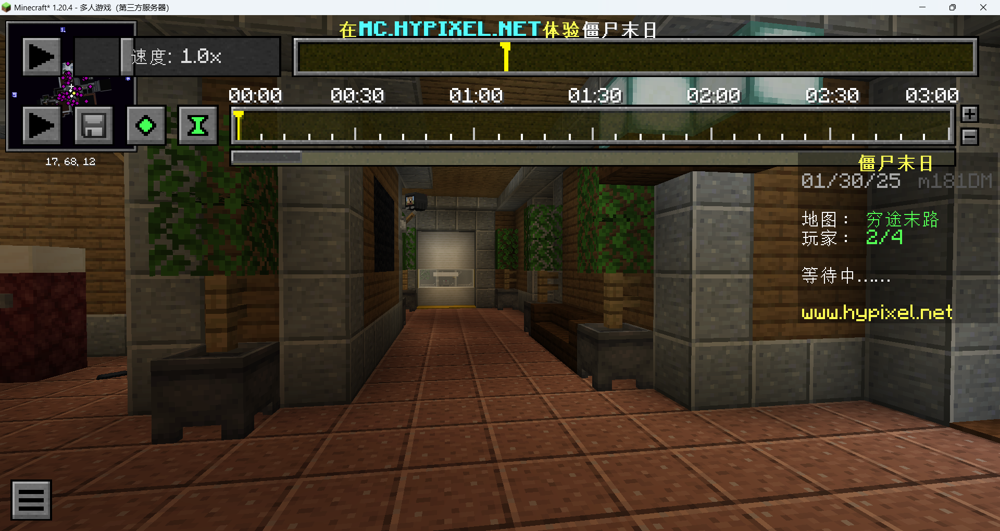
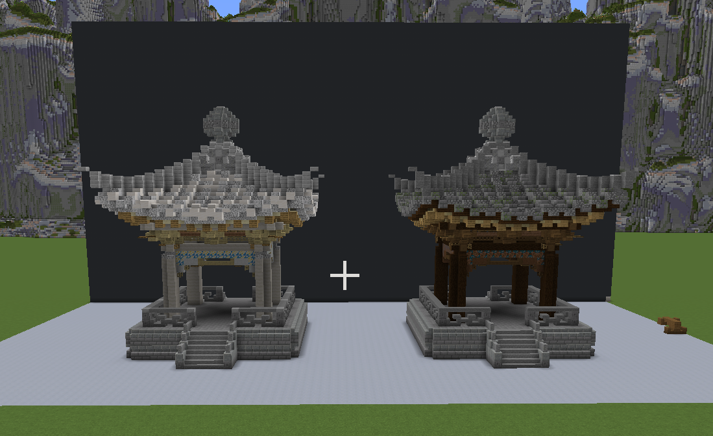
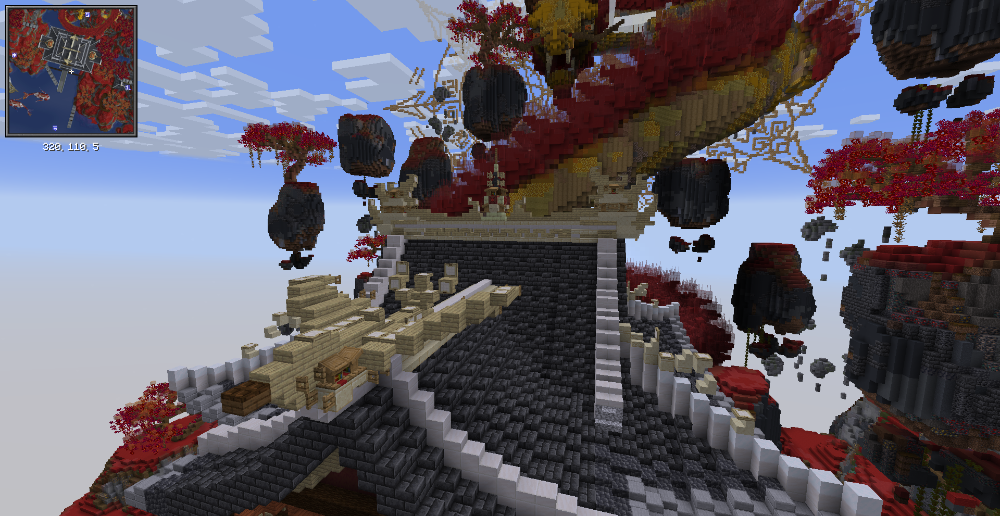
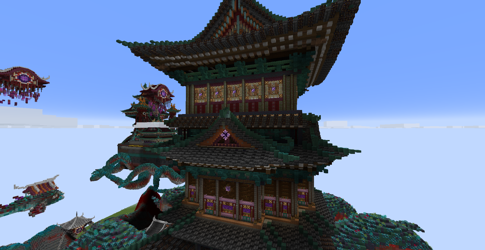
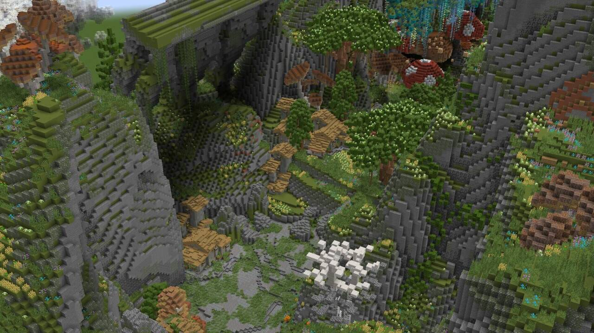
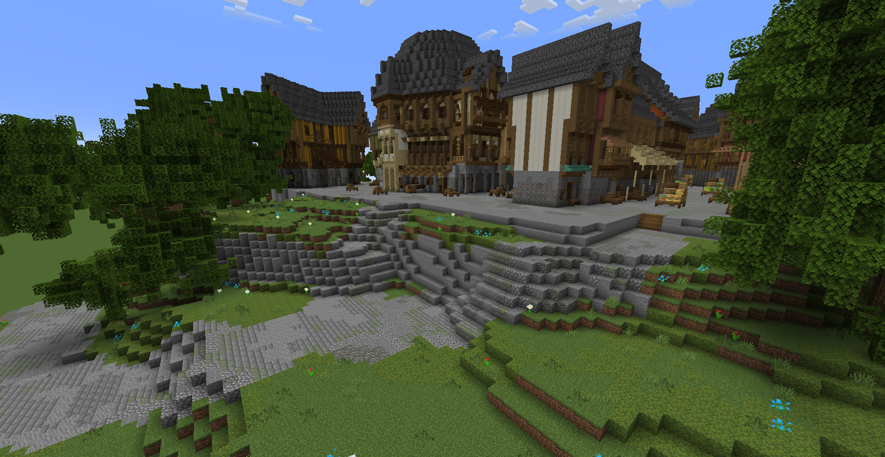

# 地图建设

:::warning

此处教程需要你阅读完`创作美术资源`的教程

:::

## 功能设计

在众多 Minecraft 服务器中，地图作为服务器的主要颜面与第一印象，类似与游戏启动时的菜单界面

作为服务器的 "菜单" ，地图的功能性也是必不可少的，而一个功能齐全且设计清晰的地图更是能给玩家带来非凡的印象

在建设地图前，我们先要根据服务器的需求来明确地图的使用场景，例如：

我的服务器有多种游戏模式，我的玩家需要中转 > 我判断这种功能需求量大 > 我在一个上游服务端部署一份拥有平台的美观的地图作为大厅

我的其中一个上游服务器是RPG，我需要增加与其他模式的独立性 > 我判断这种功能需求量大 > 我在服务器内部署了一份美观且符合背景的主城地图

我的RPG服务器有一套经济系统，我的玩家需要能够购买一些产品 > 我判断这种功能需求量小 > 我在主城内划分一片区域执行这个功能

我的RPG服务器有一套经济系统，我的玩家需要能够购买一些产品 > 我判断这种功能需求量大 > 我单独部署一份地图作为功能的执行区

## 场景规划

场景规划与功能设计有什么不同 ?

功能设计的目的是找到需求与功能，而场景规划则是为功能的实现区域进行划分，例如：

我的服务器RPG主城是城镇 > 城镇这种地方应该有铁匠、商铺、旅馆 > 我在主城内为这些区域部署功能

场景规划要符合逻辑常识，否则会给人一种怪异之感

场景规划要根据功能设计与背景做出调整

服务器中的地图应该注重游戏性而非美观性

> 以著名小游戏服务器 Hypixel 中僵尸末日的经典地图「穷途末路」为例

为了迎合主题，「穷途末路」采用了城镇废墟为背景，将玩家限制在狭小的巷子中来渲染游戏的主题以求增强玩家的代入感

整张地图的大小不超过 200*200 ，玩家路线为首尾相通的环状结构，既避免了怪物路线判断死角找不到玩家的情景，也在一定程度上避免了玩家找不到关键机器的情况

玩家的初始位置一共放置了 4 个出怪口，避免出现经济不均衡的情况

提供了两条可选择的路线，给玩家更多的选择性

玩家在初始位置大约可以撑到 10-15 回合，是游戏前期的舒适圈

在地图的办公室中，出怪口采用隔墙死角的方式来遮挡玩家的视野，实现类似巷战的效果，并在旅馆内设置了霰弹枪的购买点

在地图的旅馆中，设计了一条狭长的走廊，途中有多个出怪口，可以产生聚怪的效果

在走廊附近有高伤穿透的狙击枪的购买点

在这条走廊内，怪物的攻击距离刚好占走廊宽度的 1/3 - 2/3 ，使玩家进行游戏是操作变得穷迫、急迫

地图中的天台存放着整局游戏的关键性机关发电机，玩家若是想超过25回合，就必须往天台走

天台的布局宽阔，拥有范围武器火箭筒的购买点，在应对大量怪物时提供足够的空间，而高度差也可以缓冲怪物群

当玩家以为稳了的时候却发现，地图中的技能购买大部分在旅馆走廊，而武器强化则是在第一层，意味着玩家没办法单靠天台撑下去，而从天台下去的两条路都必须经过视野和操作空间都狭窄的区域

整个游戏的环状结构也是在此刻完全地映射出「穷途末路」的背景渲染

### 视距

有很多建筑在追求美观的时候会不断放大细节，一旦地图大小比例超过了某个阈值，地图就不再具有实用性也就不适合放在服务器上

在设计地图的时候应该要注意服务器的视距大小以及玩家的位置，将地图的大小比例控制在视野范围内，否则玩家眼中的地图是残缺且不和谐的

## 抽象采样

抽象，指从众多事物提取出共有的核心的特征，通俗点讲就是去粗留精，浓缩为精华

在实际建筑中，我们通常会将想象与现实中的建筑作为参照，但是 Minecraft 并没有办法实现如此高的精度

因此，我们就需要将参考物在脑中抽象化，将细节用方块纹路提现，用方块模型来表示大体结构

### 使用非完整方块

> 以下建筑实例图片采样于 [laobaitu156](https://space.bilibili.com/252415332)

常见的非完整方块有台阶、楼梯、活板门和围墙

在 Minecraft 建筑中，我们通常会使用这些非完整方块来拼凑出完整方块达不到的弧度或模拟形状，如下图亭子的宝顶和脊瓦：

特别是在中式建筑中，经常会出现用漏斗或楼梯模拟斗拱的拱、用台阶、活版门制作飞檐部分以及用各种非完整方块做雕刻的情况

### 混合像素

> 以下建筑实例图片采样于 [Grettzzz](https://space.bilibili.com/259534045)

在 Minecraft 建筑中，对于山体、高墙、树叶等地方，我们通常将两三种方块混合使用来实现单个方块达不到的效果，例如：

颜色相近有深浅关系的方块可以形成「层」的递进效果

颜色相近纹路不同的方块可以在山体形成「糙」的细节效果

颜色反差大纹路相近的方块可以形成「明暗」的光影效果

混合像素需要你不断地尝试练习，请相信你的直觉。

### 光源设计

在原版 Minecraft 中，光线的计算有时候不符合常识，因此我们可以使用光源方块来自己设计光源效果

:::warning

基岩版没有光源方块，光线计算由客户端而非服务端处理

:::

### 使用头颅、盔甲架和展示实体

头颅和盔甲就可以为你的服务器增加更多的细节，特别是低版本的服务器

:::warning

头颅可能因为客户端网络问题或资源包问题导致无法正常显示

:::

新版本的展示实体可以为你在原版增加更多的细节，使用 [Axiom](https://modrinth.com/mod/axiom/) 来便捷操作展示实体

## 工具选取

### 服务端插件

免费：

- [FastAsyncWorldEdit](https://modrinth.com/plugin/fastasyncworldedit)

- [FastAsyncVoxelSniper](https://modrinth.com/plugin/fastasyncvoxelsniper)

- [goBrush](https://www.spigotmc.org/resources/gobrush.23118)

- [goPaint](https://www.spigotmc.org/resources/gopaint.27717) 或 [goPaintAdvanced](https://modrinth.com/plugin/gopaintadvanced)

- [BuildBuddy](https://www.spigotmc.org/resources/buildbuddy.103139)

- [BuilderUtilities](https://modrinth.com/plugin/buildersutilities)

- [HeadDB](https://www.spigotmc.org/resources/headdb.84967)

订阅：

- [Arceon](https://www.patreon.com/arcaniax)

- [ezEdit](https://www.patreon.com/ezedits)

### 客户端模组

- [Axiom](https://modrinth.com/mod/axiom)

- [KleeSlabs](https://modrinth.com/mod/kleeslabs)

- [LotTweaks](https://www.curseforge.com/minecraft/mc-mods/lottweaks)

- [ModernKeyBinding](https://modrinth.com/mod/modernkeybinding)

- [WorldEditCUI](https://modrinth.com/mod/worldedit-cui)

- [WorldEdit](https://modrinth.com/plugin/worldedit)

:::warning

中大型单人项目不推荐在客户端使用 [WorldEdit](https://modrinth.com/plugin/worldedit) 模组在本地建筑

搭建一个本地服务端用于建筑工程才是理想的工作环境

:::

:::info

若你是用于非盈利项目，Axiom 是可以在单人协作上免费使用，并且可以在 [Discord 频道](https://discord.gg/axiomtool) 上申请 30 天白名单用于多人协作

若你是盈利项目，请在 [Axiom 官网](https://axiom.moulberry.com) 订阅许可证

若你喜欢 Axiom 并且想体验更多测试功能，请在 [Axiom 官网](https://axiom.moulberry.com) 订阅许可证

搭建多人协作插件服需要用到 **[AxiomPaper](https://modrinth.com/plugin/axiom-paper-plugin)**

:::

## 关于建筑类型与风格

常见的建筑类型有现代、中式、欧式、中世纪等，根据风格的不同又有正统、西方幻想、中式玄幻等，细分太多在此不过多赘述。

> 中世纪，采样于 z_wuxin

> 中式玄幻，采样于 Grettzzz

> 欧式，采样于 z_wuxin

