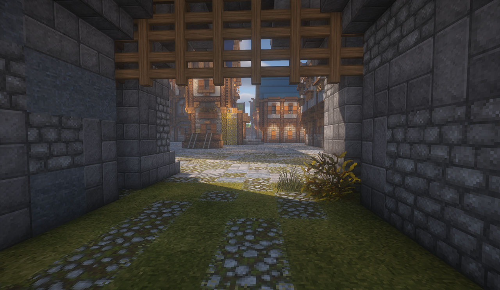
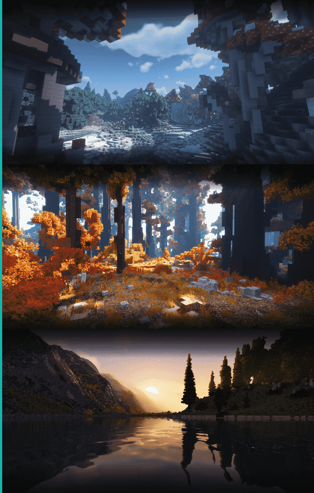
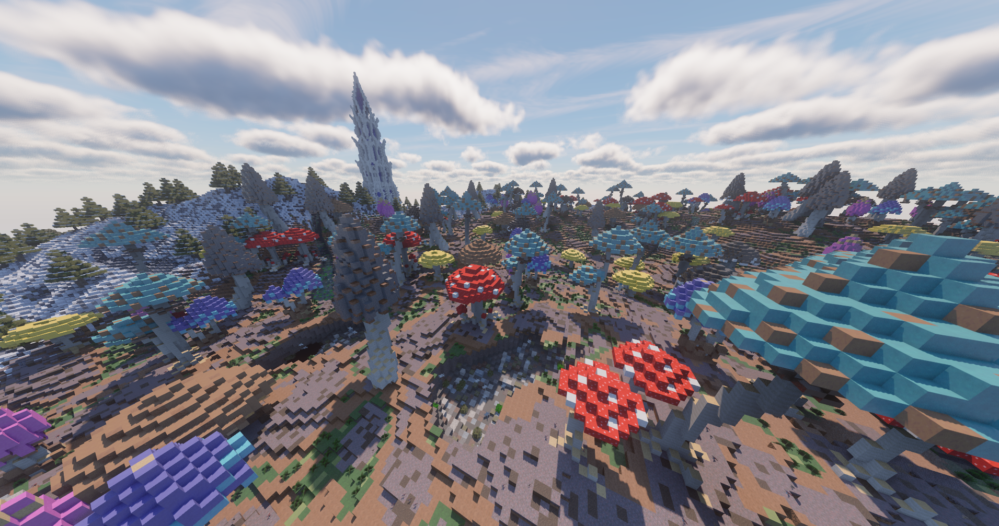
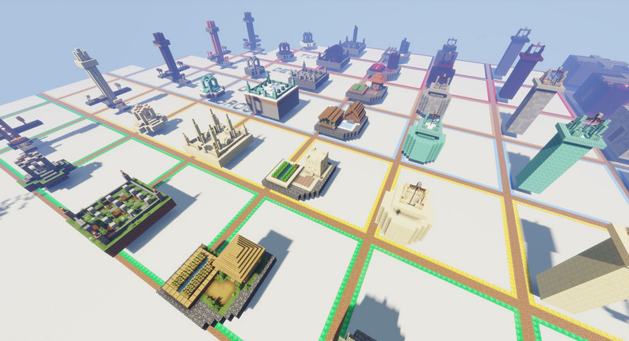

# 地图生成

制作一个地图非常困难,如果对于地图细节要求不高或者要求超大范围地图,可以考虑使用地图生成插件或工具

## 城市生成

### Ouranos(付费)

Ouranos 是一个 Java 版的城市生成插件，可以用来无限的城市地形,生成的城市偏向中世纪风格

[购买地址](https://www.spigotmc.org/resources/114772/),一些官方生成样例

### Arnis(免费)

Arnis 是一个通过 OpenStreetMap 将现实世界的城市转换到 Minecraft 中的软件,可以自己选择转换的坐标

[下载地址](https://arnis.app/),官方生成样例:

## 地下城生成

:::tip

这些地下城生成并非无中生有,而是需要设置模版,然后根据模版生成不同的地下城

:::

### DungeonMMO(付费)

DungeonMMO 是一个 Java 版的地下城生成插件，自带一些模版, 每次运行后，每个地下城都将被更新，所以你将永远不会看到相同的地下城

[购买地址](https://www.spigotmc.org/resources/106150/)

### MythicDungeons(付费)

同样的地下城生成插件，但是没有模版

[购买地址](https://www.spigotmc.org/resources/102699/)

## 迷宫生成

### Tangled Maze Plus(付费)

一个迷宫生成插件,可以生成复杂的迷宫和奖励箱

[购买地址](https://www.spigotmc.org/resources/76591/)

## 地形生成

地形生成可以生成更加好看的地形,由于这类插件较多,就不单独介绍了,以下是还在更新的

* Terra(免费) [下载地址](https://modrinth.com/plugin/terra)

* Iris (付费) [购买地址](https://www.spigotmc.org/resources/84586/)

* TerraformGenerator(付费/免费) [购买地址](https://www.spigotmc.org/resources/98309/)

* Stratos(付费) [购买地址](https://www.spigotmc.org/resources/80313/)

### 结构生成

以上四个插件自带一些结构,如果你需要更多更复杂的结构,你可以下载 BetterStructures

(免费) [下载地址](https://www.spigotmc.org/resources/103241/),免费包提供 100 + 结构,官方所有包共有 500 多个结构

