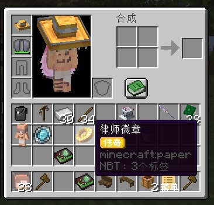
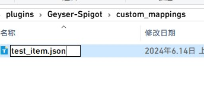
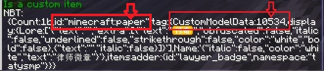
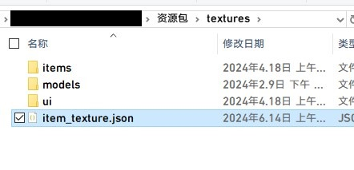

# 自定义物品模型映射

Geyser提供了自定义物品映射功能，可以为CustomModelData物品注册基岩版行为，以实现自定义物品

## Kas-tle的java2bedrock

java2bedrock.sh(俗称转换器)是一个自动资源包转换工具，可以将JAVA版的资源包转化成基岩版资源包的工具

:::tip

不建议过度依赖转换器，转换出来的资源包也仅供参考学习，没有手写的效果好，不过如果你能接受也不是不能用

转换器并非是完美的存在，他依然存在许多缺陷

:::

[项目地址](https://github.com/Kas-tle/java2bedrock.sh)

### 本地使用

:::tip

转换器需要在linux系统上运行，如果你使用WINDOWS，你可以选择wsl或者虚拟机

:::

本地运行你只需要执行

```
./converter.sh 资源包名称.zip
```

如果你需要更加复杂的转换，请查看项目的Github

### 在线转换

:::tip

你需要拥有一个GitHUB账号才可以

:::

#### 操作步骤

* 首先你需要新建一个Issue
* 在类型选择**Pack Conversion**
* 在**Java Pack Direct Download URL** 填上你的资源包下载地址（不能是网盘，要求是直链）
* 最后勾上最下面的用户协议，点击开始就可以
* 转换好后，有个机器人会提醒你去Github Action下载，下载就来就是转换好的基岩版资源包
* 将

## 人工手写映射

:::tip

此教程需要你有一定的动手和理解基岩版资源包结构，你可以动脑去看[基岩版资源包模板](https://github.com/Mojang/bedrock-samples/releases)学习

此教程假设你已能熟练使用ItemsAdder插件、并且正在边看[Geyser Wiki](https://wiki.geysermc.org/geyser/custom-items/)边看这文档学着做

:::

#### 物品映射

这里我非常推荐使用[Geyser Wiki](https://wiki.geysermc.org/geyser/custom-items/)中的Json映射方式，方便编写和修改

##### 注册物品行为

这是一个律师勋章，我想让他在基岩版上也显示



我们来到 `服务端/plugins/geyser/custom_mappings` 目录，创建一个json文件用于Geyser映射自定义物品



名字可以根据自己喜好起，我这里命名为 `test_item.json`。

如果你没有受虐倾向，建议起简单好记一看就知道里面是什么东西的名字

回到游戏，手持律师勋章，执行 `/iatag` 指令



我们看到他的 `ID` 是 `minecraft:paper`，以及 `CustomModelData(简称CMD)` 值是 10534

然后根据我们获得的物品信息，在 `test_item.json` 写入以下信息

示例:

```
{
  "format_version": "1",
  "items": {
    //这里填物品的ID
    "minecraft:paper": [
      {
        "name": "ITEM_LSXZ", //物品的名字可以随便填
        "allow_offhand": true, //是否允许将物品放在副手
        "custom_model_data": 10534 //这里填CMD值
      }
    ]
  }
}
```

json文件不允许有注释，如果你要复制过去记得删除注释

保存，然后我们的自定义物品Geyser已经注册好了，接下来是基岩版资源包方面的教程

##### 制作资源包

网上有很多制作资源包的教程，这里不多复述最基础的操作

基岩版资源包的结构你可以看这里的 [基岩文档](https://wiki.bedrock.dev/documentation/pack-structure.html)

我们来到 `资源包/textures` 目录下，创建个 `items` 文件夹用于存放物品纹理

这里我将纹理 `LSXZ.png` 放在 `textures/items/item/` 下

现在在 `资源包/textures` 目录下，创建个 `item_textures.json` 文件用于指定物品的纹理



在 `item_textures.json` 中写入

```
{
  "resource_pack_name": "这里填资源包名字",
  "texture_name": "atlas.items",
  "texture_data": {
        //填你在 test_item.json 填写的物品名称
		"ITEM_LSXZ":
        {
			"textures": [
				"textures/items/item/LSXZ" //填你纹理贴图的位置，不需要填png后缀
			]
		}
    }
}
```

完事后打包资源包，把你的资源包丢给Geyser

现在重启服务器，你的自定义物品应该能在基岩版显示了!

#### 3D模型物品

(施工中)

#### 饰品 (帽子翅膀类)

(施工中)

#### 自定义方块映射

[Geyser自定义方块映射](https://wiki.geysermc.org/geyser/custom-blocks/)

(施工中)
