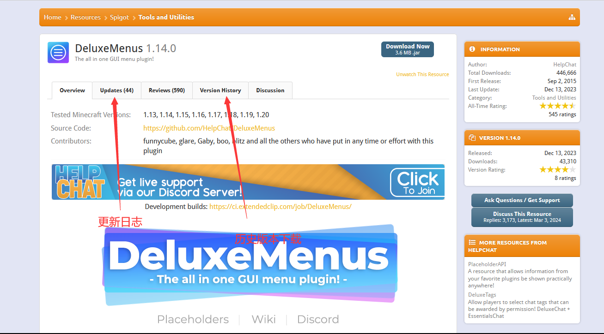
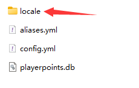

# 插件选择

很好，相信你已经在[可能用到的网站](/docs/preparation/websites)看到了很多链接， 面对成千上万的插件我们应该如何进行选择呢？

我们在此以spigot.org为例(假设您已经注册成功)， 讲解如何选择插件.

1. (*可选，推荐*)安装一个spigot专用的[搜索引擎](https://fof1092.de/Plugins/SSE/Redirect/)， 作为浏览器插件安装即可. 使用spigot search engine(spigot搜索引擎)后， 你能得到比spigot自带的搜索相关性强得多的搜索结果.

2. (*可选*)如果你觉得大量的英语很头大， 请打开你的浏览器自带的翻译器， 如edge/chrome

3. 就像逛淘宝一样， 根据你的需求将你认为有用的插件收藏起来. 最好是分门别类放在一起， 我们以随机 TP 插件为例， 我们在此搜索 RTP

    
安装搜索引擎后应该长啥样？

4. 查看这些插件的下载次数、最后更新时间、评价分数、插件特性、语言支持、是否开源、是否付费等. 如果符合以下的标准， 可以尝试下载几个并收藏这些插件(建议同类型插件选择大概3-5个最后选一个).

:::info

对于大多数插件， 选择人数较多(同类型插件前50%)， 更新维护更频繁， 用户评价多且平均分高， 插件特性满足需要(注意不是越多越好)

支持语言切换甚至直接支持全中文翻译， 开源， 免费的插件对于大多数服主来说是合理的.

:::

5. 将选好的同类型插件安装到服务器测试一下， 是否有bug， 是否特性能满足需求.

6. 如果你不嫌麻烦， 可以在 Excel 中分析插件的优劣并打分， 如图比较了当前下载量前5的随机TP插件. 每个服务器可根据自己的需求自行评价， 下图只是一个抛砖引玉的作用， 如果你看重粒子效果/title/音效等依然可以加入到表格中， 然后根据自己的需求选择其中一个即可， ***不要装多个同类型插件如CMI/ESS一起装***

## 如何下载插件历史版本？

**建议**您用**最新版本**的插件，但如果您因为一些原因必须要用旧版的话...

    
Bukkit

点击左侧文字可以查看详细内容

这是更新日志

    
SpigotMC

    
GitHub

在 Releases 中往下翻

或者这样子

    
Modrinth

## 如何查看插件支持的语言？

    
SpigotMC

    
目录下有文件夹

插件文件夹中有Language，lang，locale之类的文件夹(或其他东西？)

找 zhcn，zh-cn，zh-CN，chinese 等字眼

然后一般要去插件配置文件把语言改成这里的文件名(此处为zh_cn)

    
Crowdin

比如 https://www.spigotmc.org/resources/simpleclans.71242/

可以看到，语言那里给了个网站

https://crowdin.com/project/simpleclans

看到有 Chinese Simplified chinese zh_cn zh_CN 之类的字眼就行

    
拆开插件jar文件

比如 SkinsRestorer

在插件文件夹找不到语言文件夹

还有它可能写在插件文档里，在项目README里，在配置文件的注释里

[如何把插件语言改成中文？/如何汉化插件？](/docs/process/plugin/config.md#如何汉化插件)