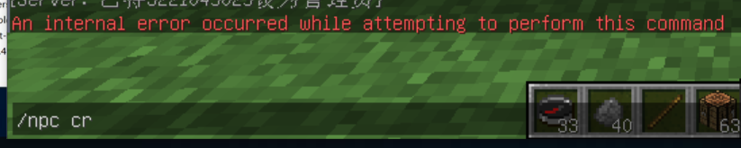
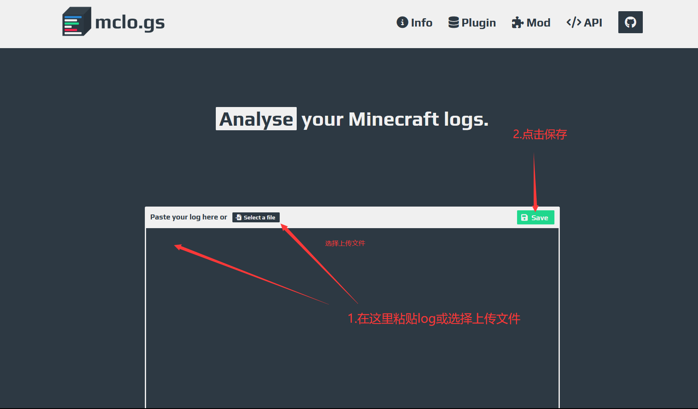
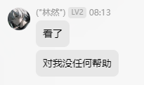

# 如何向大佬求助

首先明确，你是求助者不是少爷，第二，大多数人还是愿意互帮互助的。

:::warning

在问问题之前一定确保你已经看完这一章，因为有时候你的傲慢、无休止的问题会导致其他同行会入侵你的服务器，查你户口，给你服务器召唤 200 个假人，或者全服主交流群通报等。

:::

## 错误问问题的方式

一般来说，入门任何的领域会遇到问题，都需要问问题，但大家基本都不欢迎以下的问题：

**`怎么开基岩版互通`**

- 太直白了，请别人帮忙之前最好稍微带一些**态度**。

**`什么是 pojav？插件的 wiki 在哪里？`**

- **不要把群和人当做搜索引擎**（除非打钱了）。

**`我玩家进不来服务器怎么办`**

- **描述模糊**，可能性太多以至于没有人猜出。

**`[不正确提供 log 或不提供 log]`**

- 以下这些情况，应该去天桥的老大爷找你算算命，因为没有有效的 log 没人能知道你遇到的问题。
- 在 **服务器** 问题中提供 **客户端** log。
- **不完整** 的 log，甚至 **不提供** log。
- 错误的将**客户端**收到的报错当做**服务端**报错。
- **直接将成百上千行的 log 发到交流群**

:::warning

这段话是告诉你去控制台看报错，你把这段话截图给群发干什么？群友是控制台？

:::

# 我应该怎么做？

为避免无效问题，问问题最好需要符合以下几个基础原则：

1. 使用一定的称呼
- `请问大佬们我遇到了 xxx 该怎么办呢？`
- `打扰一下，我最近 xxx 了请问有人知道怎么回事吗？`

2. 明确遇到的问题，到**对应群**里问
- `请问在升级 1.20.4 之后遇到 xxx 插件不适配应该怎么办？`
- `作者大大，你的 xxx 插件和 yyy 核心是不是有兼容性问题呢？`
3. 提到服务器环境
- `大佬们我是 1.16.5 catserver 服务器，遇到了 xxx 问题`
- `最近我升级到了 1.21 paper 核心，玩家反应 xxx 有人有类似的问题吗？`

4. 给出合理的日志 - [详细说明](#给出日志)
5. 先查 wiki 或搜索 - [详细说明](#看完-wiki-再问)

## 给出日志

### 笨蛋脚本

使用此[脚本](https://github.com/lilingfengdev/NitWiki-Script/releases/download/windows-latest/update-log.exe)，会将日志自动上传到 mclo.gs (默认上传的日志是 `logs/latest.log`)

### 如何上传

当你询问问题的时候，发出你的报错日志(推荐一个网站 [Mclogs](https://mclo.gs/)，很方便的上传日志，

你需要明白你面对的是群友而不是道友，没有人可以在没有日志的情况下帮你解决问题，

如果你遇到的是大佬还可以给你算一卦。

  
如何使用 Mclogs 

服务器 log 文件在服务端根目录的 logs 文件夹，一般上传 latest.log （服务端最新的日志）即可

把这个链接复制粘贴发给大佬

其他的贴 log 的网站

  
其他可用的网站

- https://pastes.dev/
- https://paste.fastmirror.net/
- https://n0paste.tk/
- https://www.paste.lv/
- https://nekobin.com/
- https://note.ms/dwlg
- https://paste.gg/
- https://bytebin.lucko.me/
- https://netcut.cn/
- https://cl1p.cn/
- https://jiantieban.cn/
- https://www.verybin.com/
- https://ykjtb.com/
- https://airportal.cn/
- https://toolight.cn/text/paste
- https://nick-running.github.io/easy-tools/clipboard.html

## 看完 Wiki 再问

Wiki 就是让你解决常见问题的，不看这玩意儿就在那瞎问只会获得 `滚过去看 wiki ` 回复。

不遵守以上规则，可能会导致你写入**乐子文档**

经典如何提问: https://settingdust.gitbook.io/stop-ask-questions-the-stupid-ways/

## 经典老图

## 真正的傻逼

对不起大佬，是我疏忽了，没说明服务器没停也是会输出日志到 `latest.log` 的