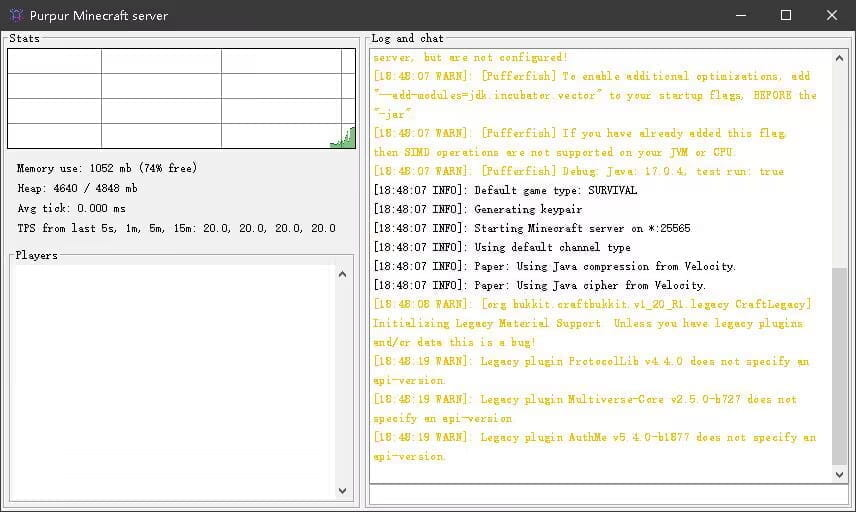

# 什么是启动脚本？

启动脚本主要部分就是设置 Java 参数设置。

*对于 Windows 服务器来说，启动脚本是 `.bat` 后缀的文件，对 Linux 服务器而言，启动脚本是 `.sh` 后缀的文件。*

`sh` 和 `bat` 是两种不同操作系统环境下用于执行脚本的文件扩展名，它们的主要区别在于运行环境、语法的不同：

## SH (Shell Script)（Linux）

* 语法: SH脚本使用Shell命令和控制结构，支持条件判断、循环、函数定义等高级编程特性。
* 执行方式: 在终端通过 `./script.sh` 或 `sh script.sh` 来执行（确保脚本具有执行权限）。

## BAT (Batch File)(Windows)

* 语法: BAT脚本包含一系列DOS命令和批处理命令，支持简单的条件判断和循环，但相比SH脚本，其功能和灵活性较低。
* 执行方式: 双击文件或者在命令提示符下输入 `script.bat` 来执行。

注意:Windows和Linux的启动脚本不能通用,不是改一下后缀名就可以

# 什么是启动参数

启动参数（也称 Flag）主要分为3类：

* 标准参数（-）：所有的 JVM 实现都必须实现这些参数的功能，而且向后兼容；
* 非标准参数（-X）：默认 JVM 实现这些参数的功能，但是并不保证所有 JVM 实现都满足，且不保证向后兼容；
* 非Stable参数（-XX）：此类参数各个 JVM 实现会有所不同，将来可能会随时取消，需要慎重使用；

## 基础

```bash
java -Xms12G -Xmx12G -jar 核心名.jar nogui
```

:::warning

作为新手，不用在意大多数参数的作用，你需要做的就是开启服务器。

**不要忘记改最后的“核心名.jar!**

:::

| 参数 | 说明 |
| ----------- | ----------- |
| -Xmx[size] | 设置最大内存大小，默认为物理内存的1/4或者1G，需大于2M，可以指定单位K/M/G |
| -Xms[size] | 设置最小内存大小，默认为物理内存的1/64，需大于1M |
| -jar | 为 Java 指定需要运行的 Jar 程序 |
| --nogui | 关闭服务器 GUI，少量性能提升，大多数人不需要用到 |

<details>
  <summary>--nogui干了什么</summary>

不显示类似下面的GUI



真的，这个GUI一点用没有，别开它了

</details>

:::info

1. 无论什么时候，分配内存时一定要多预留15%左右内存，如服务器还剩余 10G 内存， 不要将 -Xms 设置到大于 9G 的内存，否则会很危险。
2. 在 G1GC 模式下，尽量保证 Xmx = Xms 因为如果二者不同 JVM 需要更多的内存时候，JVM需要申请更多内存，这个过程的耗时会导致顿卡。
3. 更多的参数讲解，请前往 [JVM参数优化](https://yizhan.wiki/NitWikit/Java/process/maintenance/optimize/jvm-optimization)

:::

## 如何设置自动重启

对于 Windows `start.bat` 可参考的脚本如下：

```bash
@ECHO OFF
:start
java ..... -jar 核心名.jar --nogui
goto start
```

对于 Linux `start.sh` 可参考的脚本如下：

```bash
while [ true ]; do
    java ..... -jar 核心名.jar --nogui
    echo 服务器自动重启中
    echo 同时按下 CTRL + C 关服.
done
```