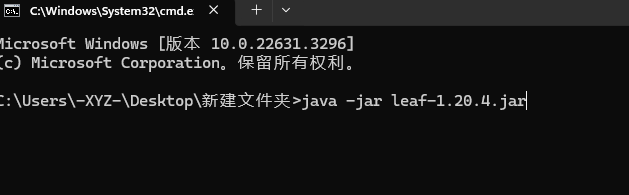
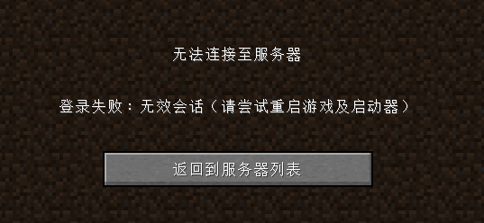

# 开启服务端

你已经做好了准备工作，开始启动你的服务器了

## 笨蛋脚本

下载此[脚本](https://github.com/lilingfengdev/NitWiki-Script/releases/download/windows-latest/generate-script.exe)，回答几个问题就可以为你自动生成启动脚本!!

<details>
<summary>直接在终端里敲命令来启动?</summary>

如果你第一次开服，或者你看不懂这个折叠里的内容，那就跳过，直接去看底下的编写启动脚本

## 终端路径

就像你的文件资源管理器


(估计有人不知道文件资源管理器是什么，所以放张图)

有路径一样，你的cmd也是有路径的(红框中为此cmd所在的路径)

[cmd是什么](https://cn.bing.com/search?q=cmd%E6%98%AF%E4%BB%80%E4%B9%88)

[怎么打开cmd](https://cn.bing.com/search?form=MOZLBR&pc=MOZI&q=%E6%80%8E%E4%B9%88%E6%89%93%E5%BC%80cmd)

## 启动命令

现在你把下载好的服务端核心放到一个空文件夹里


点击地址栏，输入cmd然后回车，就会在这个路径下打开cmd



或者用别的办法打开cmd，然后用cd命令切换路径

[怎么用cd命令切换到另一个目录](https://cn.bing.com/search?q=%E6%80%8E%E4%B9%88%E7%94%A8cd%E5%91%BD%E4%BB%A4%E5%88%87%E6%8D%A2%E5%88%B0%E5%8F%A6%E4%B8%80%E4%B8%AA%E7%9B%AE%E5%BD%95)


</details>

## 编写启动脚本

~~最简单的启动命令当然是java -jar~~

现在你把下载好的服务端核心放到一个空文件夹里


在这个文件夹里创建一个txt文件，重命名为bat后缀的文件 如 `start.bat`

[文件看不到后缀怎么办](https://cn.bing.com/search?q=%E6%96%87%E4%BB%B6%E7%9C%8B%E4%B8%8D%E5%88%B0%E5%90%8E%E7%BC%80)

用你前面下的文本编辑器编辑这个文件，写入以下信息并保存，然后双击 `start.bat`

```
java -Xms2G -Xmx2G -jar 核心名.jar --nogui
```

## 最初的开启

双击启动脚本后，大概率会卡在你会看到 Downloading mojang_x.x.x.jar，请耐心等待或查看[加速 mojang 核心下载](/docs/sundry/FAQ.md)

一旦下载完成，他会提示：

```
You need to agree to the EULA in order to run the server. Go to eula.txt for more info.
```

用文本编辑器打开此目录下生成的 `eula.txt` ，将里面的 `eula=false` 改为 `eula=true`

eula 就像是用户协议一样的东西，你想知道讲了啥，点 [这里](https://zhuanlan.zhihu.com/p/463084883)

改好之后重新开启服务器，当出现以下字样说明服务器已经成功开启。

```
Done (6.554s)! For help， type "help"
```

:::tip

你可以点击目录中的连接服务器进入下一节内容了!

:::

## 更复杂的bat

请参考 [JVM参数优化](/docs/maintenance/optimize/jvm-optimization.md)

## 笨蛋脚本

开启后，你可能需要进行一些简单配置，比如修改服务器端口，正版验证等

[下载](https://github.com/lilingfengdev/NitWiki-Script/releases/download/windows-latest/config-eazy.exe)，我们会询问一些问题，帮你**自动配置**

目前可以配置的
* 服务器端口
* 正版验证
* 服务器种子
* 最大玩家数

## 正版验证

正版验证默认被开启，不关闭正版验证的话盗版玩家是不能加入游戏的。如果你没有用正版启动游戏，那么加入服务器会出现



在 **server.properties** 中找到此项

```
online-mode=true
```
如果你想关闭正版验证，将 true 改为 false ，保存，重启服务端

:::danger

不要开服开到一半去改正版验证! 这会造成UUID混乱，玩家数据丢失

[Offline2OnlineUUIDFix](https://github.com/yfy-dodo939/Offline2OnlineUUIDFix) 可以解决此问题（感谢[yfy-dodo939提供](https://github.com/postyizhan/NitWikit/issues/67)）

:::

## 最大玩家数

在 **server.properties** 中找到此项

```
max-players=20
```

后面的数字就是你希望这个服务器最大能进入的玩家数。

## 服务器种子

在 **server.properties** 中找到此项

```
level-seed=
```

这里面就可以填上你想要的种子。

:::note

你可能会发现一些结构，比如村庄的生成，并不会遵循种子，是由于 Spigot 及其下游服务端加入了随机种子，地形的生成也会出现一些偏差

当然，你仍然可以利用种子定位群系，比如找史莱姆区块

:::

## 服务器端口

在 **server.properties** 中找到此项

```
server-port=25565
```

后面就可以改成你想要的服务器端口，当然，玩家连接的也需要更改(或者使用 srv 转发)
