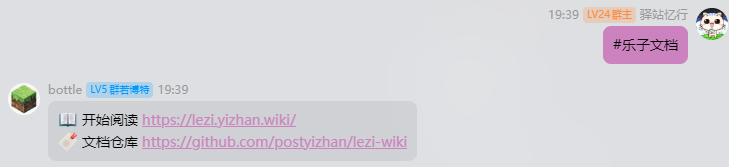

# 机器人命令

在群内发送消息即可使用！


## `mcping`

打印mc服务器信息。

用法：

```
mcping <服务器地址>
```

## 消息回复

消息回复关键词要加前缀 `#`



下方是可用的关键词。

### `乐子文档`

返回乐子文档的地址和仓库。

### `开服教程`

返回本文档的地址和仓库。

### `帮助`

返回 https://nitwikit.yizhan.wiki/%E6%89%A9%E5%B1%95%E9%98%85%E8%AF%BB/%E6%9C%BA%E5%99%A8%E4%BA%BA%E5%91%BD%E4%BB%A4

### `正确提问`

返回消息 https://nitwikit.yizhan.wiki/start/%E5%90%91%E5%A4%A7%E4%BD%AC%E6%B1%82%E5%8A%A9

### `搜索`

返回消息 https://nitwikit.yizhan.wiki/search?q=

### `核心`

返回消息

📦 单端 https://nitwikit.yizhan.wiki/start/%E6%9C%8D%E5%8A%A1%E7%AB%AF%E6%A0%B8%E5%BF%83%E9%80%89%E6%8B%A9

📦 跨服端 https://nitwikit.yizhan.wiki/%E8%B7%A8%E6%9C%8D%E7%AB%AF/%E6%A0%B8%E5%BF%83%E9%80%89%E6%8B%A9