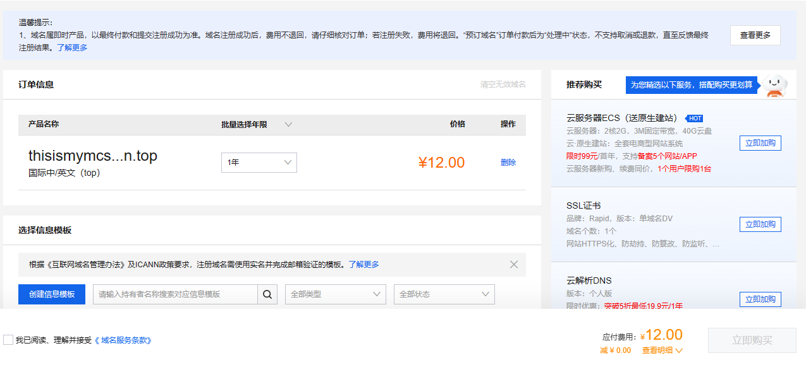

# 申请域名

域名不但是服务器的招牌，也是老玩家重新找回的一个重要渠道，一个好的域名应该够短（太长了没人记得住）、有记忆点（最好是和 Minecraft 或玩法相关），那么准备好一点小钱钱和待选的名字开始吧。

## 寻找合适的域名提供商查询域名

以阿里云的[万网](https://domain.aliyun.com/)为例，打开网站，来到如下页面：

搜索你想要的域名

:::warning

此处域名价格为你输入域名的人气决定，名称越热门越贵，没有优惠最便宜首年也这个价。

不要看有些域名首年很便宜，可能第二年续费要成百上千，不放心可以鼠标悬停在价格旁边的倒三角处查看续费价格，这里推荐.top，第二年价格最低，长期开服绝对推荐。

:::

## 购买域名
登录后点击域名旁边的加入清单，然后点批量注册旁边的域名清单，更改域名购买时间后，最好底下什么套餐都不要选，直接点立即购买。

跳转后这个页面立即购买是点不动的，滑动到下方，点击创建信息模板来实名验证。

:::tip

此操作未成年也可以，但无论如何信息需要真实（通讯地址似乎不用太精确，填到市就能过了），请不要拿着他人的身份证假冒认证！

:::

点提交后等通过，然后回来勾选最底下的我已阅读、理解并接受《域名服务条款》。在下一个页面选择支付方式后点支付。

:::tip

购买的域名一般需要至多 24 小时才能正常解析，打开网址 https://whois.aliyun.com/domain/ + 你的域名，如果域名状态那里是正常状态（ok）就代表可以使用了。

:::

## 域名解析

A 记录是 DNS 中用于将域名映射到 IPv4 地址的记录（也就是我们常用的 IP 记录）。

SRV 记录，使用二级域名记录了端口的信息，使用 SRV 可以隐藏域名端口。

:::warning

文档中，假设你购买了域名 `xxx.top`，服务器在外网的端口为 `22222` ，请勿直接照抄配置。

:::

### A 记录
将域名指向一个 IPV4 地址。

人话就是把数字 IP 地址解析成英文字符的域名。

打开网址 [阿里云域名控制台](https://dc.console.aliyun.com/#/domain-list/all)，找到你的域名点右边蓝色字的解析。

点击添加记录，记录类型选择 A 记录。

主机记录改为 `@` （这意味着使用根域名），记录值改为服务器数字 IP 。

等待解析生效。此时，玩家可通过 `xxx.top:22222` 进入服务器了。

:::tip

1. 如果只知道域名不知道 IP 就 Win + R 输入 cmd，随后输入ping + 域名。

2. 主机记录可以改成如 `play` 等，玩家就可以通过 `play.xxx.top:22222`（但这是不是有点太长了，不推荐）。

:::

### CNAME记录
将域名指向另一个域名。

假如服务商给的是解析好的域名不是 IP，那就需要用这个来指向你自己的域名。

记录类型选 CNAME。

然后主机记录填你需要的二级域名，填写 `@` 可以不用前缀。

记录值填服务商给的域名就行了。

### SRV 记录

点击添加记录，记录类型选择 SRV 。

然后主机记录填你需要的二级域名，如你需要使用 `mc.xxx.top` 代替 `xxx.top:22222` （端口），就将主机记录改为：

`_minecraft._tcp.mc`

此处的 mc 可以改为其他，如 `play` 、`*` 等，填写 `@` 可以不用前缀。

记录值填写为：

`5 0 22222 xxx.top`

> 5 0 是固定的，22222 是你的端口

点击确认，等一会，你就可以发现直接用域名可以连接上你的服务器了。

:::tip

此方法只能用于 Minecraft 服务器。

:::
