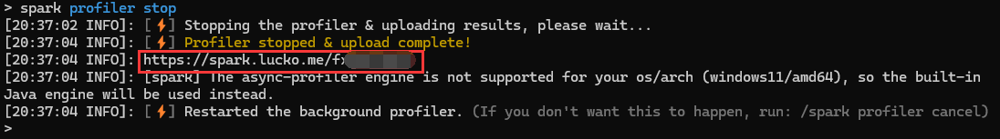

# 怎么让大佬帮我

检查你的服务器有没有安装spark插件,尝试`/spark`命令或者`/pl`看看有没有spark

:::info

Purpur端会自动安装spark插件

:::

如果没有,手动安装一下[spark](https://www.spigotmc.org/resources/spark.57242/)

## 开启spark记录

```
spark profiler start
```


在你服务器卡顿的时候开启,**一段时间后**结束

## 结束spark记录

```
spark profiler stop
```

它会给你一个链接,你把这个链接发给大佬并**礼貌的**请求他帮助你

注:链接位置在下方图片中红框标记的部分

