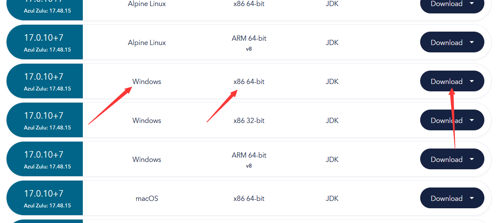
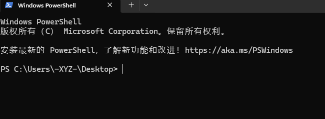
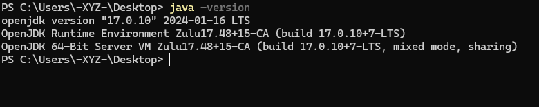

# 下载和安装 Java

您的服务端和客户端都需要安装 Java 才能运行。各个游戏版本需要安装的 Java 版本不同。

## 通过笨蛋脚本进行下载和安装

使用这个脚本，我们会自动为您安装 JDK (Java Development Kit，Java 开发环境)，并将 Java 添加到环境变量。

[下载地址](https://github.com/lilingfengdev/NitWiki-Script/releases/download/latest/install-java.py)

## 手动下载

### Oracle 版

官方版本


<details>
  <summary>怎么找到官网并从官网下载</summary>


> 如果再往下翻的话可以看到 Java 8 / 11。


> 但是在这里 Java 8 需要登录才能下载。
>
> 你可以在下方链接直接下载 Java 8。
>
> > https://www.java.com/zh-CN/download/
</details>

### Zulu 版

比较有名的分支版本，有更好的优化，推荐使用。

<details>
<summary>怎么找到官网并从官网下载</summary>


> 往下翻，找到这个，选择你想要的版本


> 找到64-bit (64位) （如果你的电脑是32位的，不建议开服。）。



> 如果您不能安装此软件（如不兼容），请关闭此文档，且**不要向**文档编写者们提问，感谢。
</details>


## 验证 Java 安装

打开 Windows 终端 / PowerShell / CMD。

[怎么打开 Windows 终端](https://cn.bing.com/search?q=%E6%80%8E%E4%B9%88%E6%89%93%E5%BC%80windows%E6%8E%A7%E5%88%B6%E5%8F%B0)



输入

```
java -version
```

并回车



> 返回类似的消息即为java已安装
