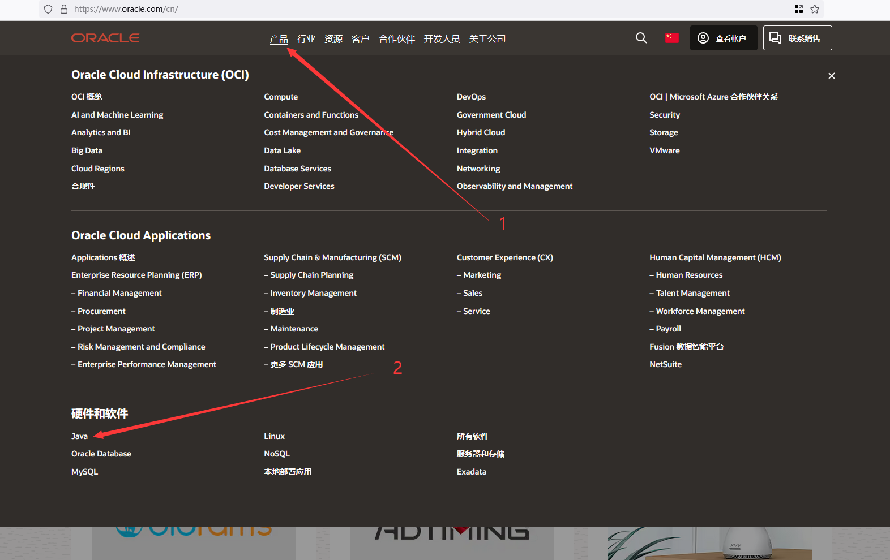
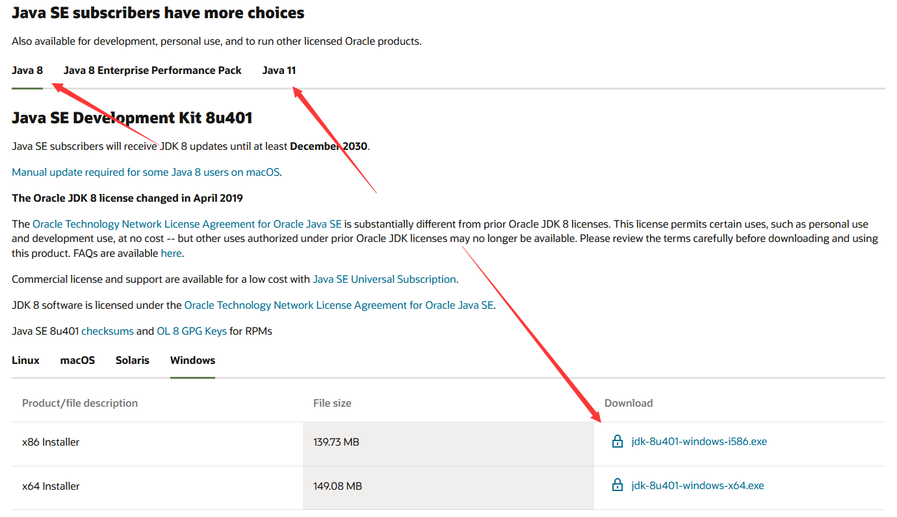
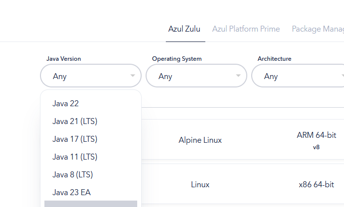

# 下载和安装java

不管是您的服务端还是客户端都需要安装java才能运行

## Oracle 版

官方版本

 
怎么找到官网并从官网下载

> 如果再往下翻的话可以看到java8/11

> 但是在这里java8需要登录才能下载
>
> 你可以在下方链接直接下载java8
>
> > https://www.java.com/zh-CN/download/

## Zulu 版

比较有名的分支版本,有更好的优化,推荐使用

 
怎么找到官网并从官网下载

> 往下翻，找到这个，选择你想要的版本

> 找到64-bit (64位)

> 如果您不能安装此软件（如不兼容），请关闭此文档并`不向`文档编写者们提问，感谢

