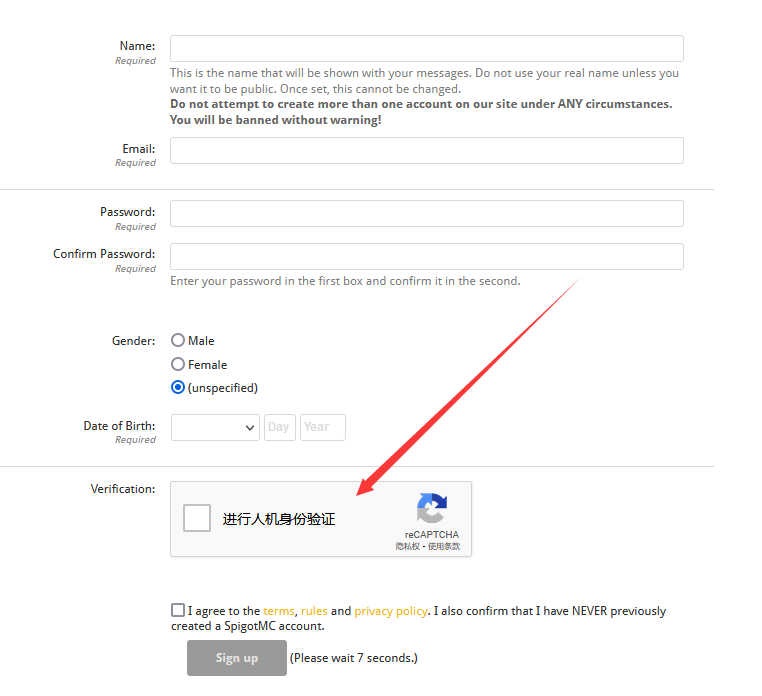

# 可能用到的网站

推荐您在下面的网站注册账号方便日后使用

## spigotmc

spigotmc应该是目前最大的插件网站了

使用魔法就可以看到验证了，而不是傻呵呵的跟人说

**spigotmc不开放注册**

**老外的网站真反人类**

## GitHub

全球最大的社交编程及代码托管网站

许多开发者会把自己编写的插件发到GitHub

虽然不登录账号不影响你浏览仓库和下载Release等

但是登录后可以给作者发issues来报告问题，提交新需求/建议，还可以下载actions中的文件

[在 GitHub 上创建帐户](https://docs.github.com/zh/get-started/start-your-journey/creating-an-account-on-github)