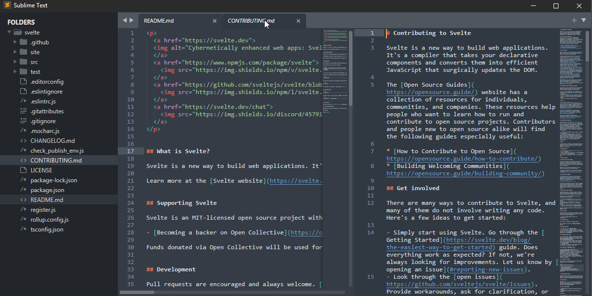
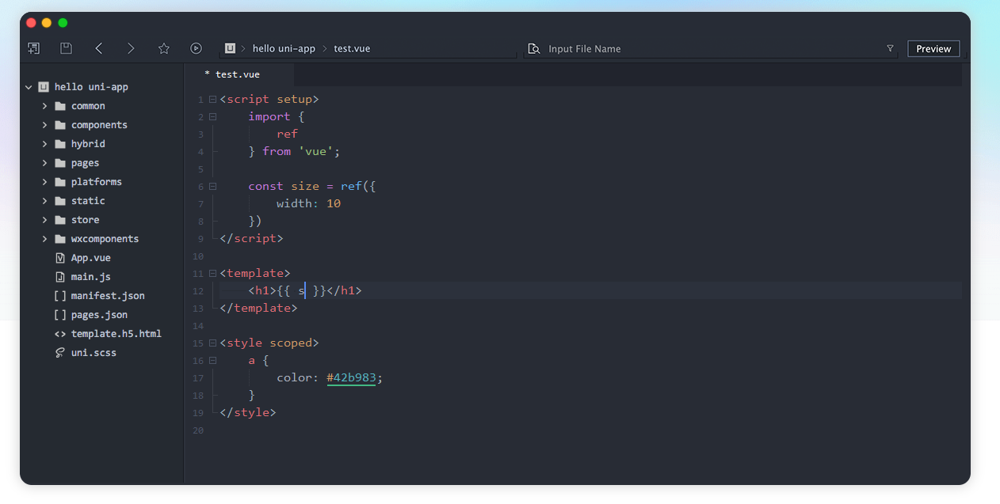

# 文本编辑器

一个好用的文本编辑器是`相当`重要的

请不要再使用windows记事本了

## Vscode

  
点击展开

全能型文本编辑器

**非常非常推荐**

https://code.visualstudio.com/

[下载龟速怎么办](https://cn.bing.com/search?q=vscode%E4%B8%8B%E8%BD%BD%E9%BE%9F%E9%80%9F%E6%80%8E%E4%B9%88%E5%8A%9E)

## Sublime Text

  
点击展开

我不太喜欢的一点是保存文件时对非激活的用户有概率弹出个窗口提示你去付费支持

但这依旧是一个非常优秀的文本编辑器

https://www.sublimetext.com

[如何汉化](https://cn.bing.com/search?q=sublime+text%e6%b1%89%e5%8c%96&qs=SC&pq=sublimetext&sk=HS1SC5&sc=10-11&cvid=19623440FA3646E0BEBECEED995CFCAF&FORM=QBRE&sp=7&lq=0)

## Kate

  
点击展开

开源,跨平台,也可以秒开文件

## Notepad3

  
点击展开

也是一个比较不错的文本编辑器

https://rizonesoft.com/downloads/notepad3/

https://github.com/rizonesoft/Notepad3

## Notepad++

  
点击展开

[notepad++](http://www.notepadplus.com.cn/)作者台独，多次辱H [这里](https://cn.bing.com/search?q=notepad%252B%252B%E8%BE%B1%E5%8D%8E)

个人建议更换，当然notepad++也不是不能用

## Notepad--

  
点击展开

国内作者维护的notepad++的替代品

[`Gitee`](https://gitee.com/cxasm/notepad--)
[`GitHub`](https://github.com/cxasm/notepad--)

## HbuilderX

  
点击展开

https://dcloud.io/hbuilderx.html

一个国产的文本编辑器

#### 关联右键菜单?

可以在工具→设置(Ctrl+Alt+,)打开设置，找到“常用配置”手动选中【关联右键菜单】

