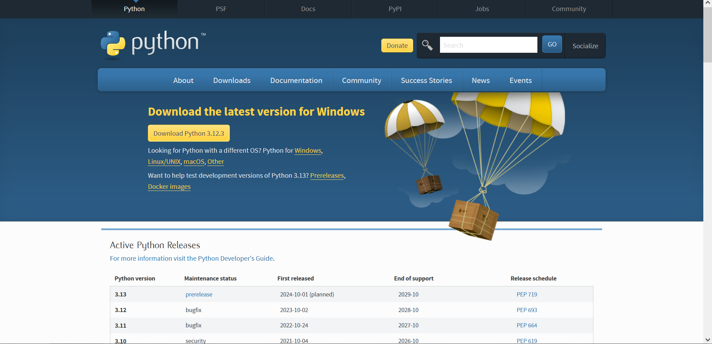

# 笨蛋脚本使用

笨蛋脚本是由本wiki的作者之一 lilingfeng 编写的，专门为笨蛋设计的，你只需要双击启动，回答几个问题就能帮你自动完成。

## 功能

目前，我们已经编写了以下的笨蛋脚本

* 自动优化服务端配置文件
* 自动配置防矿透
* 自动配置防种子破解
* 自动生成启动脚本
* 自动安装常用插件
* 自动安装 Python
* 自动安装 Java
* 一键上传日志
* 自动配置反作弊
* 自动简单配置
* 自动选择服务端核心并下载
* 还有更多(在编写中)

## 赞助我们

打点钱吧,写这些脚本并不容易,give money后,你会获得以下权益

* 使用支持:我们会解决你在使用过程中的问题和报错(对,没打钱的人我不会提供**任何支持**,有问题自己找)
* 功能请求:你可以向作者提出功能请求,我们会优先编写

## 使用准备

使用此脚本时必须安装 Python 3。（自动安装 Python 的脚本除外（笑）。）

### 安装 Python

#### 一键安装,支持 Win 7+

[下载地址](https://github.com/lilingfengdev/NitWiki-Script/releases/download/latest/install-python.bat)

#### 如果你是 Win 8.1+：
首先，并不建议使用版本低于 Windows 10 的操作系统开服，Windows 8.1 的支持已于 2023 年 1 月 10 日结束，这意味着在不远的将来 Python 将会停止支持 Windows 8.1。另一方面，Windows 10 的支持将会持续到 2030 年，相对来说更适合长期开服。

1. 首先，进入 https://www.python.org/downloads/ 网站：

2. 点击那个大大的，黄色的“Download Python 3.xx.x”

3. 你会得到一个 `.exe` 格式的文件，点击打开它。    
   如果你不知道你把文件存在哪，那我可没话说。

4. 按照提示完成安装步骤，就是一路点“Next”。（记得安装前勾选“Add Python 3.xx.x to PATH”）

#### 如果你是光荣的 Win 7 钉子户：

1. 64 位点[这里](https://www.python.org/ftp/python/3.8.9/python-3.8.9-amd64.exe)，32 位点[这里](https://www.python.org/ftp/python/3.8.9/python-3.8.9.exe)。什么？[不会区分自己的电脑是32位还是64位？](https://support.microsoft.com/zh-cn/windows/32-%E4%BD%8D%E5%92%8C-64-%E4%BD%8D-windows-%E5%B8%B8%E8%A7%81%E9%97%AE%E9%A2%98%E8%A7%A3%E7%AD%94-c6ca9541-8dce-4d48-0415-94a3faa2e13d)

2. 按照提示完成安装步骤，就是一路点“Next”。（记得安装前勾选“Add Python 3.xx.x to PATH”）

除生成启动脚本，其他脚本都必须启动一次服务端后才能使用，生成启动脚本需要提前安装服务器核心。

:::danger

所有笨蛋脚本都需要在服务器根目录执行!!

:::

## 宗旨

我们只教导傻逼，不制造傻逼，所以不要问可不可以写一个一键脚本，完成一切工作。

~~其实已经写出来了.......~~

## 许可

本脚本永久免费，如果你是付费得到本脚本的，请立刻退款并骂死那个人。

[Github](https://github.com/lilingfengdev/NitWiki-Script)
