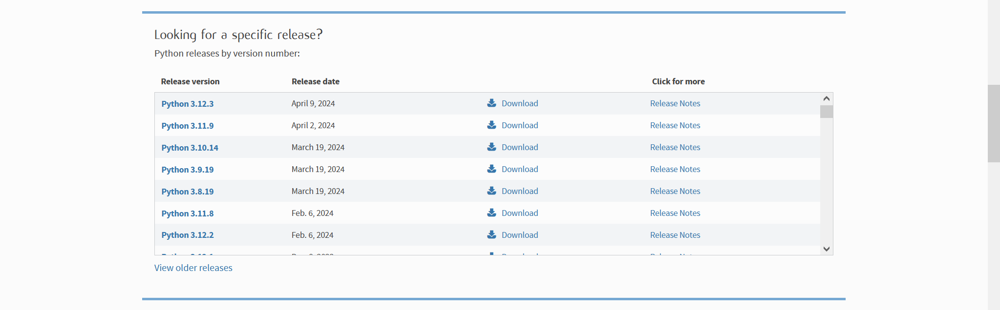

# 笨蛋脚本使用

笨蛋脚本是由本wiki的作者之一lilingfeng编写的,专门为笨蛋设计的,你只需要双击启动，回答几个问题就能帮你自动完成

## 功能

目前，我们已经编写了以下的笨蛋脚本

* 自动优化服务端配置文件
* 自动配置防矿透
* 自动配置防种子破解
* 自动生成启动脚本
* 自动安装常用插件
* 还有更多(在编写中)

## 使用准备

使用此脚本时必须安装 Python。

### 如何安装？

#### 如果你是 Win 8.1+：

1. 首先，进入 https://www.python.org/downloads/ 网站：

2. 点击那个大大的，黄色的“Download Python 3.xx.x”

3. 你会得到一个 `.exe` 格式的文件，点击打开它。    
   如果你不知道你把文件存在哪，那我可没话说。

4. 按照提示完成安装步骤，就是一路点“Next”。

#### 如果你是光荣的 Win 7 钉子户：

1. 首先，进入 https://www.python.org/downloads/ 网站：

2. 往下拉，找到“Looking for a specific release?”。

3. 在这个列表菜单里找到 `3.8.5`，然后点击右边的“Download”。

4. 按照提示完成安装步骤，就是一路点“Next”。

除生成启动脚本，其他脚本都必须启动一次服务端后才能使用，生成启动脚本需要提前安装服务器核心

:::danger

所有笨蛋脚本都需要在服务器根目录执行!!

:::

## 宗旨

我们只教导傻逼，不制造傻逼，所以不要问可不可以写一个一键脚本，完成一切工作

## 许可

本脚本永久免费，如果你是付费得到本脚本的，请立刻退款并骂死那个人

[Github](https://github.com/lilingfengdev/NitWiki-Script)
