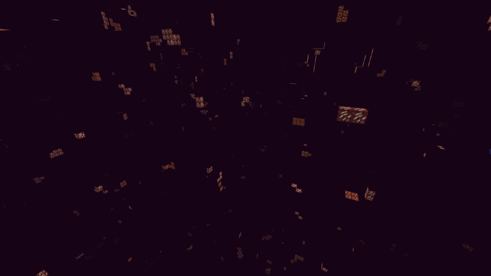

# 矿物透视与种子破解

为了防止玩家使用作弊端的Xray功能

又或者是进行矿透材质包进行作弊

又或者在服务器地图上进行反推世界种子进行矿物查询,寻找结构

导致矿产资源大量泛滥

完完全全的破坏了服务器经济系统

## 第一步-延长种子反推

笨蛋脚本:[下载](https://github.com/lilingfengdev/NitWiki-Script/releases/download/latest/auto-antiseedcracker.exe)，在服务器根目录执行即可自动配置!!

使用Paper的Anti-Xray

这是服务器核心自带的功能

这导致他只需要一些些带宽

就可以阻止你服务器上大量的矿透小子

那么该如何设置才最有效呢

首先请找到您的Paper配置的yml文件

> 找到下列模块改成true

```
feature-seeds:
  generate-random-seeds-for-all: true
```
> 这是对每个建筑使用随机种子，防止您的世界种子轻易的被破解

> 还没完，继续找到Spigot的yml文件(不用自己设置，会自动生成)

```
    seed-village: 10387312
    seed-desert: 14357617
    seed-igloo: 14357618
    seed-jungle: 14357619
    seed-swamp: 14357620
    seed-monument: 10387313
    seed-shipwreck: 165745295
    seed-ocean: 14357621
    seed-outpost: 165745296
    seed-endcity: 10387313
    seed-slime: 987234911
    seed-nether: 30084232
    seed-mansion: 10387319
    seed-fossil: 14357921
    seed-portal: 34222645
    seed-ancientcity: 20083232
    seed-trailruins: 83469867
    seed-trialchambers: 94251327
    seed-buriedtreasure: 10387320
    seed-mineshaft: default
    seed-stronghold: default

```

把以上所有数字全部打乱

完成以上设置可进一步防止反推种子

(没有完全杜绝的方法，只能拖延时间)

如果你使用包含Matter 安全种子补丁的分支(Leaf有)，那么恭喜你，你可以体验到安全功能种子，地形和生物群落的生成保持不变，但所有矿石和结构都是用 1024 位种子生成的，而不是通常的 64 位种子。这种种子几乎不可能破解，因为所需的破解时间和资源极长无比，如果你正在使用，那么你基本不用担心种子破解

:::danger

开启Leaf安全种子之前，你要明白这玩意儿是**不能关闭的**,也就是说，你开启后，除非你删档重开，不然必须使用安全种子

:::

你只需要在leaf的配置文件中找到`secure-seed`,将它打开就可以体验到安全种子

使用插件[AntiSeedCracker](https://www.spigotmc.org/resources/antiseedcracker-1-20-4.81495/)，这个插件会发送一个虚假的种子到客户端，客户端仍然可以通过分析地形来破解，但难度会大大增强

(所以建议资源世界不定期重置)

## 第二步-设置假矿

解决完种子可以被轻而易举反推的问题

我们还得解决矿物透视的问题

使用Paper自带的Anti-Xray即可拦截大量矿透

但我们也需要进行一些设置

(可直接抄作业)

当然，如果你是个笨蛋，你可以直接使用[脚本](https://github.com/lilingfengdev/NitWiki-Script/releases/download/latest/auto_antixray.exe)，在服务器根目录执行脚本即可自动配置!!

⚠警告：engine-mode: 3在1.19.3往后的版本才添加⚠

> 主世界推荐配置

> 配置Ⅰ
```
anticheat:
  anti-xray:
    enabled: true
    engine-mode: 3
    hidden-blocks:
    - copper_ore
    - deepslate_copper_ore
    - raw_copper_block
    - gold_ore
    - deepslate_gold_ore
    - iron_ore
    - deepslate_iron_ore
    - raw_iron_block
    - coal_ore
    - deepslate_coal_ore
    - lapis_ore
    - deepslate_lapis_ore
    - mossy_cobblestone
    - obsidian
    - chest
    - diamond_ore
    - deepslate_diamond_ore
    - redstone_ore
    - deepslate_redstone_ore
    - clay
    - emerald_ore
    - deepslate_emerald_ore
    - ender_chest
    lava-obscures: false
    max-block-height: 128
    replacement-blocks:
    - amethyst_block
    - andesite
    - budding_amethyst
    - calcite
    - coal_ore
    - deepslate_coal_ore
    - deepslate
    - diorite
    - dirt
    - emerald_ore
    - deepslate_emerald_ore
    - granite
    - gravel
    - oak_planks
    - smooth_basalt
    - stone
    - tuff
    update-radius: 2
    use-permission: false
```


> 配置Ⅱ

```
anticheat:
  anti-xray:
    enabled: true
    engine-mode: 1
    hidden-blocks:
    - chest
    - coal_ore
    - deepslate_coal_ore
    - copper_ore
    - deepslate_copper_ore
    - raw_copper_block
    - diamond_ore
    - deepslate_diamond_ore
    - emerald_ore
    - deepslate_emerald_ore
    - gold_ore
    - deepslate_gold_ore
    - iron_ore
    - deepslate_iron_ore
    - raw_iron_block
    - lapis_ore
    - deepslate_lapis_ore
    - redstone_ore
    - deepslate_redstone_ore
    lava-obscures: false
    max-block-height: 64
    replacement-blocks: []
    update-radius: 2
    use-permission: false

```


> 配置Ⅲ-*推荐使用*

```
anticheat:
  anti-xray:
    enabled: true
    engine-mode: 2
    hidden-blocks:
    - copper_ore
    - deepslate_copper_ore
    - raw_copper_block
    - gold_ore
    - deepslate_gold_ore
    - iron_ore
    - deepslate_iron_ore
    - raw_iron_block
    - coal_ore
    - deepslate_coal_ore
    - lapis_ore
    - deepslate_lapis_ore
    - mossy_cobblestone
    - obsidian
    - chest
    - diamond_ore
    - deepslate_diamond_ore
    - redstone_ore
    - deepslate_redstone_ore
    - clay
    - emerald_ore
    - deepslate_emerald_ore
    - ender_chest
    lava-obscures: false
    max-block-height: 128
    replacement-blocks:
    - amethyst_block
    - andesite
    - budding_amethyst
    - calcite
    - coal_ore
    - deepslate_coal_ore
    - deepslate
    - diorite
    - dirt
    - emerald_ore
    - deepslate_emerald_ore
    - granite
    - gravel
    - oak_planks
    - smooth_basalt
    - stone
    - tuff
    update-radius: 2
    use-permission: false
```


> 主世界配置推荐使用 **配置Ⅲ**

---

那么下界呢？

该如何在下界使用其他的 Anti-Xray 配置呢？

找到 world_nether/paper-world.yml

将下列你喜欢的配置进行复制粘贴即可

> 下界配置Ⅰ

```
anticheat:
  anti-xray:
    enabled: true
    engine-mode: 2
    hidden-blocks:
    # See note about air and possible client performance issues above.
    - ancient_debris
    - bone_block
    - glowstone
    - magma_block
    - nether_bricks
    - nether_gold_ore
    - nether_quartz_ore
    - polished_blackstone_bricks
    lava-obscures: false
    max-block-height: 128
    replacement-blocks:
    - basalt
    - blackstone
    - gravel
    - netherrack
    - soul_sand
    - soul_soil
    update-radius: 2
    use-permission: false
```


> 下界配置Ⅱ

```

anticheat:
  anti-xray:
    enabled: true
    engine-mode: 1
    hidden-blocks:
    - ancient_debris
    - nether_gold_ore
    - nether_quartz_ore
    lava-obscures: false
    max-block-height: 128
    # The replacement-blocks list is not used in engine-mode: 1. Changing this will have no effect.
    replacement-blocks: []
    update-radius: 2
    use-permission: false


```



> 下界配置Ⅲ

```

anticheat:
  anti-xray:
    enabled: true
    engine-mode: 3
    hidden-blocks:
    - ancient_debris
    - bone_block
    - glowstone
    - magma_block
    - nether_bricks
    - nether_gold_ore
    - nether_quartz_ore
    - polished_blackstone_bricks
    lava-obscures: false
    max-block-height: 128
    replacement-blocks:
    - basalt
    - blackstone
    - gravel
    - netherrack
    - soul_sand
    - soul_soil
    update-radius: 2
    use-permission: false


```


这边推荐使用**下界配置Ⅰ**

那么终末地配置呢？

我们推荐在终末地地图不使用假矿

所以world_the_end/paper.world.yml的配置

我们的推荐如下

```

anticheat:
  anti-xray:
    enabled: false


```

注意，如果你需要隐藏暴露在空气中的方块,需要将`air`添加到`hidden-blocks`和`replacement-blocks`,但是这样会影响服务器性能，开启前，请经过大脑


---

至此，这就是你不用插件就能做到反矿物透视的所有事

### 那么有什么 Antixray 插件

#### RayTraceAntiXray（7美元）(非常推荐)
[查看](https://builtbybit.com/resources/raytraceantixray.24914/)
用于服务器端异步多线程光线追踪的 Paper 插件，使用 Paper Anti-Xray 引擎模式 1 隐藏暴露在空气中的矿石。可以优化自带的Anti-Xray，减小服务器的负担

开源，可自行构建 https://github.com/stonar96/RayTraceAntiXray

#### RaytraceAntiXray(20欧元)(推荐)

[查看](https://builtbybit.com/resources/raytraceantixray-ores-entities-tiles.41896/)

插件特色
* 支持版本极广(1.8-最新）(1.13.2之前可是连raytrace方法都没)
* 支持实体隐藏
* 支持奖励箱，刷怪笼之类的隐藏

其他的反X光插件就别用了，就比如Orebfuscator,那玩意儿甚至不如我用Paper Antixray


