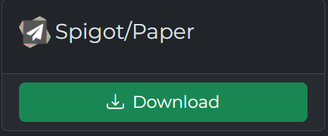

# 安装

## 注意事项

* 你的Minecraft服务端必须支持最新版本(服务器本身不一定必须是最新版本,你可以安装 ViaVersion 插件以实现低版本服务端支持高版本客户端，但请注意 **官方只支持1.12.2以上版本的服务端**)
* Geyser支持的最低Java版本为**16**

## 下载

Geyser是一个插件(当然也有其他形式,但不会提到),[下载地址](https://geysermc.org/download#geyser),你还需要安装[Floodgate](https://geysermc.org/download#floodgate)

[什么是Floodgate?有什么用?](https://docs.superiormc.cn/v/geyser-wiki/floodgate-wiki/zhu-ye)



你应该选择这个版本(无论Geyser还是Floodgate),下载完后是这样


将下载好的文件文件放置到服务端的 plugins 文件夹，并**启动服务端**。恭喜你完成了

## 简单配置

### Geyser配置
打开Geyser-Spigot/config.yml,首先让我们看到bedrock

```yaml

bedrock:
    # 这个是你的Geyser服务器端口,用来给基岩版玩家链接（没有必要别动）
    port: 19132
    # DANGER:作为一名新手,不要打开
    clone-remote-port: false
    # 给Geyser玩家显示的MOTD
    motd1: "Geyser"
    motd2: "Another Geyser server."
    # 将发送到基岩版客户端的服务器名称。 这在暂停菜单和设置菜单中都可见。
    server-name: "Geyser"
    # DANGER:作为一名新手,不要更改
    compression-level: 6
    # DANGER:作为一名新手,不要打开
    enable-proxy-protocol: false

```

在看到下面的remote

```yaml
remote:
  # DANGER:作为一名新手,不要更改
  address: auto
  # 这是Java服务器的端口，注意:必须和 server.properties 中的 port 一致
  port: 25565
  # DANGER:作为一名新手,不要更改
  auth-type: online
  # DANGER:作为一名新手,不要更改
  allow-password-authentication: true
  # DANGER:作为一名新手,不要更改
  use-proxy-protocol: false
  # DANGER:作为一名新手,不要更改
  forward-hostname: false
```

别着急，下面还有(但我们只会挑出有用的讲)

```yaml
# 开启选项后,将会把Java版本的MOTD发送给基岩版
passthrough-motd: true
# 将玩家数量和最大玩家数量发给基岩玩家。
passthrough-player-counts: true
```

```yaml
# 允许第三方斗篷可见。 目前允许：
# OptiFine 斗篷、LabyMod 斗篷、5Zig 斗篷和 MinecraftCapes
allow-third-party-capes: false

# 允许第三方 deadmau5 耳朵可见。 目前允许：
# MinecraftCapes
allow-third-party-ears: false
```

```yaml
# 允许发送虚假的冷却指示器。 否则，基岩玩家不会看到冷却时间，因为他们仍然使用 1.8 战斗。
# 请注意：如果启用了冷却时间，某些用户可能会在冷却过程中看到一个黑框，
# 可以通过进入辅助功能选项卡下的基岩设置并将“文本背景不透明度”设置为 0 来禁用此功能
# 该设置可以设置为“title”、“actionbar”或“false”
show-cooldown: title

# 是否向玩家显示坐标。
show-coordinates: true
```

```yaml
# 如果设置，当基岩玩家执行任何表情时，它将交换副手和主手物品，就像 Java 版按键绑定一样
# 可以设置三个选项：
# disabled - 默认/后备，不应用此解决方法
# no-emotes - 表情不会发送给其他基岩客户端，并且会立即交换。 这有效地阻止了所有表情被看到。(推荐)
# emotes-and-offhand - 表情将被发送到基岩客户端并且副手将被交换
emote-offhand-workaround: "disabled"
```

```yaml
# 基岩阻止在下界中建造和显示 Y127 以上的方块。
# 此配置选项通过将下界维度 ID 更改为结束 ID 来解决此问题。
# 这样做的主要缺点是整个下界将具有相同的红色雾，而不是每个生物群系具有不同的雾。
above-bedrock-nether-building: false

# 强制客户端加载所有资源包（如果有）。
# 如果设置为 false，则允许用户连接到服务器，即使他们不这样做
# 想要下载资源包。
force-resource-packs: true

# 允许解锁 Xbox 成就。
# 这会禁用游戏中 BEDROCK 成功运行的所有命令，否则 Bedrock 会认为您作弊。
xbox-achievements-enabled: false
```

### Floodgate配置

:::danger

此配置项非常重要

:::

```yaml
# Floodgate 在基岩用户名前面添加前缀以避免冲突
# 但是，某些冲突可能会导致某些插件出现问题，因此可以使用以下属性配置此前缀
# 建议使用不包含字母数字的前缀，以避免出现重复用户名的可能性。
username-prefix: "."
```

设置前缀后最好不要更改,不然所有基岩版玩家数据都会没


恭喜你,配置完毕!!,开始和你的好友一起玩吧