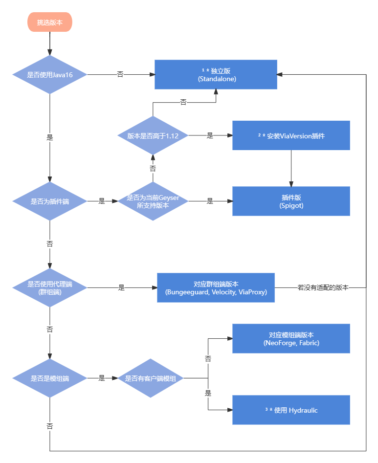

# 安装

## 版本
Geyser有以下版本类型:  
* Spigot
* Bungeecord
* Velocity
* Fabric
* NeoForge
* Standalone
* ViaProxy  
  
其中:  
  
Spigot版本 可以作为插件安装在以Spigot及其分叉(如Paper)为核心的服务端上  
Bungeecord, Velocity和ViaProxy版本 可以作为插件安装在这些代理端上  
Fabric和NeoForge版本 可以作为模组安装在这些模组端上  
Standalone版本 可以作为一个独立的代理端启动  

## 挑选版本
在安装前, 你需要找到合适的Geyser版本  
你可以参考下图:  

  
  
* 1、运行独立版**仍需要Java16**及以上环境, 只不过你可以将其和目标服务器所处的Java环境隔开 此外**在任何情况下**, 你都可使用独立版, 甚至独立版可以和其目标不在同一服务器上 
* 2、你可以通过ViaVersion插件来适配版本, 这会允许不同版本的玩家进入服务器, 不过问题不大  
* 3、[Hydraulic](https://github.com/GeyserMC/Hydraulic) 可以允许你加入带客户端模组的服务器, 但是项目处于**早期开发阶段**, 你可以做个尝试, 但是请不要在实际情况下使用

## 下载

你可以在此处下载 [Geyser](https://geysermc.org/download#geyser) 的对应版本   

## 安装
### 其他版本
作为插件或模组安装到对应文件夹即可
### 独立版
独立版作为一个单独的服务端  
你可以参考 [此处](../../正式开服/开启服务端) 的开启方法  

## 配置

找到配置文件夹下的config.yml  
(什么,你连配置文件夹都找不到? 那你真是连笨蛋都不如, 配置文件在对应版本Geyser名称的文件夹下,一般开启服务器后都会生成)  

:::danger

在本教程未提及前, 请不要随意更改任何配置项

:::

第一眼你可能会被全是英文的配置文件镇住  
别急,善用翻译来理解配置文件中的注释  
**在完成本教程的基础配置配置后, 若需进阶, 请参考 [此处](https://docs.superiormc.cn/v/geyser-wiki/user-guide/li-jie-pei-zhi) 的配置参考**  

接下来,回到配置,映入你眼帘的应该是bedrock和remote两个大项  
bedrock所代表的是你所开放的端口, 也是基岩版玩家看到的那个  
remote是连接的目标服务器, 若不使用独立版此选项无效, 请不要随意更改   

```yaml
bedrock:
  port: 19132
  clone-remote-port: false
  motd1: "Geyser"
  motd2: "Another Geyser server."
  server-name: "Geyser"
  compression-level: 6
  enable-proxy-protocol: false
  #proxy-protocol-whitelisted-ips: [ "127.0.0.1", "172.18.0.0/16" ]

```
```yaml
remote:
  address: auto
  port: 25565
  auth-type: online
  allow-password-authentication: true
  use-proxy-protocol: false
  forward-hostname: false
```
### Bedrock项
**`port`**: 其代表你向基岩版玩家所开放的端口, 在设置端口时请不要低于10000  
**`motd1`** 和 **`motd2`**: 其代表向基岩版玩家所显示的MOTD, 可根据你的喜好配置, 仅支持最基础的颜色符号  
**`server-name`**: 基岩版所看到的服务器名称, 在暂停菜单和设置中可见

### Remote项
**若不使用独立版请忽略！**  
**`address`**: 其代表目标服务器的地址, 若目标服务器和Geyser处于同一服务器下请不要更改  
**`port`**: 请和目标服务器对外开放的端口一致  
**`auth-type`**: 有offline, online和floodgate模式,offline和online分别对应离线和正版, 你目标服务器用的什么就选什么, floodgate会在后续教程中解释
  
# 其他项
再往下翻你会注意到不少其他乱七八糟的项  
这里挑几个重点

```yaml
passthrough-motd: true
passthrough-player-counts: true

# 请注意：如果启用了冷却时间，某些用户可能会在冷却过程中看到一个黑框，
# 可以通过进入辅助功能选项卡下的基岩设置并将“文本背景不透明度”设置为 0 来禁用此功能
show-cooldown: title

show-coordinates: true
above-bedrock-nether-building: false
```

**`passthrough-motd`**: 把Java版本的MOTD发送给基岩版  
**`passthrough-player-counts`**: 将玩家数量和最大玩家数量发给基岩玩家  
**`show-cooldown`**: 由于基岩版没有战斗冷却, 此功能会模拟一个冷却提示器, 你可以设置为title(小标题), actionbar(物品栏上方的标题) 或 false(关闭)  
**`show-coordinates`**: 是否向玩家显示坐标  
**`above-bedrock-nether-building`**: 开启后你将被允许在下届高度127以上建造, 缺点是整个下界中雾的颜色不再可变, 将一直是红色  
  
## 进一步兼容
**此部分还未完工！咕咕咕！**  
### Floodagte
为进一步兼容, 你需要安装 [Floodgate](https://geysermc.org/download#floodgate)

[什么是Floodgate?有什么用?](https://docs.superiormc.cn/v/geyser-wiki/floodgate-wiki/zhu-ye)

```yaml
# Floodgate 在基岩用户名前面添加前缀以避免冲突
# 但是，某些冲突可能会导致某些插件出现问题，因此可以使用以下属性配置此前缀
# 建议使用不包含字母数字的前缀，以避免出现重复用户名的可能性。
username-prefix: "."
```

:::danger

设置前缀后最好不要更改

:::


恭喜你,配置完毕!!,开始和你的好友一起玩吧