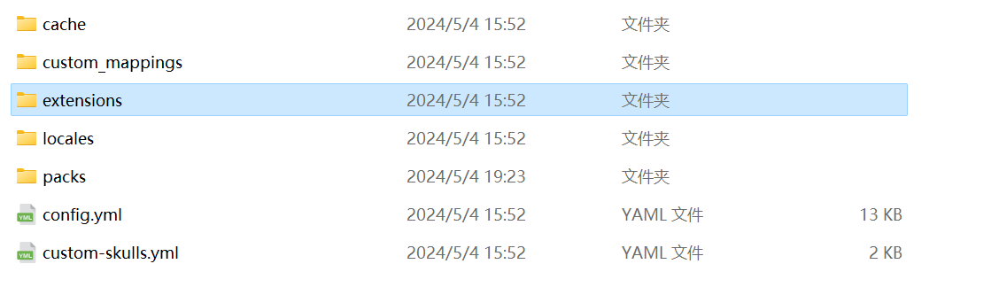

# Geyser Boss

概览只是一个开始,你会发现很多功能不正常,比如皮肤不显示之类的

## Hurricane

一个修基岩版和JAVA版之间部分特性不一致，导致游戏体验不好的插件

修复：
- 竹子和滴水岩碰撞（通过将它们设置为无服务器端碰撞）
- https://github.com/GeyserMC/Geyser/issues/638 通过在服务器端执行控制。(在 1.20+ 版本中无效）

:::danger

此插件目前不支持1.20以上

:::

## GeyserSkinManager


:::note

需要搭配[BedrockSkinUtility](https://github.com/Camotoy/BedrockSkinUtility)使用最好

:::

在这下载[GeyserSkinManager](https://github.com/Camotoy/GeyserSkinManager)

## GeyserOptionalPack

[下载地址](https://download.geysermc.org/v2/projects/geyseroptionalpack/versions/latest/builds/latest/downloads/geyseroptionalpack)

### 实现内容:

- 盔甲架底座武器/底板可见性
- 盔甲架姿势
- 幻术师
- 缺失的粒子
- 副手动画
- 潜影贝隐形平等性
- 发光箭实体纹理
- 超过记分板字符限制的绕过方式
- 隐藏在Java版中不存在的UI元素，例如：
  - 制图桌中的文本输入字段
  - 创造模式下的2x2工作台
  - 命令方块菜单中的时钟延迟和重命名字段
  - Java版中不存在的结构方块选项

### 安装在哪

下载下来是这样的


一个mcpack文件,首先打开Geyser-Spigot配置文件夹


安装到```packs```文件夹即可

### BedrockChestUI

BedrockChestUI是一个用于实现自定义基岩版箱子UI行数的插件 ,由于基岩版原生不支持1,2,4,5行的箱子,所以本插件基于 ProtocolLib + 基岩版资源包实现 ,此插件需要Floodgate和ProtocolLib作为前置,支持Minecraft版本 1.17.1-1.19.4

[下载](https://gitee.com/xi-bohan/BedrockChestUI/releases/tag/BedrockChestUI)

将```ChstomChest0.2.mcpack```安装到```packs```,```BedrockChestUI-1.0.5.jar```是插件，都需要安装

### GeyserUtils

GeyserUtils是zimzaza4开发的Geyser扩展工具

#### 安装

[下载GeyserUtils](https://github.com/zimzaza4/GeyserUtils)

把`geyserutils-spigot`放入插件文件夹

将`geyserutils-geyser`放入geyser的`extensions`文件夹



这样就安装好了

### BetterBedrockThirdPerson

可以让基岩版玩家获得更好的第三人称视角!

[下载地址](https://github.com/lilingfengdev/GeyserBetterBedrockThirdPerson/releases/tag/latest)

### floodgate-skript

一个Skript扩展插件,可以在Skript中检测基岩玩家

### LuckBedrock

此插件为Luckperms权限管理插件提供了一个额外的情境判断，

使您可以设置仅基岩版玩家的权限或仅Java版玩家的权限，让您不再因为权限管理而急眼！

[下载](https://www.minebbs.com/threads/luck-bedrock.24169/)

### GeyserClickableMessageGUI

当玩家发送可在游戏中点击的链接时,此插件会弹出一个窗口以点击(基岩版原生不支持)

[下载](https://github.com/zimzaza4/GeyserClickableMessageGUI/releases/tag/1.0.0)

这是一个Geyser扩展,你应该安装到```Geyser-Spigot/extensions```

