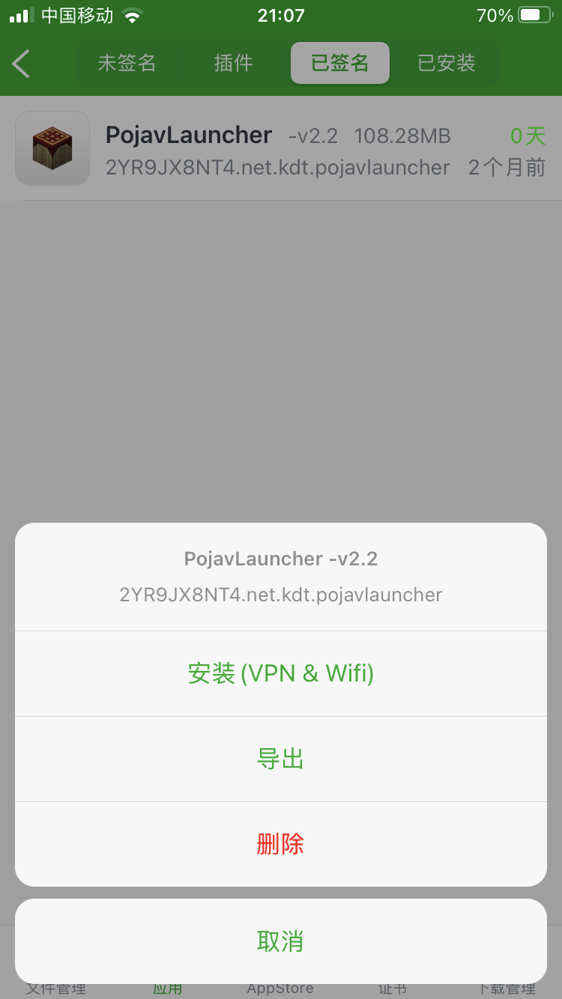
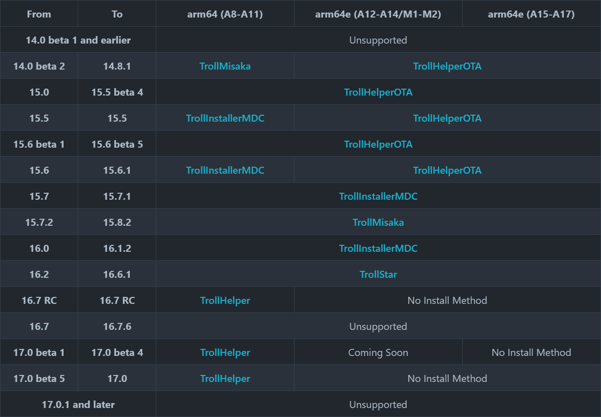

# Pojav_IOS

免越狱安装 PojavLauncher_iOS

## 方法一: 使用牛蛙助手
### 安装Pojav
在电脑打开此[链接](https://ios222.com/)下载牛蛙助手
使用数据线连接手机与电脑，按照提示安装
从此[链接](https://github.com/PojavLauncherTeam/PojavLauncher_iOS/releases )下载Pojav的ipa安装包

在手机上的牛蛙助手中导入ipa文件

点击签名进行自签(刚开始用自签会被封号，不会很严重修改密码就好了，自签只有一周的使用时间，过了时间要重新签名)

点击进行安装

### 启动Pojav
打开牛蛙助手，点击JIT，使用JIT启动Pojav
### 补充
安装完之后若点击程序出现未受信任的提示

请打开设置→通用→VPN与设备管理，
点击对应的配置描述文件信任它

若牛蛙提示下图，就按它说的打开牛蛙的VPN

## 方法二: 使用 TrollStore

从此[链接](https://github.com/PojavLauncherTeam/PojavLauncher_iOS/releases )下载Pojav的ipa安装包

从此[链接](https://github.com/opa334/TrollStore/releases)获取TrollStore

点击查看[TrollStore的安装流程](https://ios.cfw.guide/installing-trollstore/)

我手机安装不了巨魔，接下来怎么做等待有缘人

TODO
