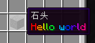

# MiniMessage

MiniMessage 旨在用简单字符串表示聊天组件，便于用户学习和开发人员扩展。

和 [格式化代码](格式化代码.md) 篇一样，一个 TrMenu菜单 配置展示下

```
Icons:
  test:
    display:
      material: stone
      lore:
        - '<rainbow>Hello world'
```



https://docs.advntr.dev/minimessage/format.html

它的文档上把功能和写法列的很详细了，并且附有效果图，一看就懂，我就不写教程了
