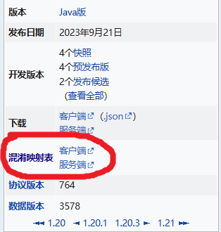
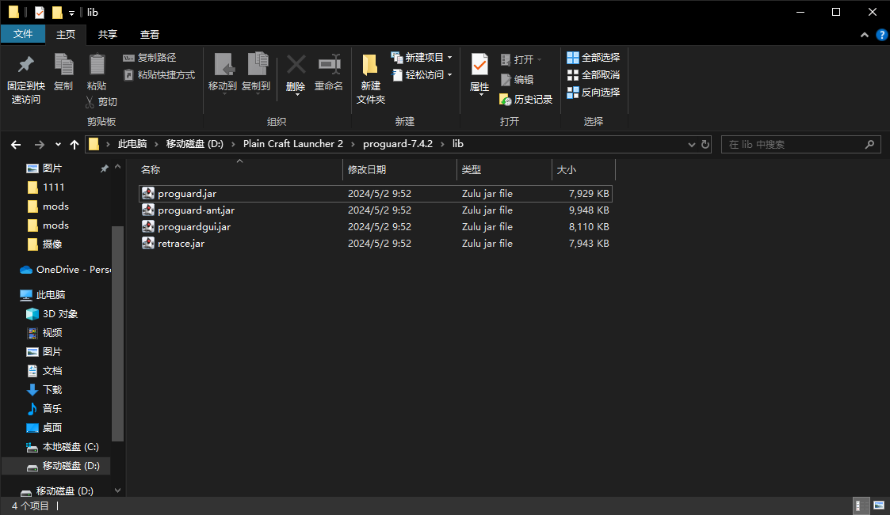
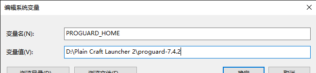
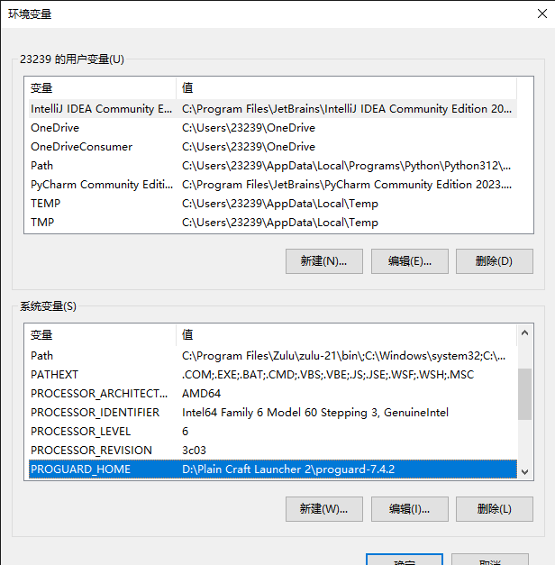

# 反混淆堆栈记录

参考文献：
- https://zh.minecraft.wiki/w/%E6%B7%B7%E6%B7%86%E6%98%A0%E5%B0%84%E8%A1%A8
- https://zh.minecraft.wiki/w/Tutorial:%E8%8E%B7%E5%8F%96%E5%B4%A9%E6%BA%83%E6%8A%A5%E5%91%8A
- https://zh.minecraft.wiki/w/%E5%B4%A9%E6%BA%83

*本篇文章部分引自 [中文Minecraft Wiki](https://zh.minecraft.wiki/) 依照 [CC BY-NC-SA 3.0](https://creativecommons.org/licenses/by-nc-sa/3.0/deed.zh) 协议*

*此篇文章适用于客户端和服务端，所以我就照着客户端讲了*

**所有操作都以 Windows 操作系统为例**

:::info 关于混淆映射表

这个玩意不是全版本都有，只有在高于 `19w36a (1.15)` 版本中才有（除了 `Combat Test 3`），后续又为 `1.14.4` 版本增设

如果你不是这些版本，祝你好运 :）

根据[相关协议](https://zh.minecraft.wiki/w/%E6%B7%B7%E6%B7%86%E6%98%A0%E5%B0%84%E8%A1%A8#%E8%AE%B8%E5%8F%AF%E8%AF%81)规定，您可以以开发的目的复制、使用这些映射，但您不能完整无修改地再分发这些映射。

:::

## 介绍

有时候你会在游玩时发生崩溃现象，而你对着一堆诸如 `at net.minecraft.class_310.method_1514(class_310.java:856)` 一定会表示不知所措，此篇文章可以告诉你如何有效解决这一问题

## 获取崩溃报告日志文件

*游戏崩溃的第一件事是及时寻找对应的崩溃报告日志文件，而不是在多次提醒的情况下依旧截图启动器给的快速解决方案*

首先，你需要找到启动器所使用的游戏目录，除非你跟我说 `我游戏是朋友装的` 之类的，否则你应该很清楚你的游戏目录在哪里

导航到游戏目录中的 `crash-reports` 目录，如果本次崩溃没有生成 `crash-reports `目录，那就看 `logs` 目录，如果两个目录都没有就自行解决诸如 `hs_err_pid#####.log` 等问题

- 崩溃报告的文件名遵循此格式 `crash-yyyy-mm-dd_hh.mm.ss-(client/server).txt`，你需要根据崩溃报告生成的时间来判断哪个报告是你所需要的或者需要哪一种混淆映射表
- 如果你是在 `logs` 目录找到的，那就无脑找 `latest.log` ，因为你游戏不可能连运行日志都没有

*有些纯模组作妖导致的报错可能都没地方放mc方面的报错，这种可以通过简单翻译类名来大致推测问题所在*

## 寻找混淆映射表

在反混淆之前，你需要寻找混淆映射表文件，混淆映射表原意就是用来反混淆被混淆后的堆栈记录的，所以你不用担心会发生什么奇怪的问题

首先你需要确定发生崩溃的版本，本次示例使用 `1.20.2` 版本

以防意外情况导致你无法确定当前版本，进入崩溃文件翻到 `System Details` 一栏，你应该能够看到以下信息

```txt
-- System Details --
Details:
	Minecraft Version: 1.20.2
	Minecraft Version ID: 1.20.2
	Operating System: Windows 10 (amd64) version 10.0
	Java Version: 17.0.10, Eclipse Adoptium
	Java VM Version: OpenJDK 64-Bit Server VM (mixed mode, sharing), Eclipse Adoptium
	Memory: 334987520 bytes (319 MiB) / 1140850688 bytes (1088 MiB) up to 2147483648 bytes (2048 MiB)
	CPUs: 8
    ......
```

其中的 `Minecraft Version ID` 则是你当前崩溃发生的版本

在 [中文Minecraft Wiki](https://zh.minecraft.wiki/) 中搜索对应版本，然后选择对应的混淆映射表下载（不是打开是下载！）



## 反混淆崩溃文件

混淆映射表中包含的信息足以反混淆Minecraft使之反编译出容易理解的内容

接下来就需要反混淆崩溃文件，在此之前，请先找个空文件夹，我们之后的操作全在这个文件夹中进行

示例使用工具 [Retrace](https://www.guardsquare.com/manual/tools/retrace)，需要你的JAVA版本为8或更高版本

您可以在 [ProGuard](https://github.com/Guardsquare/proguard) 发行版的目录中找到 `ReTrace jar`（混淆完还能反混淆回来，好耶）

下载完成后解压，在 `lib` 目录内你应该会找到 `proguard.jar` 文件，之后我们会用的它



前往 `控制面板`，搜索 `系统变量`，然后点 `编辑系统环境变量`，进入 `系统属性`后点 `环境变量`，在下面的 `系统变量` 中新建一个变量名为 `PROGUARD_HOME` 的环境变量，变量值则是你的ProGuard所在文件夹，比如 `D:\Plain Craft Launcher 2\proguard-7.4.2`，接下来一路确定即可





随后前往你的空文件夹，将你的崩溃文件和你的混淆映射表放进去，可以顺便将它重命名成一个更易辩识的文件名方便输入

打开你的命令行界面，将路径切换为以上东西所在的目录，或者直接在文件夹中按住Shift并右击空白处，再选择“在此处打开PowerShell窗口”，执行以下命令：

```bat
call "%PROGUARD_HOME%\bin\retrace.bat" client.txt crash.txt > output.txt
```

现在新生成的 `output.txt` 则是你反混淆之后的崩溃文件
