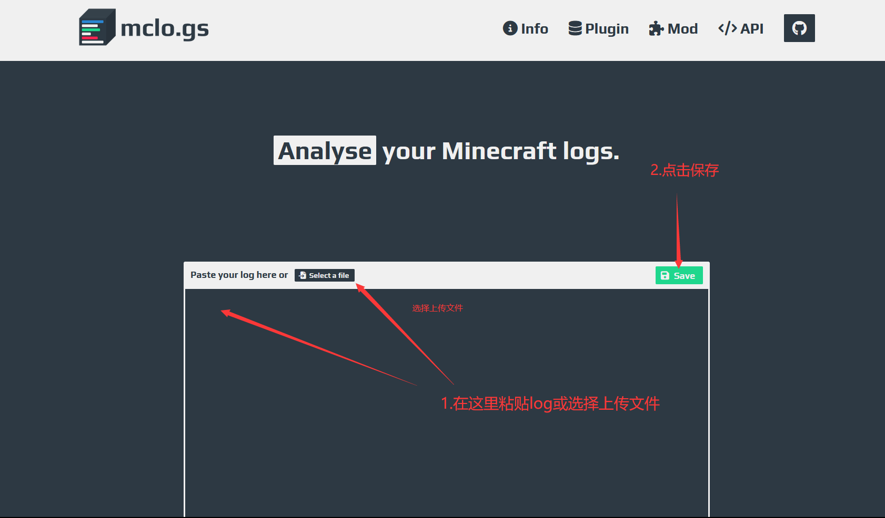
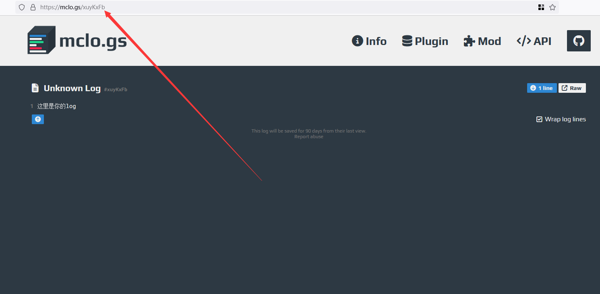

# 问问题的技巧

## 怎么一进交流群就有人骂我

发生这种情况不要慌，一般是你问的问题对于群友来说过于常见以为你是来捣乱的，或者你的问题网上可以查到*你不会使用你的bing搜索吗*

诸如 `你查了个集贸你查` `插件服用command方块不是纯弱智吗` 等语句可能只是群友一时冲动说的，并不是想骂你

*如果群友真生气了可能你服就没了*

记住一点，没有人会骂你，不要咎由自取，因为我们一般是直接动手💣

## 保持礼貌

交流群的大佬们并没有义务回答你的问题，不要将他们回答你的问题当成“理所应当”，这只会导致你进入乐子文档，使用礼貌用语，而不是“sb","cnm"

## 给出日志

:::danger

不要在一些技术交流群发日志文件！！！

:::

当你询问问题的时候,发出你的报错日志(推荐一个网站[Mclogs](https://mclo.gs/),很方便的上传日志,你需要明白你面对的是群友而不是道友，没有人可以在没有日志的情况下帮你解决问题，如果你遇到的是大佬还可以给你算一卦。

  
如何使用Mclogs

把这个链接复制粘贴发给大佬

其他的贴log的网站,如

- https://pastes.dev/
- https://paste.fastmirror.net/

## 适当的有偿

交流群里的大佬都是有自己的服务器的，所以当你提出问题的时候，最好发个红包，¥10左右就行

## 看完wiki再问

wiki就是让你解决常见问题的,不看这玩意儿就在那瞎问只会获得`滚过去看wiki'友善回复。

不遵守以上规则，可能会导致你写入乐子文档

## 经典老图

经典如何提问: https://settingdust.gitbook.io/stop-ask-questions-the-stupid-ways/