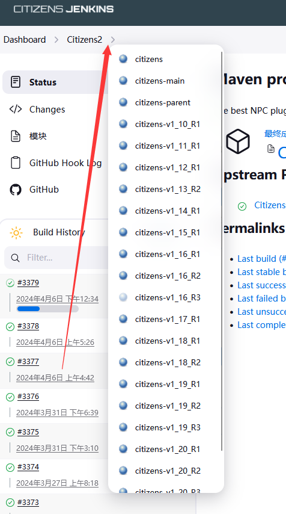

# citizens

:::info

`官网` :https://wiki.citizensnpcs.co/Citizens_Wiki

`spigotmc` :https://www.spigotmc.org/resources/citizens.13811/

`Bukkit(太老旧不要使用)` :https://dev.bukkit.org/projects/citizens

`GitHub` :https://github.com/CitizensDev/Citizens2

`插件百科` :https://www.mineplugin.org/Citizens

:::

老牌npc插件

## 下载

在spigot帖内自行寻找,以 *懒* *看不懂英文* *它是英文的* 为由通常会遭到群友谩骂

可以这样子找你需要的版本

## 执行命令

citizens插件本身有执行命令的 https://wiki.citizensnpcs.co/NPC_Commands

所以不要再使用 https://www.spigotmc.org/resources/citizenscmd.30224/ 了